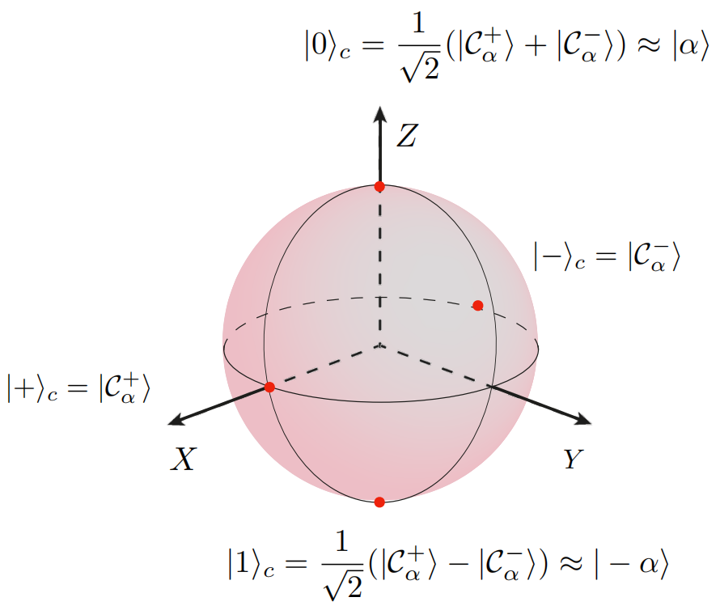
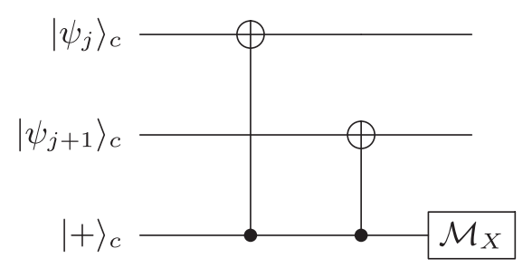

# Bosonic Codes
## Bosonic Modes

Bosonic quantum error–correcting codes live in the infinite–dimensional Hilbert space of a single harmonic oscillator
(microwave cavity, optical mode, phononic resonator, *etc.*).
Throughout these notes
1.  $\hat a$ and $\hat a^{\dagger}$ are the *annihilation* and *creation* operators, obeying $[\hat a,\hat a^{\dagger}] \;=\; 1 .$
2.  $\hat n = \hat a^{\dagger}\hat a$ counts photons; its eigenstates $|n⟩$ are called *Fock states*: $\hat n |n\rangle \;=\; n |n\rangle, \quad n = 0,1,2,\dots$.
3.  By setting $[\hat q,\hat p]=i\hbar$, the position and momentum quadratures are
    $$
    \begin{aligned}
        \hat q =\frac{\hat a^{\dagger} + \hat a}{\sqrt{2}},\quad
          \hat p =\frac{\hat a^{\dagger} - \hat a}{i\sqrt{2}}
    \end{aligned}
    $$

To understand cat state codes (bosonic code), one must first understand the core problem they aim to solve: the fragility of qubits.
In quantum computing, the information storage of a qubit relies on quantum states (such as the polarization of photons, the spin of electrons, or the energy states of superconducting circuits).
These states are extremely susceptible to environmental noise, leading to decoherence, and consequently, computational errors.
There are two main types of errors:

1.  **Bit-flip error:** Similar to the classical computer error where $0$ turns into $1$ or $1$ turns into $0$. In the quantum realm, this means the |0⟩ state flips into the |1⟩ state, and vice versa.
2.  **Phase-flip error:** This is an error unique to quantum mechanics. The phase of a quantum superposition state $\alpha\vert 0 \rangle + \beta\vert 1 \rangle$ flips, becoming $\alpha\vert 0 \rangle - \beta\vert 1 \rangle$. This destroys the coherence of the superposition, which is critical for quantum computation.

Traditional quantum error correction codes (such as surface codes) can simultaneously correct both types of errors, but they typically require a large number of physical qubits to encode one logical qubit, and the error correction process itself is very complex, requiring frequent measurements and feedback, placing extremely high demands on hardware.
**The breakthrough of cat codes lies in this:** They specifically target a particular, very common noise source—energy decay (or amplitude damping).
In superconducting qubit systems and others, energy decay (|1⟩ spontaneously decaying back to |0⟩) is the main cause of both bit-flip and phase-flip errors.
Cat codes use a clever encoding method that makes the logical qubits inherently robust against this main error source of energy decay.

**Table 1:** Fundamental Differences in Physical Qubits

| **Characteristic** | **Cat-state Encoding** | **Surface Code** |
| --- | --- | --- |
| **Physical Qubit Carrier** | A **microwave resonator** (continuous-variable system) | Multiple **superconducting Transmon qubits**, etc. (discrete-variable systems) |
| **Hilbert Space** | **Infinite-dimensional** (can have 0, 1, 2, ... infinitely many photons) | **Two-dimensional** (only has |0⟩ and |1⟩ basis states) |
| **Information Encoding Method** | Encode **one logical qubit** in **one cat state** of the resonator. For example: $|0_L⟩ = |\alpha⟩ + |-\alpha⟩$, $|1_L⟩ = |\alpha⟩ - |-\alpha⟩$ | Encode **one logical qubit** in the **entangled state** of multiple physical qubits. (e.g., specific entanglement of all data qubits in the surface code lattice) |
| **Core Error Correction Mechanism** | **Utilize infinite-dimensional space for autonomous stability**. Photon loss errors cause **parity flips** rather than direct information annihilation, making them easy to detect and correct. | **Achieve active error correction through stabilizer measurements**. Requires continuous measurement of correlations between adjacent physical qubits (XXXX or ZZZZ measurements to detect errors). |
| **Resource Overhead** | **Low**. One logical qubit $\approx$ **1 resonator + 1 auxiliary Transmon**. | **Extremely high**. One logical qubit requires **hundreds to thousands** of physical Transmon qubits. |
| **Error Types** | Inherently strong robustness against **energy decay (photon loss)**. | Equally handles **bit-flip errors** and **phase-flip errors**. |
| **Logical Operations** | Operations are complex, typically requiring implementation through **nonlinear interactions with auxiliary qubits**. | Mature theory for logical gate operations (e.g., **lattice surgery**), but operations are complex when performed on the encoded level. |

%---------------------------------------------------------------------------
## Cat Codes

### Logical Codewords

In quantum error corrections, logic codeword encode physical bit into logic bit to protect information.
The cat code embeds a logical qubit into states of a harmonic oscillator.
It is crucial to distinguish between two fundamental bases which are named after the Pauli operators whose eigenstates they are.

1.  **The Computational Basis ($|0_L⟩, |1_L⟩$):** This is the basis used to store information, often called the **Z-basis** because its states are eigenstates of the logical $\hat{Z}_L$ operator. The states are approximately the coherent states $|\alpha⟩$ and $|-\alpha⟩$, which are well-separated in phase space. This separation provides physical protection against bit-flip errors.
    $$
    \begin{align}
    \left\{\begin{aligned}
        |0_L\rangle &=\frac{1}{\sqrt{2}}(|+_L\rangle + |-_L\rangle)\propto |\alpha\rangle\\
        |1_L\rangle &=\frac{1}{\sqrt{2}}(|+_L\rangle - |-_L\rangle)\propto |-\alpha\rangle
    \end{aligned}\right. \to
    \left\{\begin{aligned}
        \hat{Z}|0\rangle &= +1 \cdot |0\rangle \\
        \hat{Z}|1\rangle &= -1 \cdot |1\rangle
    \end{aligned}\right. \quad
    \left.\begin{aligned}
        \hat{X}|0\rangle &= |1\rangle \\
        \hat{X}|1\rangle &= |0\rangle
    \end{aligned}\right. \end{align}
    $$
    
2.  **The Parity Basis ($|+_L⟩, |-_L⟩$):** This is the basis of definite photon-number parity, often called the **X-basis** because its states are the eigenstates of the logical $\hat{X}_L$ operator (which corresponds to the physical parity operator $\hat{P}$). The states are the **even** and **odd** Schrödinger cat states. This basis is essential for detecting the most common type of error, phase-flip ($\hat{Z}_L$).
    $$
    \begin{align}
    \left\{\begin{aligned}
      \text{even： }|+_L\rangle &= \mathcal N_{+}\bigl(|\alpha\rangle + |-\alpha\rangle\bigr) \to \frac{1}{\sqrt{2}}(|0\rangle + |1\rangle)\\
      \text{odd： }|-_L\rangle &= \mathcal N_{-}\bigl(|\alpha\rangle - |-\alpha\rangle\bigr) \to \frac{1}{\sqrt{2}}(|0\rangle - |1\rangle)
    \end{aligned}\right. \to
    \left\{\begin{aligned}
        \hat{X}|+\rangle &= +1 \cdot |+\rangle \\
        \hat{X}|-\rangle &= -1 \cdot |-\rangle
    \end{aligned}\right. \quad
    \left.\begin{aligned}
        \hat{Z}|+\rangle &= |-\rangle \\
        \hat{Z}|-\rangle &= |+\rangle
    \end{aligned}\right. \end{align}
    $$

 

*Figure 1: Different Presentation of logical states |±⟩ and computational states |0/1⟩*

The **even $|+_L⟩$ / odd $|-_L⟩$ cat code** embeds one qubit in two superpositions of coherent states $|\alpha⟩$ and $|-\alpha⟩$ with the normalization factor 
$$
\begin{aligned}
\mathcal N_{\pm} = \frac{1}{\sqrt{2\left(1 \pm e^{-2|\alpha|^{2}}\right)}}
\end{aligned}
$$:
$$
\begin{align}
\left\{
\begin{aligned}
|\alpha\rangle &= e^{-\frac{1}{2}|\alpha|^2} \sum_{n=0}^{\infty} \frac{\alpha^n}{\sqrt{n!}} |n\rangle\\
|-\alpha\rangle &= e^{-\frac{1}{2}|-\alpha|^2} \sum_{n=0}^{\infty} \frac{(-\alpha)^n}{\sqrt{n!}} |n\rangle
\end{aligned}
\right. \to
\left\{
\begin{aligned}
  |+_L\rangle &\propto 2e^{-\frac{1}{2}|\alpha|^2} \left( \frac{\alpha^0}{\sqrt{0!}}|0\rangle + \frac{\alpha^2}{\sqrt{2!}}|2\rangle + \dots \right) \\
  |-_L\rangle &\propto 2e^{-\frac{1}{2}|\alpha|^2} \left( \frac{\alpha^1}{\sqrt{1!}}|1\rangle + \frac{\alpha^3}{\sqrt{3!}}|3\rangle + \dots \right)
  \end{aligned}
  \right. \end{align}
$$

The inner product of coherent states is $\langle \alpha | \beta \rangle = \exp(-\frac{1}{2}|\alpha|^2 - \frac{1}{2}|\beta|^2 + \alpha^* \beta)$, therefore:
$$
\begin{align}
\langle \alpha | -\alpha \rangle = \exp(-\frac{|\alpha|^2}{2} - \frac{|\alpha|^2}{2} + \alpha^*(-\alpha)) = \exp(-2|\alpha|^2)
\end{align}
$$
which means these two states are orthogonal only when photon number $\alpha \to \infty$
For $|+_L⟩$:
$$
\begin{align}
\begin{aligned}
\langle +_L|+_L \rangle &= \langle \alpha|\alpha \rangle + \langle \alpha|-\alpha \rangle + \langle -\alpha|\alpha \rangle + \langle -\alpha|-\alpha \rangle \\
&= 1 + e^{-2|\alpha|^2} + e^{-2|\alpha|^2} + 1 = 2 + 2e^{-2|\alpha|^2}
\end{aligned}
\rightarrow
N_+ = \frac{1}{\sqrt{2 + 2e^{-2|\alpha|^2}}}
\end{align}
$$

Similarly, for $|-_L⟩$:
$$
\begin{align}
\begin{aligned}
\langle -_L|-_L \rangle &= \langle \alpha|\alpha \rangle - \langle \alpha|-\alpha \rangle - \langle -\alpha|\alpha \rangle + \langle -\alpha|-\alpha \rangle \\
&= 1 - e^{-2|\alpha|^2} - e^{-2|\alpha|^2} + 1 = 2 - 2e^{-2|\alpha|^2}
\end{aligned}
\rightarrow
N_- = \frac{1}{\sqrt{2 - 2e^{-2|\alpha|^2}}}
\end{align}
$$

Their inner product to prove its absolute orthogonal:
$$
\begin{align}
\langle +_L | -_L \rangle &\propto (\langle \alpha | + \langle - \alpha |)(|\alpha\rangle - |-\alpha\rangle)
= \langle \alpha | \alpha \rangle - \underbrace{\langle \alpha | - \alpha \rangle}_{e^{-2|\alpha|^2}} + \underbrace{\langle - \alpha | \alpha \rangle}_{e^{-2|\alpha|^2}} - \langle - \alpha | - \alpha \rangle =0
\end{align}
$$

> **[Cat state for extreme $\alpha$]**
>
> When $|\alpha|$ is large, $e^{-2|\alpha|^2} \approx 0 \to N_{\pm} \approx 1/\sqrt{2}$, the cat state forms logical basis states :
> $$
> \begin{align}
> |+_L\rangle \approx \frac{1}{\sqrt{2}}(|\alpha\rangle + |-\alpha\rangle), \quad |-_L\rangle \approx \frac{1}{\sqrt{2}}(|\alpha\rangle - |-\alpha\rangle)
> \end{align}
> $$

> **[Settings of $\alpha$]**
>
> 1.  **Role of $\alpha$:**
>     * **Overlap:** Overlap $\langle \alpha | - \alpha \rangle = e^{-2|\alpha|^2} \to |\alpha| \nearrow \to$ overlap $\searrow \to$ better distinguishability.
>     * **Decoherence:** Cat states decay at rates $\propto |\alpha|^2$. Larger $|\alpha| \to$ faster decoherence.
>     * **Error Correction:**
>         * Larger $\alpha$ improves parity measurement reliability.
>         * Normalization constants $N_{\pm} \approx 1/\sqrt{2}$ when $|\alpha| \gtrsim 2$.
>         * Photon loss error ($a|0_L\rangle \propto |1_L\rangle$) becomes perfect bit-flip only when $|\alpha| \to \infty$.
>
> 2.  **Theoretical Ideal Value:** $|\alpha| \approx 2$
>     * **Overlap:** $e^{-8} \approx 0.00034$ (negligible)
>     * **decoherence:** Mean photon number $\langle n \rangle = \langle \alpha|a^\dagger a|\alpha\rangle = |\alpha|^2 = 4$ (manageable)
>
> 3.  **Experimental Status:**
>     * **Superconducting systems:** $|\alpha| = 2-3$ (state-of-the-art)
>     * **Optical systems:** $|\alpha| = 0.5-1.5$ (limited by photon loss)
>
> **Key Insight:** $\alpha$ controls the balance between macroscopic distinctness (good) and decoherence (bad). Current superconducting systems can achieve theoretical ideal $|\alpha| \approx 2$.

> **[Effection of $\alpha$]**
>
> Now we derive the relation between coherent state amplitude $\alpha$ and decoherent rate & photon loss. Considering the connection of system and environment, given Linblad equation:
> $$
> \begin{align}
>     \frac{d\rho}{dt} &= \kappa \left( \underbrace{a\rho a^\dagger}_{\text{photon loss}} \underbrace{- \frac{1}{2} a^\dagger a \rho - \frac{1}{2} \rho a^\dagger a}_{\text{decay of coherence}} \right)
> \end{align}
> $$
> $\kappa(s^{-1})$ is a rate parameter that describes the strength of coupling between a quantum system (in this case, an optical or microwave cavity) and its external environment. Specifically, it represents the rate at which energy (photons) leaks out of the system.
> The expectation value of Parity operator $\langle P \rangle = \mathrm{Tr}(\rho P)$, thus $\frac{d}{dt}\langle P \rangle = \mathrm{Tr}\left( \frac{d\rho}{dt} P \right)$. Substitute it back to Linblad equation:
> $$
> \begin{align}
>     \frac{d}{dt}\langle P \rangle &= \kappa \mathrm{Tr}\left[ \left( a\rho a^\dagger - \frac{1}{2} a^\dagger a \rho - \frac{1}{2} \rho a^\dagger a \right) P \right] \\
>     &= \kappa \left[ \mathrm{Tr}(a\rho a^\dagger P) - \frac{1}{2}\mathrm{Tr}(a^\dagger a \rho P) - \frac{1}{2}\mathrm{Tr}(\rho a^\dagger a P) \right]
> \end{align}
> $$
> Now consider the first term. Utilizing the cyclic nature of traces $\mathrm{Tr}(ABC)=\mathrm{Tr}(BCA)$, also using $aP=−Pa \Rightarrow (Pa)^\dagger = (-aP)^\dagger \Rightarrow a^\dagger P = -P a^\dagger \Rightarrow \mathrm{Tr}(\rho a^\dagger P a) = -\mathrm{Tr}(\rho P a^\dagger a)$:
> $$
> \begin{align}
>     \mathrm{Tr}(a\rho a^\dagger P) = \mathrm{Tr}(\rho a^\dagger P a)
>     = -\mathrm{Tr}(\rho P a^\dagger a) = -\langle P a^\dagger a \rangle
> \end{align}
> $$
> Similarly for the later two terms:
> $$
> \begin{align}
>     -\frac{1}{2}\mathrm{Tr}(a^\dagger a \rho P) &= -\frac{1}{2}\mathrm{Tr}(\rho P a^\dagger a) = -\frac{1}{2}\langle P a^\dagger a \rangle\\
>     -\frac{1}{2}\mathrm{Tr}(\rho a^\dagger a P) &= -\frac{1}{2}\langle a^\dagger a P \rangle = -\frac{1}{2}\langle P a^\dagger a \rangle
> \end{align}
> $$
> Combine them all together, we have:
> $$
> \begin{align}
>     \frac{d}{dt}\langle P \rangle &= -2\kappa\langle a^\dagger a P \rangle
>     \approx -2\kappa |\alpha|^2\langle P \rangle\\
>     \langle P \rangle(t) &= \langle P \rangle(0)e^{-2\kappa|\alpha|^2 t}
> \end{align}
> $$
> 1.  **Photon Loss Rate is Proportional to the Square of the Amplitude**
>     * Photon loss rate $= \kappa \langle n \rangle = \kappa |\alpha|^2$
>     * Larger $|\alpha| \to$ larger mean photon number $|\alpha|^2 \to$ more photons lost per unit time.
> 2.  **Parity Flip Mechanism**
>     * Each photon loss flips the parity of the photon number.
>     * Photon loss rate $= \kappa |\alpha|^2$
>     * Therefore, the parity decay rate $= 2 \times$ photon loss rate $= 2\kappa |\alpha|^2$
> 3.  **Sensitivity of Cat States**
>     * Cat states $|+_L⟩$ and $|-_L⟩$ are distinguished by parity.
>     * Decoherence manifests as the loss of parity information.
>     * Larger amplitude $\alpha$, faster the parity information is lost.

### Noise Model: Why Photon Loss is a Phase-Flip Error

The central idea of the cat code is to design it such that the most probable physical error corresponds to an easily detectable logical error.
**Why is the $\hat{Z}_L$ error the one we detect, not $\hat{X}_L$?}
* **Logical Bit-Flips ($\hat{X}_L$) are Physically Suppressed:** A logical bit-flip means the system must jump from $|0_L\rangle \approx |\alpha\rangle$ to $|1_L\rangle \approx |-\alpha\rangle$. Since these states are far apart in phase space, common local noise (like losing one photon) cannot cause this jump. Therefore, **logical bit-flips are exponentially rare**. We don't build primary detection because they almost never happen.
* **Logical Phase-Flips ($\hat{Z}_L$) are Physically Common:** The most common physical error is **single photon loss**, represented by the operator $\hat{a}$. This operator always **flips the parity** of a state (even $\leftrightarrow$ odd). This corresponds to the transformation $|+_L⟩ \leftrightarrow |-_L⟩$. As we will now prove, a flip in the parity basis is, by definition, a logical phase-flip ($\hat{Z}_L$).

> **[Proof: A flip in the Parity (X) Basis is a Phase-Flip (Z) Error]**
>
> An error is named for its action on the *computational basis*.
> A $\hat{Z}_L$ error is defined by the transformation: $\hat{Z}_L|0_L\rangle = |0_L\rangle$ and $\hat{Z}_L|1_L\rangle = -|1_L\rangle$.
> Let's see if the operator that flips the parity basis, $|+_L⟩ \leftrightarrow |-_L⟩$, satisfies this definition.
> * **Action on $|+_L⟩$**:
>     $$
>     \begin{aligned}
>     \hat{Z}_L |+_L\rangle = \hat{Z}_L \left( \frac{1}{\sqrt{2}}(|0_L\rangle + |1_L\rangle) \right)
>     = \frac{1}{\sqrt{2}}(|0_L\rangle - |1_L\rangle)
>     = |-_L\rangle
>     \end{aligned}
>     $$
>
> * **Action on $|-_L⟩$**:
>     $$
>     \begin{aligned}
>     \hat{Z}_L |-_L\rangle = \hat{Z}_L \left( \frac{1}{\sqrt{2}}(|0_L\rangle - |1_L\rangle) \right)
>     = \frac{1}{\sqrt{2}}(|0_L\rangle + |1_L\rangle)
>     = |+_L\rangle
>     \end{aligned}
>     $$
>
> 1.  **Action on $|0_L⟩$:**
>     $$
>     \begin{aligned}
>         \text{Flip}(|0_L\rangle) &= \text{Flip}\left(\frac{1}{\sqrt{2}}(|+_L\rangle + |-_L\rangle)\right) = \frac{1}{\sqrt{2}}(|-_L\rangle + |+_L\rangle) = |0_L\rangle
>     \end{aligned}
>     $$
> 2.  **Action on $|1_L⟩$:**
>     $$
>     \begin{aligned}
>         \text{Flip}(|1_L\rangle) = \text{Flip}\left(\frac{1}{\sqrt{2}}(|+_L\rangle - |-_L\rangle)\right) = \frac{1}{\sqrt{2}}(|-_L\rangle - |+_L\rangle)
>         = -|1_L\rangle
>     \end{aligned}
>     $$
>
> The operator that flips the parity basis has the exact same action as the logical $\hat{Z}_L$ operator.
> Therefore, since photon loss flips the parity basis, it causes a logical phase-flip error.

### Noise Model: Kraus Operators

The most common and detrimental error in many bosonic systems (especially microwave cavities), like Cat states here, is the spontaneous loss of photons to the environment.
Noise model describes the decoherence from the interrection between quantum system and environment.
This process is also known as **amplitude damping**., which can be described by annihilation operator $\hat{a}$.
A quantum operation that describes the interaction of a system with its environment is not, in general, a unitary evolution of the system alone.
To model the amplitude damping, given **Lindblad master equation**:
$$
\begin{align}
\frac{d\rho}{dt} = \kappa \left( a\rho a^\dagger - \frac{1}{2} a^\dagger a \rho - \frac{1}{2} \rho a^\dagger a \right)
\end{align}
$$
This describes the time evolution of the density matrix under photon loss.
Using the **operator-sum representation**, its solution, the evolution of a density matrix $\rho$, is given by:
$$
\begin{align}
    \rho \to \rho(t) = \sum_{k=0}^\infty E_k \rho(0) E_k^\dagger
\end{align}
$$
The operators $E_k$ are called **Kraus operators**, and they satisfy the completeness relation $\sum_k E_k^\dagger E_k = \mathbb{1}$ to ensure that the trace of the density matrix remains 1 (i.e., probability is conserved).
We can find them by solving the differential equation for the evolution.
For a harmonic oscillator undergoing amplitude damping, the solution is known to be:
$$
\begin{align}
E_k(t) = \sqrt{\frac{(1 - e^{-\kappa t})^k}{k!}} e^{-\frac{\kappa t}{2} \hat{a}^\dagger \hat{a}} \hat{a}^k
\end{align}
$$
where $\kappa$ is the photon loss rate (or decay rate), $k$ represents the number of lost photons.
Each Kraus operator corresponds to a different "path" the quantum evolution can take, conditioned on the state of the environment.
For photon loss, the two primary paths are:
1.  The system does **not** lose a photon.
2.  The system loses **exactly one** photon.

Higher-order loss events are possible but are much less probable over a short time interval $\Delta t$.
Thus, to first order, we only need two Kraus operators.
Photon loss in a short time $\Delta t$ is described, to first order, by Kraus operators
$$
\begin{align}
  E_0 &= \mathbb{1} - \frac{\kappa\Delta t}{2}\hat a^{\dagger}\hat a, \quad \text{(No photon loss)}\\
  E_1 &= \sqrt{\kappa\Delta t}\,\hat a , \quad \text{(One photon loss)}.
\end{align}
$$

> **[Calculation of Kraus operators from Lindblad equation (up to second order)]**
>
> Lindblad equation is a differential equation describing the time evolution of the density matrix $\rho(t)$:
> $$
> \begin{align}
>     \frac{d\rho}{dt} = \mathcal{L}(\rho) 
>     &= -i[H, \rho] + \sum_k \gamma_k \left( L_k \rho L_k^\dagger - \frac{1}{2}\{L_k^\dagger L_k, \rho\} \right)\\
>     &= -i[H, \rho] + \sum_k \left( L_k \rho L_k^\dagger - \frac{1}{2}L_k^\dagger L_k \rho - \frac{1}{2}\rho L_k^\dagger L_k \right) \text{ by absorbing }\sqrt{\gamma_k} \text{ into } L_k
> \end{align}
> $$
> * $L_k$ are the **Lindblad operators** (or **jump operators**), which model the dissipative interaction with the environment (e.g., photon loss, dephasing).
> * $\gamma_k$ are the rates at which these dissipative processes occur.
>
> The Kraus Operator-Sum Representation (Discrete Map) describes the evolution of $\rho$ as a discrete map or a "quantum channel," $\mathcal{E}$.
> The map is given by:
> $$
> \begin{align}
>     \rho(t+\Delta t) = \mathcal{E}(\rho(t)) = \sum_j E_j \rho(t) E_j^\dagger
> \end{align}
> $$
> * $E_j$ are the **Kraus operators**.
> * Satisfy the **completeness relation**, $\sum_j E_j^\dagger E_j = \mathbb{1}$, ensures that $\mathrm{Tr}(\rho) = 1$.
>
> First-order Taylor expansion:
> $$
> \begin{align}
>     \rho(t+dt) &\approx \rho(t) + \left(\frac{d\rho}{dt}\right) dt\\
>     &\approx \rho(t) + \left[ -i[H, \rho(t)] + \sum_k \left( L_k \rho(t) L_k^\dagger - \frac{1}{2}L_k^\dagger L_k \rho(t) - \frac{1}{2}\rho(t) L_k^\dagger L_k \right) \right] dt\\
>     &\approx \underbrace{\rho - i(H\rho - \rho H)dt}_{E_0} + \sum_k \left( \underbrace{L_k \rho L_k^\dagger dt}_{E_1} \underbrace{- \frac{1}{2}L_k^\dagger L_k \rho dt - \frac{1}{2}\rho L_k^\dagger L_k dt}_{E_0} \right)
> \end{align}
> $$
> Now we need to make it look like $\sum_j E_j \rho E_j^\dagger$.
> 1.  The "Jump" Operators ($E_k, k \ge 1$):
>     A jump associated with $L_k$ occurs with a probability proportional to $dt$.
>     The operator $L_k$ acts on the state. Let's define:
>     $$
>     \begin{align}
>         \boxed{E_k = \sqrt{dt} L_k \quad \text{for } k \ge 1}
>     \end{align}
>     $$
>     The term $E_k\rho E_k^\dagger$ becomes $(\sqrt{dt} L_k)\rho(\sqrt{dt} L_k^\dagger) = dt(L_k\rho L_k^\dagger)$.
> 2.  The "No Jump" Operator $E_0$ represents the evolution where no jump occurs.
>     Let's define:
>     $$
>     \begin{align}
>         \boxed{E_0 = \mathbb{1}+ K dt}
>     \end{align}
>     $$
>
> To determine $K$, expand the $E_0$ term to the first order in $dt$:
> $$
> \begin{align}
>     E_0\rho E_0^\dagger &\approx \rho + (K\rho + \rho K^\dagger)dt \quad \text{(Ignoring the } O(dt^2) \text{ term)}\\
>     \rightarrow\rho(t+dt) &= \sum_{j=0} E_j\rho E_j^\dagger \approx \left[ \rho + (K\rho + \rho K^\dagger)dt \right] + \sum_{k \ge 1} (L_k\rho L_k^\dagger)dt
> \end{align}
> $$
> This is our constructed evolution.
> Let's compare it with the one we got from the Lindblad eq.:
> $$
> \begin{align}
>     \rho(t+dt) \approx \rho + \left[ -i[H, \rho] - \frac{1}{2}\sum_k (L_k^\dagger L_k \rho + \rho L_k^\dagger L_k) \right] dt + \sum_k (L_k\rho L_k^\dagger)dt
> \end{align}
> $$
> Clearly that the $\sum_k (L_k\rho L_k^\dagger)dt$ terms are already identical, so do the remaining parts:
> $$
> \begin{align}
>     (K\rho + \rho K^\dagger)dt = \left[ -i[H, \rho] - \frac{1}{2}\sum_k (L_k^\dagger L_k \rho + \rho L_k^\dagger L_k) \right] dt
> \end{align}
> $$
> This equality must hold for any $\rho$.
> Let's propose a non-Hermitian operator $K$:
> $$
> \begin{align}
>     \boxed{K = -iH - \frac{1}{2}\sum_k L_k^\dagger L_k}
> \end{align}
> $$
> Now consider the special case: photon loss.
> 1.  To make the analysis simple and focus on the destructive effect of photon loss, we set $H=0$.
> 2.  The operator that destroys one quantum of excitation (photon) is $a$, thus $L_1 = a$.
> 3.  $\kappa$ represents the photons lossing rate, so $\gamma_1 = \kappa$.
>
> Thus:
> $$
> \begin{align}
>     \boxed{\frac{d\rho}{dt} = \kappa \left( a \rho a^\dagger - \frac{1}{2} a^\dagger a \rho - \frac{1}{2} \rho a^\dagger a \right)
>     \to
>     \left\{\begin{aligned}
>     E_0 &= \mathbb{1}- \frac{\kappa \delta t}{2} \hat{a}^\dagger \hat{a}\\
>     E_1 &= \sqrt{\kappa \delta t} \hat{a}
>     \end{aligned}\right.}
> \end{align}
> $$

> **[General solution of Kraus operators from beam splitter interaction (keep all orders)]**
>
> The beam splitter interaction is described by $U(t)$, acts on system ($a$) and environment ($b$):
> $$
> \begin{align}
>     U(t) = \exp\left[-i\theta(a b^\dagger + a^\dagger b)\right], \quad \theta = \sqrt{\kappa t}
> \end{align}
> $$
> $a$ and $b$ are the annihilation operators of the system and environment, respectively, satisfying the commutation relations $[a, a^\dagger] = [b, b^\dagger] = 1$, and $[a, b] = [a, b^\dagger] = 0$.
> To understand how $U(t)$ evolves the operators, we calculate in the Heisenberg picture.
> Define the generator $G = a b^\dagger + a^\dagger b$, so $U(t) = \exp[-i\theta G]$.
> Thus $[G, a] = -b$ and $[G, b] = -a$.
> Let $a(\theta) = U^\dagger a U$, we have:
> $$
> \begin{align}
>     \left\{\begin{aligned}
>     \frac{d a(\theta)}{d\theta} &= i [G, a(\theta)] = -i b(\theta) \\
>     \frac{d b(\theta)}{d\theta} &= i [G, b(\theta)] = -i a(\theta)
>     \end{aligned}\right. \to
>     \left\{\begin{aligned}
>     a(\theta) &= U^\dagger(t) a U(t) = a \cos\theta - i b \sin\theta \\
>     b(\theta) &= U^\dagger(t) b U(t) = b \cos\theta - i a \sin\theta
>     \end{aligned}\right. \end{align}
> $$
> **Meaning:** The system operator $a$ evolves to a linear combination of $a$ and $b$, indicating that photons may leak from the system to the environment.
> The Kraus operators describe the evolution of the system when the environment is initially in the vacuum state $|0\rangle_E$.
> The system state and Kraus operators $E_k$ after time $t$ is:
> $$
> \begin{align}
>     \rho_S(t) = \mathrm{Tr}_E\left[U(t) \left(\rho_S \otimes |0\rangle_E\langle 0| \right) U^\dagger(t)\right],\quad
>     E_k = \langle k|_E U(t) |0\rangle_E
> \end{align}
> $$
> where $|k\rangle_E$ is the Fock basis state of the environment mode (indicating the environment has $k$ photons).
> To compute $E_k$, we use the SU(2) disentangling theorem to decompose $U(t)$:
> $$
> \begin{align}
>     U(t) = \exp\left[-i \tan\theta a b^\dagger\right] \exp\left[-\ln(\cos^2\theta) (a^\dagger a + b^\dagger b + 1)/2\right] \exp\left[-i \tan\theta a^\dagger b\right]
> \end{align}
> $$
> * The environment initial state is $|0\rangle_E$, so $\exp[-i \tan\theta a^\dagger b] |0\rangle_E = |0\rangle_E$ (because $b|0\rangle_E = 0$).
> * The action of the middle exponential operator (because $b^\dagger b |0\rangle_E = 0$):
>     $$
>     \begin{align}
>         \exp\left[-\ln(\cos^2\theta) (a^\dagger a + b^\dagger b + 1)/2\right] |0\rangle_E = (\cos\theta)^{a^\dagger a + 1} |0\rangle_E
>     \end{align}
>     $$
>
> Therefore:
> $$
> \begin{align}
>     U(t) |0\rangle_E = \exp\left[-i \tan\theta a b^\dagger\right] (\cos\theta)^{a^\dagger a + 1} |0\rangle_E
> \end{align}
> $$
> Now compute $E_k = \langle k|_E U(t) |0\rangle_E$.
> Expand the exponential:
> $$
> \begin{align}
>     \exp\left[-i \tan\theta a b^\dagger\right] = \sum_{m=0}^\infty \frac{(-i \tan\theta)^m}{m!} (a b^\dagger)^m
> \end{align}
> $$
> Action on $|0\rangle_E$:
> $$
> \begin{align}
>     (a b^\dagger)^m |0\rangle_E = a^m (b^\dagger)^m |0\rangle_E = a^m \sqrt{m!} |m\rangle_E
> \end{align}
> $$
> Taking the matrix element $\langle k|_E$, only the $m=k$ term contributes:
> $$
> \begin{align}
> E_k = \frac{(-i \tan\theta)^k}{k!} \sqrt{k!} a^k (\cos\theta)^{a^\dagger a + 1} 
> = (-i)^k \frac{(\tan\theta)^k}{\sqrt{k!}} (\cos\theta)^{a^\dagger a+1} a^k
> \end{align}
> $$
> Ignoring the phase $(-i)^k$ (since the Kraus representation is not unique), we obtain:
> $$
> \begin{align}
>     E_k \propto \sqrt{\frac{(\tan^2\theta)^k}{k!}} (\cos\theta)^{a^\dagger a+1} a^k
> \end{align}
> $$
> Substituting 
> $\begin{aligned}
> \tan^2 \theta = \frac{1 - \cos^2 \theta}{\cos^2 \theta}
> \end{aligned}$
> and recognizing that for amplitude damping $\cos^2 \theta = e^{-\kappa t}$ :
> $$
> \begin{align}
> \tan^2 \theta = \frac{1 - e^{-\kappa t}}{e^{-\kappa t}} = e^{\kappa t} (1 - e^{-\kappa t})
> \end{align}
> $$
> Therefore:
> $$
> \begin{align}
> E_k = \sqrt{\frac{[e^{\kappa t} (1 - e^{-\kappa t})]^k}{k!}} (e^{-\kappa t/2})^{a^\dagger a + 1} a^k 
> = \sqrt{\frac{(1 - e^{-\kappa t})^k}{k!}} e^{-\frac{\kappa t}{2} a^\dagger a} a^k
> \end{align}
> $$
> Simplify the expression, $(e^{-\kappa t/2})^{a^\dagger a + 1} = e^{-\kappa t/2} e^{-\frac{\kappa t}{2} a^\dagger a}$, $\sqrt{e^{\kappa t}} \sqrt{(1 - e^{-\kappa t})^k} = e^{\kappa t/2} \sqrt{(1 - e^{-\kappa t})^k}$:
> $$
> \begin{align}
> E_k = e^{\kappa t/2} \sqrt{\frac{(1 - e^{-\kappa t})^k}{k!}} e^{-\kappa t/2} e^{-\frac{\kappa t}{2} a^\dagger a} a^k
> \end{align}
> $$
>
> However, in the standard form, the extra factor $e^{\kappa t(k-1)/2}$ is absorbed or ignored because the normalization condition of the Kraus operators is still satisfied.
> The final standard form is:
> $$
> \begin{align}
>     E_k = \sqrt{\frac{(1 - e^{-\kappa t})^k}{k!}} e^{-\frac{\kappa t}{2} a^\dagger a} a^k
> \end{align}
> $$
>
> **Verification of Normalization:**
>
> Compute $\sum_k E_k^\dagger E_k$:
> $$
> \begin{align}
>     \sum_k E_k^\dagger E_k = \sum_k \frac{(1 - e^{-\kappa t})^k}{k!} (a^k)^\dagger \left(e^{-\frac{\kappa t}{2} a^\dagger a}\right)^\dagger e^{-\frac{\kappa t}{2} a^\dagger a} a^k
> \end{align}
> $$
> For any state $|n\rangle$:
> $$
> \begin{align}
>     \sum_k E_k^\dagger E_k |n\rangle &= \sum_{k=0}^n \binom{n}{k} (1 - e^{-\kappa t})^k (e^{-\kappa t})^{n-k} |n\rangle\\
>     &= \sum_{k=0}^n \binom{n}{k} (1 - e^{-\kappa t})^k (e^{-\kappa t})^{n-k} |n\rangle = |n\rangle
> \end{align}
> $$
> The normalization condition is satisfied.
> Let $\gamma = \kappa \Delta t$. Since $\Delta t\ll1$ , $\gamma \ll 1$ .
> Based on the first-order terms of the Taylor expansion:
> $$
> \begin{align}
> e^{-\gamma} \approx 1 - \gamma
> \to
> e^{-\frac{\gamma}{2}} \approx 1 - \frac{\gamma}{2}
> \end{align}
> $$
> The exact expression for the operator $E_0$ is:
> $$
> \begin{align}
> \boxed{\left.E_0\right|_{\gamma\to0} = e^{-\frac{\gamma}{2} a^\dagger a}
> \approx \mathbb{1} - \frac{\gamma}{2} a^\dagger a
> =\mathbb{1} - \frac{\kappa \Delta t}{2} a^\dagger a}
> \end{align}
> $$
> This approximation means that in a short time, the probability of no photon loss is very high, but the system will have a slight phase decay (described by the $a^\dagger a$ term).
> The exact expression for the operator $E_1$ is:
> $$
> \begin{align}
> E_1 = \sqrt{1 - e^{-\gamma}} e^{-\frac{\gamma}{2} a^\dagger a} a
> \end{align}
> $$
> First, approximate the term inside the square root:
> $$
> \begin{align}
> 1 - e^{-\gamma} \approx 1 - (1 - \gamma) = \gamma
> \to
> \sqrt{1 - e^{-\gamma}} \approx \sqrt{\gamma} = \sqrt{\kappa \Delta t}
> \end{align}
> $$
> Next, approximate the exponential operator:
> $$
> \begin{align}
> e^{-\frac{\gamma}{2} a^\dagger a} \approx \mathbb{1} - \frac{\gamma}{2} a^\dagger a \approx \mathbb{1}
> \end{align}
> $$
> Because $\mathbb{1}$ is the dominant term, and the term multiplied by $a$ is a higher-order small quantity, it can be ignored.
> Therefore:
> $$
> \begin{align}
> \boxed{E_1 \approx \sqrt{\kappa \Delta t} \, a}
> \end{align}
> $$
> This approximation shows that in a short time, the probability of losing one photon is proportional to $\sqrt{\kappa \Delta t}$, and the operator effect is described by the annihilation operator $a$.

Let's verify the completeness relation ($\sum_k E_k^\dagger E_k = \mathbb{1}$ ) to first order in $\Delta t$:
$$
\begin{align}
    E_0^\dagger E_0 + E_1^\dagger E_1 &= \left(\mathbb{1} - \frac{\kappa\Delta t}{2}\hat a^{\dagger}\hat a\right)\left(\mathbb{1} - \frac{\kappa\Delta t}{2}\hat a^{\dagger}\hat a\right) + (\sqrt{\kappa\Delta t}\,\hat a^\dagger)(\sqrt{\kappa\Delta t}\,\hat a) \\
    &\approx (\mathbb{1} - \kappa\Delta t \hat a^\dagger \hat a) + \kappa \Delta t \hat a^\dagger \hat a = \mathbb{1}
\end{align}
$$

The single–loss operator $E_1$ flips photon–number parity, using $\left\{\begin{aligned}
    \hat{a}|\alpha\rangle&=\alpha|\alpha\rangle\\
    \hat{a}|-\alpha\rangle&=(-\alpha)|-\alpha\rangle=-\alpha|-\alpha\rangle
\end{aligned}\right.$

Let's see how the main error Kraus operator, $E_1 = \sqrt{\kappa \Delta t}\,\hat a$, affects the logical states.
1.  **Action on $|+_L⟩$:**
    $$
    \begin{align}
        E_1|+_L\rangle &= \sqrt{\kappa \Delta t}\,\hat a \left[ \mathcal{N}_{+} (|\alpha\rangle + |-\alpha\rangle) \right] \\
        &= \sqrt{\kappa \Delta t}\,\mathcal{N}_{+} (\alpha|\alpha\rangle - \alpha|-\alpha\rangle) \\
        &= \alpha\sqrt{\kappa \Delta t}\,\mathcal{N}_{+} (|\alpha\rangle - |-\alpha\rangle) = \alpha\sqrt{\kappa \Delta t}\,\frac{\mathcal{N}_{+}}{\mathcal{N}_{-}}|-_L\rangle
    \end{align}
    $$
    A single photon loss transforms $|+_L⟩$ (even) into $|-_L⟩$ (odd) , is a logical bit-flip error $\hat{X}_L$.
2.  **Action on $|-_L⟩$:**
    $$
    \begin{align}
        E_1|-_L\rangle &= \sqrt{\kappa \Delta t}\,\hat a \left[ \mathcal{N}_{-} (|\alpha\rangle - |-\alpha\rangle) \right] \\
        &= \sqrt{\kappa \Delta t}\,\mathcal{N}_{-} (\alpha|\alpha\rangle + \alpha|-\alpha\rangle) \\
        &= \alpha\sqrt{\kappa \Delta t}\,\mathcal{N}_{-} (|\alpha\rangle + |-\alpha\rangle) = \alpha\sqrt{\kappa \Delta t}\,\frac{\mathcal{N}_{-}}{\mathcal{N}_{+}}|+_L\rangle
    \end{align}
    $$
    Similarly, a photon loss transforms $|-_L⟩$ into $|+_L⟩$, also a logical bit-flip error $\hat{X}_L$.

The crucial insight is that a single photon loss deterministically flips the logical state. This error is therefore detectable.
### Quantum Error Correction

The QEC protocol is a three-step cycle: detect the error, diagnose it, and apply a correction.
The logical states are constructed to be eigenstates of the **photon number parity operator**, $\hat{P} = (-1)^{\hat n} = e^{i\pi\hat a^\dagger \hat{a}}$.
It "flip" state by acting on Coherent state:
$$
\begin{align}
\hat{P}|\alpha\rangle &= \hat{P} \left( e^{-\frac{|\alpha|^2}{2}} \sum_{n=0}^{\infty} \frac{\alpha^n}{\sqrt{n!}} |n\rangle \right)
= e^{-\frac{|\alpha|^2}{2}} \sum_{n=0}^{\infty} \frac{\alpha^n}{\sqrt{n!}} \hat{P}|n\rangle
= e^{-\frac{|\alpha|^2}{2}} \sum_{n=0}^{\infty} \frac{\alpha^n}{\sqrt{n!}} (-1)^n |n\rangle\\
&= e^{-\frac{|-\alpha|^2}{2}} \sum_{n=0}^{\infty} \frac{(-\alpha)^n}{\sqrt{n!}} |n\rangle = |-\alpha\rangle
\end{align}
$$
In turns, when acting on Cat states:
* $|+_L⟩$ is composed only of even Fock states, so $\hat{P}|+_L\rangle = \hat{P} \frac{1}{\sqrt{2}}(|\alpha\rangle+|-\alpha\rangle) = +1 \cdot |+_L\rangle$.
* $|-_L⟩$ is composed only of odd Fock states, so $\hat{P}|-_L\rangle = \hat{P} \frac{1}{\sqrt{2}}(|\alpha\rangle-|-\alpha\rangle)  = -1 \cdot |-_L\rangle$.

An error $E_1 \propto \hat a$ changes the number of photons by one, thus flipping the parity of the state.
We can detect the error by repeatedly measuring the parity $\hat{P}$.
If the system starts in an even state (e.g., $|+_L⟩$) and we measure an odd parity (eigenvalue -1), we know a single-photon-loss error has occurred.
This measurement outcome is the **syndrome**.

Once an error is detected, we must apply a unitary operation to reverse the bit-flip.
A simple photon addition ($\hat a^\dagger$) is not unitary and cannot be the recovery.
A valid (though complex) unitary for recovery is:
$$
\begin{align}
    U_{\text{corr}} = \hat{P} \hat{D}(\beta):=\hat{Z}_L
\end{align}
$$
This operation is a composition of two operators:
1.  The **Displacement Operator** $\hat{D}(\beta) = \exp(\beta \hat{a}^{\dagger}-\beta^* \hat{a})$.
    This operator shifts a coherent state $|\gamma\rangle$ in phase space: $\hat{D}(\beta)|\gamma\rangle = e^{(\beta\gamma^* - \beta^*\gamma)/2}|\gamma+\beta\rangle$.
    Here, we use a small, purely imaginary displacement $\begin{aligned}
        \beta = \frac{i \pi}{2\alpha}
        \end{aligned}$ (assuming $\alpha\in\mathbb{R}$ , then $\beta\in\mathbb{C}$).
    This provides a small "kick" along the momentum quadrature. And its work on coherent states are:
    $$
    \begin{align}
    \hat{D}(\beta)|\alpha\rangle&=e^{\left[\frac{i \pi}{2 \alpha} \alpha-\left(-\frac{i \pi}{2 \alpha}\right) \alpha\right] / 2}|\alpha+\beta\rangle=e^{\frac{i \pi}{2}}|\alpha+\beta\rangle=i|\alpha+\beta\rangle\\
    \hat{D}(\beta)|-\alpha\rangle&=e^{\left[\frac{i \pi}{2 \alpha}(-\alpha)-(-\frac{i \pi}{2 \alpha})(-\alpha)\right] / 2}|-\alpha+\beta\rangle=e^{-\frac{i \pi}{2}}|-\alpha+\beta\rangle=-i|-\alpha+\beta\rangle
    \end{align}
    $$
    From another point of view, by expanding $D(\beta)$ with Taylor expansion, its expression is:
    $$
    \begin{align}
        D(\beta) = e^{\beta a^\dagger - \beta^* a} = \mathbb{1} + (\beta a^\dagger - \beta^* a) + \frac{1}{2}(\beta a^\dagger - \beta^* a)^2 + \dots
    \end{align}
    $$
    It'll be natual if we take little shift $\beta \ll 1$, the first order term $\beta a^\dagger$ will become a main correction term.
    It donimates a creation operator $a^\dagger$, offset with photon loss $a$, results $a^\dagger a|n\rangle=n|n\rangle$.
2.  The **Parity Operator** $\hat{P}$, which reflects a state through the origin of phase space: $\hat{P}|\gamma\rangle = |-\gamma\rangle$.

Let's see how $U_{\text{corr}}$ acts on an errored state. Suppose we started with $|+_L⟩$, an error occurred, and the state became proportional to errored $|-_L⟩ \propto (|\alpha\rangle - |-\alpha\rangle)$ 
$$
\begin{align}
    \text{Begin: }\left|+_L\right\rangle \xrightarrow{\text { error }}\left|-_L\right\rangle
\end{align}
$$
We apply $U_{\text{corr}}$:
1.  **Apply Displacement $\hat{D}(\beta)$:**
    $$
    \begin{align}
        \hat{D}(\beta)(|\alpha\rangle - |-\alpha\rangle) &= e^{\frac{i\pi}{2}}|\alpha+\beta\rangle - e^{-\frac{i\pi}{2}}|-\alpha+\beta\rangle 
        = i|\alpha+\beta\rangle - (-i)|-\alpha+\beta\rangle\\
        &= i(|\alpha+\beta\rangle + |-\alpha+\beta\rangle)
    \end{align}
    $$
2.  **Apply Parity $\hat{P}$:**
    $$
    \begin{align}
        \hat{P}\left[i(|\alpha+\beta\rangle + |-\alpha+\beta\rangle)\right] &= i(\hat{P}|\alpha+\beta\rangle + \hat{P}|-\alpha+\beta\rangle)
        = i(|-(\alpha+\beta)\rangle + |-(-\alpha+\beta)\rangle) \\
        &= i(|-\alpha-\beta\rangle + |\alpha-\beta\rangle) \propto |+_L\rangle \text{ displaced by } -\beta
    \end{align}
    $$

$$
\begin{align}
\text { Result: }\left|+_L\right\rangle \xrightarrow{\text { error }}\left|-_L\right\rangle \xrightarrow{\text { corr }}\left|+_L\right\rangle_{\text {disp }}
\end{align}
$$
The recovery operation successfully flips the logical state back from $|-_L⟩$ to $|+_L⟩$.
The entire logical state is now slightly displaced in phase space, but this is a global transformation that does not affect the encoded information and can be tracked or corrected later.

Similarly, for errored state $|+_L⟩$ :
$$
\begin{align}
    \text{Begin: }\left|-_L\right\rangle \xrightarrow{\text { error }}\left|+_L\right\rangle
\end{align}
$$
Action on the errored $|+_L⟩$ A similar calculation yields:
$$
\begin{align}
U_{c o r r}(|\alpha\rangle+|-\alpha\rangle)=-i(|\alpha-\beta\rangle-|-\alpha-\beta\rangle)
\end{align}
$$

This final state is an odd cat state displaced by $-\beta$, proportional to a displaced logical one, $|-_L⟩$.
$$
\begin{align}
\text { Result: }\left|-_L\right\rangle \xrightarrow{\text { error }}\left|+_L\right\rangle \xrightarrow{\text { corr }}\left|-_L\right\rangle_{\text {disp }}
\end{align}
$$

> **[Summary]**
>
> The whole process of error and correction is:
> $$
> \begin{align}
> \text { Result: }\left|\mp_L\right\rangle \xrightarrow[\hat{Z_L}]{\text { error }}\left|\pm_L\right\rangle \xrightarrow[\hat{U}_{corr}]{\text { corr }}\left|\mp_L\right\rangle_\text{disp}
> \end{align}
> $$
> Actually, considering $\hat{Z}^2=\mathbb{1}$.
> Thus theoretically, $\hat{U}_{corr}$ is also a $\hat{Z}$ operator, here to prove it:
> 
> We established the action of $U_{\mathrm{corr}}$ on the parity basis:
> $$
> \begin{align}
>     U_{\mathrm{corr}} |+_L\rangle \propto |-_L\rangle,\quad
>     U_{\mathrmVerticals} |-_L\rangle \propto |+_L\rangle
> \end{align}
> $$
>
> Now, let's see what this action does to the computational basis states:
> $$
> \begin{align}
>     U_{\mathrm{corr}} |0_L\rangle &= U_{\mathrm{corr}} \frac{1}{\sqrt{2}}(|+_L\rangle + |-_L\rangle) = \frac{1}{\sqrt{2}}(U_{\mathrm{corr}} |+_L\rangle + U_{\mathrm{corr}} |-_L\rangle)
>     \propto \frac{1}{\sqrt{2}}(|-_L\rangle + |+_L\rangle) = |0_L\rangle\\
>     U_{\mathrm{corr}} |1_L\rangle &= U_{\mathrm{corr}} \frac{1}{\sqrt{2}}(|+_L\rangle - |-_L\rangle) = \frac{1}{\sqrt{2}}(U_{\mathrm{corr}} |+_L\rangle - U_{\mathrm{corr}} |-_L\rangle)
>     \propto \frac{1}{\sqrt{2}}(|-_L\rangle - |+_L\rangle) = -|1_L\rangle
> \end{align}
> $$
>
> The operation leaves $|0_L⟩$ alone and maps $|1_L⟩$ to $-|1_L⟩$, precisely the definition of a logical $\hat{Z}_L$ gate.

### Example and Summary

> **[QEC for Character "wuli" using Cat-State Encoding]**
>
> 1.  **Classical to Logical Bits**
>
>     First, we convert the character "w" to its binary representation using ASCII encoding:
>     $$
>     \begin{align}
>     \text{Character "w"} &\rightarrow \text{ASCII decimal: } 119 \\
>     &\rightarrow \text{8-bit binary: } 01110111
>     \end{align}
>     $$
>
>     We protect the first bit, which is **0**.
> 2.  **Encoding into Logical Qubits**
>
>     We use a two-level encoding scheme for comprehensive protection:
>
>     1.  **Cat Qubit Encoding**
>
>         Each classical bit is mapped to the computational basis of a single cat qubit, providing intrinsic protection against bit-flip errors $(\hat{X}_L)$:
>         $$
>         \begin{align}
>         \text{Classical } 0 \rightarrow \text{Logical } |0_L\rangle
>         \end{align}
>         $$
>
>     2.  **Repetition Code**
>
>         To protect against phase-flip errors $(\hat{Z}_L)$, we use a **length-3 repetition code** with three cat qubits.
>         The initial '0' is now represented as:
>         $$
>         \begin{align}
>         |\psi_{\text{protected}}\rangle = |+_L\rangle_1 |+_L\rangle_2 |+_L\rangle_3
>         \end{align}
>         $$
>
>         where 
>         $\begin{aligned}
>         |+_L\rangle = \frac{|0_L\rangle + |1_L\rangle}{\sqrt{2}}
>         \end{aligned}$ is the logical plus state in the cat qubit encoding.
>
> 3.  **Simulating an Error**
>
>     Assume a single photon loss event occurs on the second cat qubit:
>     $$
>     \begin{align}
>     \text{Physical Error: } & \hat{a} \text{ acts on qubit 2} \\
>     \text{Logical Consequence: } & \hat{Z}_L \text{ on qubit 2} \\
>     \text{Resulting state: } & |\psi_{\text{error}}\rangle = |+_L\rangle_1 |-_L\rangle_2 |+_L\rangle_3
>     \end{align}
>     $$
>
> 4.  **Syndrome Detection**
>
>     We use stabilizer measurements to detect the error location.
>     1.  **Stabilizer Measurement Circuit (Figure 1.1)**
>
>         The circuit measures the joint parity of two data qubits using:
>
>         
>         *Figure 1.1: Joint-parity measurement*
>
>         Data Qubits $(|\psi_j⟩_c, |\psi_{j+1}⟩_c)$: Two cat qubits as CNOT controls
>
>         Ancilla Qubit $(|+⟩_c)$: Prepared in $|+_L⟩$ state, as CNOT target
>
>         Measurement $(M_X)$: Ancilla measured in X-basis, outcome gives syndrome
>
>     2.  **Error Detection Process for "w"**
>         $$
>         \begin{align}
>         \text{Measure } S_1 = \hat{X}_{L,1} \otimes \hat{X}_{L,2}
>         \left\{\begin{aligned}
>         \text{From qubit 1 } (|+_L\rangle)&: \text{No flip to ancilla} \\
>         \text{From qubit 2 } (|-_L\rangle)&: \text{Flips ancilla to } |-L\rangle \\
>         \text{Measurement outcome}&: \mathbf{-1}
>         \end{aligned}\right. \end{align}
>         $$
>
>         $$
>         \begin{align}
>         \text{Measure } S_2 = \hat{X}_{L,2} \otimes \hat{X}_{L,3}
>         \left\{\begin{aligned}
>         \text{From qubit 2 } (|-_L\rangle)&: \text{Flips ancilla to } |-L\rangle \\
>         \text{From qubit 3 } (|+_L\rangle)&: \text{No additional flip} \\
>         \text{Measurement outcome}&: \mathbf{-1}
>         \end{aligned}\right. \end{align}
>         $$
>
>         Syndrome signature would be $(-1, -1)$ for measurement $(S_1, S_2)$, based on common to both stabilizers, the error locates at Qubit 2
>
> 5.  **Error Correction**
>
>     The correction operation is applied by performing a logical Z gate ($\hat{Z}_L$) on the second qubit.
>     After this correction, the system returns to the corrected state where all three qubits are in the logical plus state.
>     Finally, the decoding process successfully recovers the original classical bit value of 0.

> **[Summary]**
>
> To Encode the information and going through QEC process:
> 1.  Convert the the object text to 8-bit ASCII binary: like $"w" \to 01110111$
> 2.  Encode each logical bit by Cat code (qubit first time), $0 \to |0_L\rangle$ , $1 \to |1_L\rangle$ 
> 3.  Encode each qubit by repetition Cat code $|0_L\rangle \to |+_L\rangle|+_L\rangle|+_L\rangle, |1_L\rangle \to |-_L\rangle|-_L\rangle|-_L\rangle$ 
> 4.  Syndrome check: Measure the parity operator $\hat{P}$ (errored by bit-flip $\hat{Z}_L$). Outcome $−1$ signals that error $E_1$ occurred, the state is proportional to $|-_L⟩$.
> 5.  After Correction $\left(U_{\text {corr}}\propto\hat{a}^\dagger\right)$ : The state recovers to $|+_L⟩$.
> 
> On the Bloch sphere: $|0⟩$ is sensitive to $\hat{X}$ errors but not to $\hat{Z}$ errors: 
> $$
> \left\{\begin{aligned}
>     \hat{Z}|0\rangle = +1 \cdot |0\rangle
>     ,\:\hat{X}|0\rangle = |1\rangle\\
>     \hat{Z}|1\rangle = -1 \cdot |1\rangle
>     ,\:\hat{X}|1\rangle = |0\rangle
> \end{aligned}\right.
> $$
> , while $|+⟩$ (the equator) is sensitive to $\hat{Z}$ errors but not to $\hat{X}$ errors:
> $$
> \left\{\begin{aligned}
>     \hat{X}|+\rangle = +1 \cdot |+\rangle
>     ,\:\hat{Z}|+\rangle = |-\rangle\\
>     \hat{X}|-\rangle = -1 \cdot |-\rangle
>     ,\:\hat{Z}|-\rangle = |+\rangle
> \end{aligned}\right. .
> $$
> Our two-level encoding strategy leverages this geometric property: the first level, cat-state encoding to |0⟩ , physically suppresses bit-flip errors ($\hat{X}_L$), making phase-flip ($\hat{Z}_L$) the primary threat.
> Therefore, in the second level repetition code, we actively encode information from the Z-basis ($|0_L⟩$) to the X-basis ($|+_L⟩$).
> This crucial transformation causes $\hat{Z}_L$ errors to manifest as measurable bit-flips in the X-basis, enabling the repetition code's stabilizer measurements (e.g., $S_1 = \hat{X}_{L,1} \otimes \hat{X}_{L,2}$) to successfully detect and locate them.
> This is essentially a strategic translation that converts the error type into a language the error-correcting code can recognize.
> The state is restored to its correct logical form, but with one important change: Global Displacement: The entire code space has been displaced in phase space by the vector corresponding to $-\beta=-\frac{i\pi}{2 \alpha}$.
> Since this displacement is applied globally to the entire logical qubit, it does not affect the encoded information, which lies in the relative superposition of the basis states.
> The system is still in a valid, albeit displaced, code space.

%---------------------------------------------------------------------------
## Binomial Codes

### Logical Codewords

Given integers $N$ (*order*) and $S$ (*spacing*), define
$$
\begin{align}
  |+_L\rangle &=
    \sum_{k=0}^{\lfloor(N-S)/2\rfloor}
      \sqrt{\binom{N}{2k}}\;|2k\rangle, \\
  |-_L\rangle &=
    \sum_{k=0}^{\lfloor(N-S)/2\rfloor}
      \sqrt{\binom{N}{2k+S}}\;|2k+S\rangle.
\end{align}
$$
Orthogonality of error spaces up to $\lfloor S/2\rfloor$ lost photons follows from the binomial coefficient structure.

### Noise Model

The same single–loss Kraus operator $E_1=\sqrt{\kappa\Delta t}\,\hat a$ applies.
Higher–order binomial codes also handle multiple loss, gain, and dephasing errors.

### Example: ``0–2–4'' Code

> **[Example]**
>
> For $N=4$, $S=0$ the codewords are 
> $$
> \begin{align}
>   |+_L\rangle &= \frac{1}{\sqrt{2}}\bigl(|0\rangle + |4\rangle\bigr), \\
>   |-_L\rangle &= |2\rangle.
> \end{align}
> $$
> 1.  **Error action.**
>     $$
>     \begin{align}
>       E_1 |+_L\rangle &\;\propto\; |3\rangle, \\
>       E_1 |-_L\rangle &\;\propto\; |1\rangle.
>     \end{align}
>     $$
> 2.  **Syndrome measurement.** Measure photon number modulo $2$. 
>     Both $|3\rangle$ and $|1\rangle$ are *odd*, signalling one loss.
> 3.  **Recovery.** A unitary controlled on the syndrome adds one photon:
>     $$
>     \begin{align}
>       |3\rangle \;\longrightarrow\; |4\rangle, \qquad
>       |1\rangle \;\longrightarrow\; |2\rangle,
>     \end{align}
>     $$
>     returning the state to the code space.

%---------------------------------------------------------------------------
## Gottesman--Kitaev--Preskill (GKP) Code

### Stabilizers and Logical Grid

The commuting stabilizers are 
$$
\begin{align}
  \hat S_q = e^{\,i\,2\sqrt{\pi}\,\hat p},\quad
  \hat S_p = e^{-i\,2\sqrt{\pi}\,\hat q}.
\end{align}
$$
Logical basis states in the $\hat q$ representation are 
$$
\begin{align}
  |+_L\rangle &= \sum_{s\in\mathbb Z} |q = 2s\sqrt{\pi}\rangle, \\
  |-_L\rangle &= \sum_{s\in\mathbb Z} |q = (2s+1)\sqrt{\pi}\rangle.
\end{align}
$$

### Noise Model

Small phase–space displacements are
$$
\begin{align}
  E(\delta q,\delta p) \;=\; e^{-i\,\delta q\,\hat p}\,
    e^{\,i\,\delta p\,\hat q},
\end{align}
$$
with $|\delta q|,|\delta p|<\sqrt{\pi}/2$ for correctability.

### Example: Displacement Error Correction

> **[Example]**
>
> 1.  **Error.** The oscillator experiences 
>     $$
>     \begin{align}
>       |\psi\rangle \;\longrightarrow\; E(\delta q,\delta p) |\psi\rangle, \qquad
>       |\delta q|,|\delta p|<\frac{\sqrt{\pi}}{2}.
>     \end{align}
>     $$
> 2.  **Syndrome measurement.** Measure 
>     $$
>     \begin{align}
>       q_{\text{sy}} &= \hat q \bmod \sqrt{\pi}, \\
>       p_{\text{sy}} &= \hat p \bmod \sqrt{\pi}.
>     \end{align}
>     $$
>     These two real numbers constitute the classical syndrome.
> 3.  **Feedback.** Apply the opposite displacement: 
>     $$
>     \begin{align}
>       \hat R &= e^{\,i\,p_{\text{sy}}\hat q}\,
>                e^{-i\,q_{\text{sy}}\hat p}, \\
>       \hat R\,E(\delta q,\delta p)|\psi\rangle &\;\approx\; |\psi\rangle.
>     \end{align}
>     $$
