
<a href="https://albert-5.gitbook.io/albert-docs/" target="_blank" rel="noopener">在 GitBook 中阅读：从 Transformer 到 Agent</a>

<link rel="stylesheet" href="from-transformer-to-agent.css">

<nav class="fta-toc" aria-label="Table of contents">
  
Contents

  <ol>
    <li class="fta-toc-level-2">1<a href="#section-1">Transformer、ALM、LLM和Agent</a></li>
    <li class="fta-toc-level-2">2<a href="#section-2">总览：Transformer 与 Titans 的核心差异</a></li>
    <li class="fta-toc-level-3 fta-toc-sub">2.1<a href="#section-3">Transformer 的标准流程</a></li>
    <li class="fta-toc-level-4 fta-toc-sub">2.1.1<a href="#section-4">Tokenization</a></li>
    <li class="fta-toc-level-4 fta-toc-sub">2.1.2<a href="#section-5">Embedding</a></li>
    <li class="fta-toc-level-4 fta-toc-sub">2.1.3<a href="#section-6">Positional Encoding</a></li>
    <li class="fta-toc-level-4 fta-toc-sub">2.1.4<a href="#section-7">Self-Attention</a></li>
    <li class="fta-toc-level-5 fta-toc-sub">2.1.4.1<a href="#pdf-query-key-value">Query、Key、Value 的严格定义</a></li>
    <li class="fta-toc-level-5 fta-toc-sub">2.1.4.2<a href="#pdf-scaled-dot-product">缩放点积注意力的完整推导</a></li>
    <li class="fta-toc-level-5 fta-toc-sub">2.1.4.3<a href="#pdf-causal-mask">因果掩码：自回归生成中的 Self-Attention 约束</a></li>
    <li class="fta-toc-level-4 fta-toc-sub">2.1.5<a href="#section-8">Multi-Head Attention</a></li>
    <li class="fta-toc-level-4 fta-toc-sub">2.1.6<a href="#section-9">FFN / Residual / LayerNorm</a></li>
    <li class="fta-toc-level-4 fta-toc-sub">2.1.7<a href="#section-10">Probability：从隐藏状态到下一个 token</a></li>
    <li class="fta-toc-level-4 fta-toc-sub">2.1.8<a href="#section-11">Encoder 与 Decoder：原始 Transformer 的两种模块</a></li>
    <li class="fta-toc-level-5 fta-toc-sub">2.1.8.1<a href="#pdf-encoder-context-representation">Encoder：把输入序列编码成上下文表示</a></li>
    <li class="fta-toc-level-5 fta-toc-sub">2.1.8.2<a href="#pdf-decoder-conditional-generation">Decoder：在条件上下文下逐步生成输出</a></li>
    <li class="fta-toc-level-4 fta-toc-sub">2.1.9<a href="#section-12">Encoder-only、Decoder-only 与 Encoder-Decoder 架构</a></li>
    <li class="fta-toc-level-5 fta-toc-sub">2.1.9.1<a href="#pdf-encoder-only">Encoder-only：面向表示学习的架构</a></li>
    <li class="fta-toc-level-5 fta-toc-sub">2.1.9.2<a href="#pdf-decoder-only">Decoder-only：面向自回归生成的架构</a></li>
    <li class="fta-toc-level-5 fta-toc-sub">2.1.9.3<a href="#pdf-encoder-decoder">Encoder-Decoder：面向条件生成的架构</a></li>
    <li class="fta-toc-level-3 fta-toc-sub">2.2<a href="#section-13">Transformer 的长上下文瓶颈</a></li>
    <li class="fta-toc-level-4 fta-toc-sub">2.2.1<a href="#pdf-time-space-complexity">时间与空间复杂度的严格分析</a></li>
    <li class="fta-toc-level-5 fta-toc-sub">2.2.1.1<a href="#pdf-attention-short-term-memory">为什么注意力本质上是一种"短期记忆"</a></li>
    <li class="fta-toc-level-5 fta-toc-sub">2.2.1.2<a href="#pdf-long-chain-dilemma">长链推理的矛盾</a></li>
    <li class="fta-toc-level-3 fta-toc-sub">2.3<a href="#section-14">记忆视角：Attention、KV Cache、线性记忆</a></li>
    <li class="fta-toc-level-4 fta-toc-sub">2.3.1<a href="#pdf-linear-memory-least-squares">线性记忆与最小二乘的对偶关系</a></li>
    <li class="fta-toc-level-5 fta-toc-sub">2.3.1.1<a href="#pdf-linear-to-nonlinear">从线性到非线性：Titans 的核心洞察</a></li>
    <li class="fta-toc-level-3 fta-toc-sub">2.4<a href="#section-15">Titans 的长期神经记忆</a></li>
    <li class="fta-toc-level-4 fta-toc-sub">2.4.1<a href="#section-16">Key-Value associative memory</a></li>
    <li class="fta-toc-level-4 fta-toc-sub">2.4.2<a href="#section-17">Surprise</a></li>
    <li class="fta-toc-level-4 fta-toc-sub">2.4.3<a href="#section-18">Momentum</a></li>
    <li class="fta-toc-level-4 fta-toc-sub">2.4.4<a href="#section-19">动量项与遗忘项的闭式展开</a></li>
    <li class="fta-toc-level-4 fta-toc-sub">2.4.5<a href="#section-20">Test-time learning</a></li>
    <li class="fta-toc-level-5 fta-toc-sub">2.4.5.1<a href="#pdf-train-inference-separation">训练与推理的参数更新分离</a></li>
    <li class="fta-toc-level-5 fta-toc-sub">2.4.5.2<a href="#pdf-read-write-separation">读取与写入的分离</a></li>
    <li class="fta-toc-level-5 fta-toc-sub">2.4.5.3<a href="#pdf-rnn-memory-difference">与 RNN 和记忆网络的本质区别</a></li>
    <li class="fta-toc-level-5 fta-toc-sub">2.4.5.4<a href="#pdf-parallel-training">训练时的并行化策略</a></li>
    <li class="fta-toc-level-5 fta-toc-sub">2.4.5.5<a href="#pdf-persistent-memory">Persistent Memory：任务级先验知识</a></li>
    <li class="fta-toc-level-3 fta-toc-sub">2.5<a href="#section-21">Titans 三种架构</a></li>
    <li class="fta-toc-level-4 fta-toc-sub">2.5.1<a href="#section-22">MAC</a></li>
    <li class="fta-toc-level-4 fta-toc-sub">2.5.2<a href="#section-23">MAG</a></li>
    <li class="fta-toc-level-4 fta-toc-sub">2.5.3<a href="#section-24">MAL</a></li>
    <li class="fta-toc-level-4 fta-toc-sub">2.5.4<a href="#section-25">三者对比表</a></li>
    <li class="fta-toc-level-3 fta-toc-sub">2.6<a href="#section-26">为什么 Titans 适合长链推理</a></li>
    <li class="fta-toc-level-4 fta-toc-sub">2.6.1<a href="#pdf-multistep-information-fidelity">把长链推理写成多步信息保真问题</a></li>
    <li class="fta-toc-level-5 fta-toc-sub">2.6.1.1<a href="#pdf-information-theory">信息论视角</a></li>
    <li class="fta-toc-level-5 fta-toc-sub">2.6.1.2<a href="#pdf-dynamical-stability">动力系统稳定性分析</a></li>
    <li class="fta-toc-level-3 fta-toc-sub">2.7<a href="#section-27">实验结果与适用边界</a></li>
    <li class="fta-toc-level-4 fta-toc-sub">2.7.1<a href="#section-28">从本文机制分析得到的实验预期</a></li>
    <li class="fta-toc-level-4 fta-toc-sub">2.7.2<a href="#section-29">成功之处</a></li>
    <li class="fta-toc-level-3 fta-toc-sub">2.8<a href="#section-30">局限、开放问题与总结</a></li>
    <li class="fta-toc-level-4 fta-toc-sub">2.8.1<a href="#section-31">不足与开放问题</a></li>
    <li class="fta-toc-level-4 fta-toc-sub">2.8.2<a href="#section-32">结论：给数学物理学生的统一理解框架</a></li>
    <li class="fta-toc-level-3 fta-toc-sub">2.9<a href="#section-33">数学附录</a></li>
    <li class="fta-toc-level-4 fta-toc-sub">2.9.1<a href="#section-34">概率建模基础</a></li>
    <li class="fta-toc-level-5 fta-toc-sub">2.9.1.1<a href="#pdf-autoregressive-factorization">自回归分解的严格推导</a></li>
    <li class="fta-toc-level-5 fta-toc-sub">2.9.1.2<a href="#pdf-negative-log-likelihood">负对数似然损失</a></li>
    <li class="fta-toc-level-5 fta-toc-sub">2.9.1.3<a href="#pdf-softmax-logit-probability">Softmax：从 logit 到概率</a></li>
    <li class="fta-toc-level-5 fta-toc-sub">2.9.1.4<a href="#pdf-softmax-jacobian-full">Softmax 雅可比矩阵的完整推导</a></li>
    <li class="fta-toc-level-4 fta-toc-sub">2.9.2<a href="#section-35">更深的数学：深记忆为什么比线性记忆更强？</a></li>
    <li class="fta-toc-level-5 fta-toc-sub">2.9.2.1<a href="#pdf-linear-memory-limit">线性记忆的表达能力上限</a></li>
    <li class="fta-toc-level-5 fta-toc-sub">2.9.2.2<a href="#pdf-two-layer-mlp-gradient">两层 MLP 记忆模块的梯度分析</a></li>
    <li class="fta-toc-level-5 fta-toc-sub">2.9.2.3<a href="#pdf-function-approximation">从函数逼近论看深记忆的优势</a></li>
    <li class="fta-toc-level-4 fta-toc-sub">2.9.3<a href="#section-36">符号表</a></li>
    <li class="fta-toc-level-4 fta-toc-sub">2.9.4<a href="#section-37">参考文献</a></li>
    <li class="fta-toc-level-2">3<a href="#section-38">LLM与Agent：从概率模型到闭环智能系统</a></li>
    <li class="fta-toc-level-3 fta-toc-sub">3.1<a href="#section-39">本章总览：为什么 LLM 需要变成 Agent</a></li>
    <li class="fta-toc-level-3 fta-toc-sub">3.2<a href="#section-40">第一层：LLM 作为概率生成模型</a></li>
    <li class="fta-toc-level-4 fta-toc-sub">3.2.1<a href="#section-41">概率建模基础回顾</a></li>
    <li class="fta-toc-level-4 fta-toc-sub">3.2.2<a href="#section-42">LLM 的训练：预训练、指令微调与偏好优化</a></li>
    <li class="fta-toc-level-5 fta-toc-sub">3.2.2.1<a href="#section-43">预训练：学习语言的统计结构</a></li>
    <li class="fta-toc-level-5 fta-toc-sub">3.2.2.2<a href="#section-44">指令微调：让模型学会"按指令办事"</a></li>
    <li class="fta-toc-level-5 fta-toc-sub">3.2.2.3<a href="#section-45">RLHF：用人类偏好校准模型（Reinforcement Learning from Human Feedback ）</a></li>
    <li class="fta-toc-level-4 fta-toc-sub">3.2.3<a href="#section-46">LLM 的推理：自回归生成与采样策略</a></li>
    <li class="fta-toc-level-5 fta-toc-sub">3.2.3.1<a href="#section-47">自回归生成循环</a></li>
    <li class="fta-toc-level-5 fta-toc-sub">3.2.3.2<a href="#section-48">贪心解码、温度采样、Top-k 与 Top-p</a></li>
    <li class="fta-toc-level-4 fta-toc-sub">3.2.4<a href="#section-49">LLM 的能力与局限：推理与幻觉</a></li>
    <li class="fta-toc-level-5 fta-toc-sub">3.2.4.1<a href="#section-50">推理能力从何而来</a></li>
    <li class="fta-toc-level-5 fta-toc-sub">3.2.4.2<a href="#section-51">幻觉的概率解释</a></li>
    <li class="fta-toc-level-3 fta-toc-sub">3.3<a href="#section-52">第二层：Agent 作为闭环决策系统</a></li>
    <li class="fta-toc-level-4 fta-toc-sub">3.3.1<a href="#section-53">Agent 的状态、目标与行动</a></li>
    <li class="fta-toc-level-5 fta-toc-sub">3.3.1.1<a href="#section-54">Agent 的抽象定义</a></li>
    <li class="fta-toc-level-4 fta-toc-sub">3.3.2<a href="#section-55">MDP 与 Bellman 方程</a></li>
    <li class="fta-toc-level-4 fta-toc-sub">3.3.3<a href="#section-56">Agent 的模块结构</a></li>
    <li class="fta-toc-level-3 fta-toc-sub">3.4<a href="#section-57">第三层：LLM Agent 的六步工作流</a></li>
    <li class="fta-toc-level-4 fta-toc-sub">3.4.1<a href="#section-58">理解任务</a></li>
    <li class="fta-toc-level-4 fta-toc-sub">3.4.2<a href="#section-59">分解规划</a></li>
    <li class="fta-toc-level-5 fta-toc-sub">3.4.2.1<a href="#section-60">任务分解的形式化</a></li>
    <li class="fta-toc-level-5 fta-toc-sub">3.4.2.2<a href="#section-61">搜索树</a></li>
    <li class="fta-toc-level-4 fta-toc-sub">3.4.3<a href="#section-62">行动选择</a></li>
    <li class="fta-toc-level-5 fta-toc-sub">3.4.3.1<a href="#section-63">ReAct：推理与行动交替</a></li>
    <li class="fta-toc-level-4 fta-toc-sub">3.4.4<a href="#section-64">工具调用</a></li>
    <li class="fta-toc-level-4 fta-toc-sub">3.4.5<a href="#section-65">观察、校验与修正</a></li>
    <li class="fta-toc-level-5 fta-toc-sub">3.4.5.1<a href="#section-66">外部校验：让语言模型进入实验闭环</a></li>
    <li class="fta-toc-level-4 fta-toc-sub">3.4.6<a href="#section-67">终止条件与最终输出</a></li>
    <li class="fta-toc-level-3 fta-toc-sub">3.5<a href="#section-68">RAG 与外部知识</a></li>
    <li class="fta-toc-level-3 fta-toc-sub">3.6<a href="#section-69">安全、对齐与可靠性</a></li>
    <li class="fta-toc-level-4 fta-toc-sub">3.6.1<a href="#section-70">为什么Agent需要安全层</a></li>
    <li class="fta-toc-level-4 fta-toc-sub">3.6.2<a href="#section-71">目标错配与评估指标</a></li>
    <li class="fta-toc-level-4 fta-toc-sub">3.6.3<a href="#section-72">准确性评估（Precision / Recall / F1）</a></li>
    <li class="fta-toc-level-3 fta-toc-sub">3.7<a href="#section-73">实现一个最小 Agent</a></li>
    <li class="fta-toc-level-4 fta-toc-sub">3.7.1<a href="#section-74">系统状态设计</a></li>
    <li class="fta-toc-level-4 fta-toc-sub">3.7.2<a href="#section-75">从零实现的参考架构</a></li>
    <li class="fta-toc-level-3 fta-toc-sub">3.8<a href="#section-76">结论：概率层、推理层、控制层</a></li>
    <li class="fta-toc-level-2">4<a href="#section-77">数学附录：几个常用推导</a></li>
    <li class="fta-toc-level-3 fta-toc-sub">4.1<a href="#section-78">Softmax 雅可比矩阵</a></li>
    <li class="fta-toc-level-3 fta-toc-sub">4.2<a href="#section-79">KL 散度非负性证明</a></li>
    <li class="fta-toc-level-3 fta-toc-sub">4.3<a href="#section-80">经验风险与真实风险</a></li>
    <li class="fta-toc-level-3 fta-toc-sub">4.4<a href="#section-81">数值方法的局部截断误差</a></li>
    <li class="fta-toc-level-3 fta-toc-sub">4.5<a href="#section-82">Euler和RK4解法对比</a></li>
    <li class="fta-toc-level-2">5<a href="#section-83">符号表</a></li>
    <li class="fta-toc-level-2">6<a href="#section-84">学习路线与实践作业</a></li>
    <li class="fta-toc-level-4 fta-toc-sub">6.0.1<a href="#section-85">建议路线</a></li>
    <li class="fta-toc-level-4 fta-toc-sub">6.0.2<a href="#section-86">作业一：手算采样分布</a></li>
    <li class="fta-toc-level-4 fta-toc-sub">6.0.3<a href="#section-87">作业二：实现谐振子数值分析的 Agent</a></li>
    <li class="fta-toc-level-4 fta-toc-sub">6.0.4<a href="#section-88">作业三：扩展分析</a></li>
    <li class="fta-toc-level-2">7<a href="#references">References</a></li>
  </ol>
</nav>
<article class="fta-post">
<h2 id="section-1">Transformer、ALM、LLM和Agent</h2>

可以把这几个概念按“从底层到应用层”理解：

\[
\begin{aligned}
\text{Transformer}
\to
\text{ALM}
\to
\text{LLM}
\to
\text{Agent}
\end{aligned}
\](0.1)

但它们不是完全同一层级的东西。

<ul>
<li>Transformer：一种神经网络架构</li>

<strong>Transformer 是模型的“骨架”或“发动机结构”。</strong>

它最核心的机制是<strong>注意力机制 self-attention</strong>，可以让模型在处理一个词时，同时参考上下文里的其他词。

比如句子：<code>苹果发布了新手机，它很贵</code>

模型需要知道“它”指的是“新手机”，而不是“苹果”。Transformer 的注意力机制就擅长做这种上下文关联。所以：

<blockquote>

<strong>Transformer 不是专门指语言模型，而是一种通用模型架构。</strong>

</blockquote>

它可以用于文本、图像、语音、蛋白质结构等任务。很多 LLM 是基于 Transformer 的，但 Transformer 本身不等于 LLM。

<li>ALM：一种生成方式</li>

<strong>自回归模型描述的是“怎么生成内容”</strong>：根据前面已经有的内容，预测下一个 token.比如：<code>&quot;我 今天 想 吃&quot;</code>$\underline{\hspace{2em}}$,模型预测下一个 token 可能是“火锅”。然后句子变成：<code>&quot;我 今天 想 吃 火锅 &quot;</code>$\underline{\hspace{2em}}$. 再继续预测下一个 token。

所以自回归模型的生成过程是一步一步往后写：

\[
\begin{aligned}
P(x_1,x_2,\ldots,x_n)
&amp;=
P(x_1)P(x_2\mid x_1)P(x_3\mid x_1,x_2)\cdots
\end{aligned}
\](0.2)

在 LLM 里，很多模型都是自回归的，比如 GPT 系列。

<blockquote>

<strong>自回归不是架构，而是一种建模 / 生成范式。</strong>

</blockquote>

Transformer 可以被训练成自回归模型，也可以被训练成别的形式，比如 BERT 掩码语言模型。

<li>LLM：“大规模训练出来的语言模型”。</li>

它通常具备几个特点：参数量大、训练数据量大、能理解和生成自然语言、可以做问答、写作、翻译、总结、代码、推理等任务。很多现代 LLM 的内部结构是：

<blockquote>

<strong>基于 Transformer 架构的自回归语言模型。</strong>

</blockquote>

例如 GPT 类模型大致可以理解为：

\[
\begin{aligned}
\mathrm{GPT}
&amp;=
\text{Transformer Decoder}
+
\text{自回归训练方式}
+
\text{大规模语料训练}
\end{aligned}
\](0.3)

所以 LLM 和前两个概念的关系是：

<blockquote>

Transformer 提供结构，自回归提供生成方式，大规模训练之后形成 LLM。

</blockquote>
<li>Agent：会使用 LLM 自主完成任务的系统</li>
<li>它通常以 LLM 为核心，但不止有 LLM。一个 Agent 可能包含：</li>

\[
\begin{aligned}
\text{Agent}
&amp;=
\text{LLM}
+
\text{工具调用}
+
\text{记忆}
+
\text{规划}
+
\text{执行循环}
\end{aligned}
\](0.4)

比如你让一个 Agent：

<blockquote>

帮我规划一次去东京的旅行，查机票、订酒店、做预算。

</blockquote>

普通 LLM 可能只是给你一段建议。 Agent 则可能会：

<table class="fta-table"><tr><th>1. 理解目标</th><th>2. 拆分任务</th><th>3. 调用搜索工具</th></tr><tr><td>4. 比较航班和酒店</td><td>5. 生成计划</td><td>6. 根据反馈继续修改</td></tr><tr><td>7. 必要时执行预订动作</td><td></td><td></td></tr></table>

<blockquote>

<strong>LLM 是 Agent 的“大脑”，但 Agent 是围绕这个大脑搭建出来的行动系统。</strong>

</blockquote>
</ul>
<aside class="fta-callout fta-example">
Example 1

可以把它们类比成一辆自动驾驶汽车：

<table class="fta-table"><tr><th><strong>概念</strong></th><th><strong>类比</strong></th><th><strong>作用</strong></th></tr><tr><td>Transformer</td><td>发动机/神经系统结构</td><td>提供强大的信息处理能力</td></tr><tr><td>ALM</td><td>驾驶时一步步决策</td><td>根据前面状态预测下一步</td></tr><tr><td>LLM</td><td>训练好的司机大脑</td><td>能理解语言、推理、生成答案</td></tr><tr><td>Agent</td><td>自动驾驶系统</td><td>会规划路线、调用地图、执行操作</td></tr></table>

</aside>
<h2 id="section-2">总览：Transformer 与 Titans 的核心差异</h2>
<aside class="fta-callout fta-summary">
Summary

本章的核心思想是：<strong>Transformer 的注意力更像"高精度、有限窗口的短期记忆"；Titans 额外引入的神经记忆模块更像"可持续更新的长期记忆"。</strong> 两者结合后，模型才能在很长的上下文中既保留局部精确依赖，又不丢失远处信息。

文本进入 Transformer 后，大致经过以下步骤:

<ol>
<li><strong>Tokenization</strong></li>

将原始文本切分成 token 序列：$\text{文本}\to(x_1,x_2,\ldots,x_n).$

<li><strong>Embedding</strong></li>

将离散 token 映射为连续向量（第 $t$ 个 token 的向量是$e_t$）：$e_t=E_{\mathrm{emb}}[x_t]$.

<li>由于注意力机制本身知道 token 的顺序，因此要<strong>加入位置编码</strong>：$H_t^{(0)}=e_t+P_t$. 其中，$P_t$ 表示第 $t$ 个位置的位置编码。</li>
<li><strong>Self-Attention</strong>: 模型根据当前隐藏状态 $H$ 计算 Query、Key 和 Value：</li>

\[
\begin{aligned}
Q = HW_Q, K = HW_K, V = HW_V.
\end{aligned}
\](1.1)

然后通过注意力机制完成不同位置之间的信息交互：

\[
\begin{aligned}
O=\operatorname{softmax}
    \left(
    \frac{QK^\top}{\sqrt{d_k}}
    \right)V.
\end{aligned}
\](1.2)

<li><strong>Multi-Head Attention</strong></li>

多个注意力头在不同表示空间中并行工作。

<ul>
<li>有的头可能关注代词指代关系；</li>
<li>有的头可能关注主谓关系；</li>
<li>有的头可能关注局部短语结构；</li>
<li>有的头可能关注语义相似关系。</li>
</ul>
<li><strong>FFN、残差连接和 LayerNorm</strong></li>

注意力负责 token 之间的信息交流，前馈网络负责对单个 token 的表示进行非线性加工：

\[
\begin{aligned}
H&#x27;&amp;=\operatorname{LayerNorm}
    \left(H+\operatorname{MHA}(H)\right),\\
    H&#x27;&#x27;&amp;=\operatorname{LayerNorm}\left(
    H&#x27;+\operatorname{FFN}(H&#x27;)
    \right).
\end{aligned}
\](1.3)(1.4)

<li><strong>多层堆叠并生成输出</strong></li>

多个 Transformer 层逐步形成更高层的语义表示。在自回归语言模型中，还会加入因果掩码，使模型预测当前位置时不能看到未来 token。

</ol>
</aside>
<figure class="fta-figure">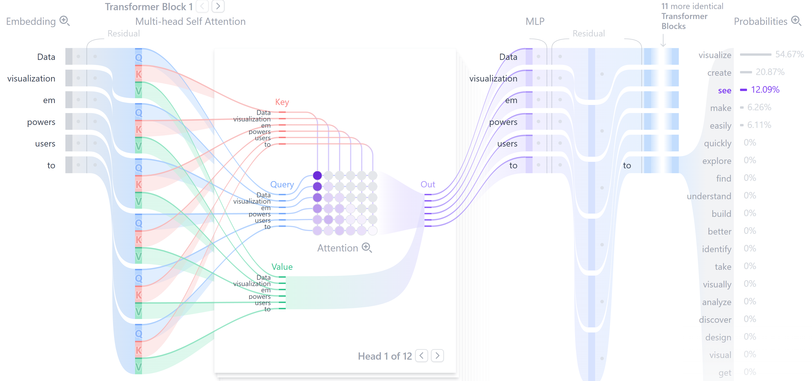<figcaption>Overview of Transformer</figcaption></figure>
<aside class="fta-callout fta-example">
Example 2

<strong>贯穿全章的例子：</strong>我们以<strong>机器翻译</strong>（English $\to$ 中文）为统一例子。具体来说，翻译句子

\[
\begin{aligned}
&amp;\text{EN: ``The cat sat on the mat because it was tired.&#x27;&#x27;}\\
&amp;\text{ZH: ``猫坐在垫子上，因为它累了.&#x27;&#x27;}
\end{aligned}
\]

代词"it"需要跨越6个 token 与"cat"建立联系——这正是长程依赖的核心难点。本章所有计算和说明都围绕这个翻译例子展开。

</aside>
<figure class="fta-table-figure"><figcaption>Transformer 与 Titans 的核心差异</figcaption>
<table class="fta-table"><tr><th>比较维度</th><th>Transformer</th><th>Titans</th></tr><tr><td>核心记忆形式</td><td>注意力窗口内的 Key--Value 表示，强调局部精确读取</td><td>可在线更新的神经长期记忆，强调远程历史压缩与召回</td></tr><tr><td>计算重点</td><td>在显式上下文中计算 token 与 token 的关系</td><td>在短窗口注意力之外，把重要历史写入记忆参数</td></tr><tr><td>长上下文瓶颈</td><td>注意力矩阵随序列长度呈 $O(T^2)$ 增长</td><td>用长期记忆缓解远程信息丢失，但引入更新稳定性问题</td></tr><tr><td>适合场景</td><td>短到中等上下文、局部依赖、精确 token 交互</td><td>长上下文、长链推理、需要跨段保持实体或事实的任务</td></tr></table>
</figure>
<aside class="fta-callout fta-summary">
Summary

第一，先把 Transformer 的标准流程讲清楚；第二，说明自注意力为什么在长上下文中遇到计算与记忆瓶颈；第三，用记忆视角引出 Titans 的长期神经记忆、测试时学习与三种架构。

</aside>
<h3 id="section-3">Transformer 的标准流程</h3>

Transformer 不能直接对自然语言字符串做矩阵乘法。文本进入模型需要三步：tokenization（切分为离散编号）、embedding（映射为连续向量）、位置编码（注入顺序信息）。三者合起来得到初始隐藏状态 $H^{(0)}\in\mathbb{R}^{n\times d}$。

<h4 id="section-4">Tokenization</h4>

设 tokenization 函数为

\[
\begin{aligned}
T_{\rm tok}: \text{string} \to (x_1, x_2, \dots, x_n), \quad x_i \in \mathcal{V}.
\end{aligned}
\](1.5)

常见方法为字节对编码（Byte Pair Encoding, BPE）。BPE 的核心思想是从字符级开始，反复合并最高频的相邻符号对，直到达到预设的词表大小。频繁出现的片段（如"ing"、"tion"）被合并成单个 token，稀有片段保持拆分。

Token 不等于中文词或英文单词。一个中文词可能是一个 token 也可能拆成多个；英文长词、公式名、代码变量也可能拆分。

<aside class="fta-callout fta-explanation">
Explanation: 为什么不直接按字切分？

按字符切分：词表小（如26字母+标点），但序列长度大，长距离依赖更难。按完整单词切分：序列短，但词表巨大（英语数十万词），且无法处理新词。BPE 折中：高频片段合并为 token，低频片段保持拆小——既控制词表大小，又能表示任意新词。

</aside>
<aside class="fta-callout fta-example">
Example 3

在我们的翻译例子中，英文句子 "The cat sat on the mat because it was tired." 经 BPE tokenization 后得到约10个 token。中文目标句 "猫坐在垫子上，因为它累了" 经 tokenization 后得到约6个 token（中文 token 化策略与英文不同）。注意：中英文的 token 数通常不相等，这与书写系统的信息密度差异有关。

</aside>
<h4 id="section-5">Embedding</h4>

设词表大小为 $V$，隐藏维度为 $d$。<strong>嵌入矩阵</strong>（Embedding Matrix）为

\[
\begin{aligned}
E_{\rm emb} \in \mathbb{R}^{V\times d}.
\end{aligned}
\](1.6)

$E_{\rm emb}$ 的第 $i$ 行是第 $i$ 个 token 的可学习向量表示。若第 $t$ 个 token 编号为 $x_t$，则其嵌入向量为

\[
\begin{aligned}
e_t = E_{\rm emb}[x_t] \in \mathbb{R}^d.
\end{aligned}
\](1.7)

这等价于用一个 one-hot 向量 $u_t\in\mathbb{R}^V$（第 $x_t$ 位为1，其余为0）左乘 $E_{\rm emb}$：$e_t = u_t^\top E_{\rm emb}$。

对长度为 $n$ 的序列，将所有 token 向量按行堆叠：

\[
\begin{aligned}
X = \begin{bmatrix} e_1, e_2, \dots, e_n \end{bmatrix}^\top \in \mathbb{R}^{n\times d}.
\end{aligned}
\](1.8)

$X$ 的每一行对应一个位置，每一列对应一个特征维度。

Embedding 的物理类比：把离散标签映射到连续相空间中的点。离散 token 本身无法做微分，但向量 $e_t$ 可以参与矩阵乘法和梯度更新。训练过程中，语义相近的 token 的嵌入向量往往在空间中靠近——这是训练目标（预测下一个 token）强加的结构，而非人为指定。

<aside class="fta-callout fta-example">
Example 4

在我们的翻译例子中，英文源句的10个 token 各自获得一个 $d$ 维嵌入向量。设 $d=4$（简化），token "cat"（第2个位置）的嵌入向量为：

\[
\begin{aligned}
e_2 = [0.3, 0.6, -0.4, 0.7].
\end{aligned}
\](1.9)

这个向量的每个维度没有单独的语义含义——它们是训练过程中自动学到的分布式表示。但训练完成后，"cat" 和语义相近的 "dog" 等动物名词往往在某些维度上有相似的激活模式。

</aside>
<h4 id="section-6">Positional Encoding</h4>

自注意力层主要由矩阵乘法和行归一化组成，其对输入行的置换是等变的（输入打乱，输出也跟着打乱）。如果只给模型一组 token 向量而不告诉顺序，模型无法区分"猫追狗"和"狗追猫"。因此需要位置编码。

<figure class="fta-figure">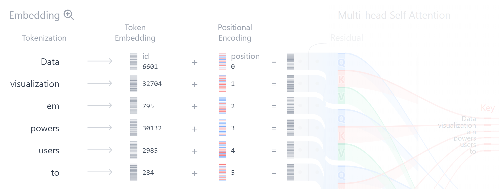<figcaption>Embedding</figcaption></figure>

令 $P\in\mathbb{R}^{n\times d}$ 为位置编码矩阵，第 $t$ 行 $P_t\in\mathbb{R}^d$ 表示第 $t$ 个位置的位置信息。初始隐藏状态为

\[
\begin{aligned}
H_t^{(0)} = e_t + P_t.
\end{aligned}
\](1.10)

经典 Transformer 使用正弦位置编码。对位置 $p$（从1开始计数）和维度索引 $i$（从0开始）：

\[
\begin{aligned}
P_{p,2i} = \sin\!\left(\frac{p}{10000^{2i/d}}\right),\quad
P_{p,2i+1} = \cos\!\left(\frac{p}{10000^{2i/d}}\right).
\end{aligned}
\](1.11)

其中 $\omega_i=10000^{-2i/d}$ 决定了第 $i$ 对的角频率——低频（$i$ 小）变化慢，编码大范围位置；高频（$i$ 大）变化快，编码局部位置差异。相对位移 $\Delta$ 对应一个二维旋转变换。对任意位置 $p$ 和位移 $\Delta$：

\[
\begin{aligned}
\sin(\omega_i(p+\Delta)) &amp;= \sin(\omega_i p)\cos(\omega_i \Delta) + \cos(\omega_i p)\sin(\omega_i \Delta),\\
\cos(\omega_i(p+\Delta)) &amp;= \cos(\omega_i p)\cos(\omega_i \Delta) - \sin(\omega_i p)\sin(\omega_i \Delta).
\end{aligned}
\](1.12)(1.13)

这意味着 $\text{PE}(p+\Delta)$ 可以通过一个仅依赖于 $\Delta$ 的旋转矩阵从 $\text{PE}(p)$ 线性变换得到。因此，模型可以从向量关系中推断相对距离——两个位置越远，它们编码之间的"角度"越大。

<aside class="fta-callout fta-example">
Example 5

在我们的翻译句子中，10个位置分别获得不同的位置编码。设 $d=8$，前两个频率维度：

<ul>
<li>$i=0$: $\omega_0 = 1$，波长 $= 2\pi$（高频，区分相邻 token）</li>
<li>$i=1$: $\omega_1 = 10000^{-2/8} = 10000^{-0.25} \approx 0.1$，波长 $\approx 62.8$（低频，区分大段位置）</li>
</ul>

因此，对于位置 $p$，位置编码的前四个分量可以写为

\[
\begin{aligned}
\bigl[
\sin(p),\,
\cos(p),\,
\sin(0.1 p),\,
\cos(0.1 p)
\bigr].
\end{aligned}
\](1.14)

在句子<code>The cat sat on the mat because it was tired</code>, 中， "cat" 位于位置 $p=2$，而 "it" 位于位置 $p=8$。二者的相对距离为 $\Delta = 6$, 高频分量可以帮助模型区分相邻的 token，例如 "cat" 和 "sat"；低频分量则可以让模型感知 "it" 与 "cat" 之间相隔了 6 个位置。具体地，在低频分量 $i=1$ 上，二者产生的相位差为

\[
\begin{aligned}
\omega_1 \Delta \approx 0.1 \times 6 = 0.6.
\end{aligned}
\](1.15)

虽然 "cat" 和 "it" 在序列中相隔较远，但它们的位置编码间仍然保留了可计算的相对位置信息。

在 Self-Attention 中，当模型计算$q_8^\top k_2$时， 来自位置 8 的 token "it"， 来自位置 2 的 token "cat"。由于二者的输入表示分别包含位置编码

\[
\begin{aligned}
H^{(0)}_8 = e_8 + P_8,
\quad
H^{(0)}_2 = e_2 + P_2,
\end{aligned}
\](1.16)

因此，位置编码使得模型既可以区分相邻的 "cat" 和 "sat"，也可以感知 "it" 与 "cat" 之间存在 6 个位置的距离。在计算点积注意力, 内积 $q_8 \cdot k_2$ $(q_8^\top k_2)$ 时，位置编码为注意力分数贡献了额外的相对位置信息，并与 token 的语义信息叠加在一起，两者一起比较。

</aside>
<aside class="fta-callout fta-summary">
Summary

文本进入 Transformer 的三步预处理：Tokenization 将字符串切分为离散编号；Embedding 将编号映射为连续向量；位置编码将顺序信息叠加到向量上。三者合起来得到初始隐藏状态 $H^{(0)}$。

</aside>
<h4 id="section-7">Self-Attention</h4>
<figure class="fta-figure">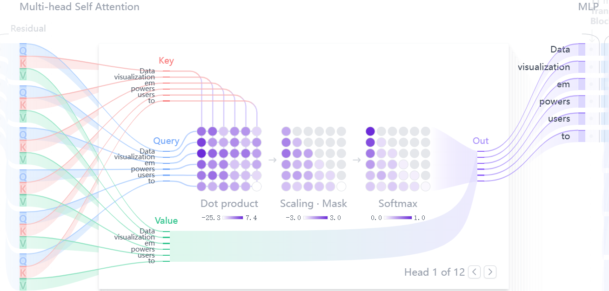<figcaption>Self-Attention</figcaption></figure>
<h5 id="pdf-query-key-value">Query、Key、Value 的严格定义</h5>

设输入隐藏状态为

\[
\begin{aligned}
H = \begin{bmatrix} h_1, h_2, \dots, h_n \end{bmatrix}^\top \in \mathbb{R}^{n\times d}.
\end{aligned}
\](1.17)

其中 $h_i\in\mathbb{R}^d$ 是第 $i$ 个 token 位置的表示向量。自注意力为每个位置构造三个角色，通过三个可训练的权重矩阵实现：

\[
\begin{aligned}
Q = HW_Q \in \mathbb{R}^{n\times d_k}, \quad
K = HW_K \in \mathbb{R}^{n\times d_k}, \quad
V = HW_V \in \mathbb{R}^{n\times d_v}.
\end{aligned}
\](1.18)

其中 $W_Q, W_K \in \mathbb{R}^{d\times d_k}$，$W_V \in \mathbb{R}^{d\times d_v}$。

每个 token 位置的三个向量含义如下：

<ul>
<li>$q_t$（Query，第 $t$ 行）："我在寻找什么信息？"</li>
<li>$k_t$（Key，第 $t$ 行）："我有什么标签/索引？"</li>
<li>$v_t$（Value，第 $t$ 行）："如果被关注，我提供什么内容？"</li>
</ul>
<h5 id="pdf-scaled-dot-product">缩放点积注意力的完整推导</h5>

注意力机制的核心计算是：用 Query 与所有 Key 做内积来度量"匹配程度"，然后按匹配程度对 Value 做加权平均。

<strong>第一步——计算注意力打分矩阵：</strong>

\[
\begin{aligned}
S = \frac{QK^\top}{\sqrt{d_k}} \in \mathbb{R}^{n\times n}, \quad
S_{ij} = \frac{q_i \cdot k_j}{\sqrt{d_k}}.
\end{aligned}
\](1.19)

$S_{ij}$ 表示第 $i$ 个位置对第 $j$ 个位置的"匹配程度"。$S_{ij}$ 大则第 $i$ 个位置倾向于关注第 $j$ 个位置。

<strong>第二步——Softmax 行归一化：</strong>

\[
\begin{aligned}
A_{ij} = \frac{\exp(S_{ij})}{\sum_{r=1}^{n}\exp(S_{ir})}, \quad
\sum_{j=1}^{n} A_{ij} = 1.
\end{aligned}
\](1.20)

$A_{ij}$ 的含义是：在计算第 $i$ 个位置的输出时，给第 $j$ 个位置的 Value 分配多少权重。$A$ 的每一行都是一个概率分布。

<strong>第三步——加权求和输出：</strong>

\[
\begin{aligned}
O = A V \in \mathbb{R}^{n\times d_v}, \quad
o_i = \sum_{j=1}^{n} A_{ij} v_j.
\end{aligned}
\](1.21)

$O_i$表示第$j$个位置得到的权重与对应结果的匹配，权重高则内容被凸显，权重低则内容关注度低。

<aside class="fta-callout fta-explanation">
Explanation: 条件期望解释

若把 $A_{i\cdot}$ 视为在位置索引集合 $\{1,\dots,n\}$ 上的概率分布，那么输出就是条件期望：

\[
\begin{aligned}
o_i = \mathbb{E}_{j\sim A_{i\cdot}}[v_j].
\end{aligned}
\](1.22)

因此，自注意力本质上是在做一种<strong>数据依赖的条件平均</strong>：根据当前 query 的内容，动态决定从哪些位置"读取"信息以及读多少。

</aside>
<aside class="fta-callout fta-example">
Example 6

例子中，设 $d_k=4$，计算 "it"（第8个 token）对 "cat"（第2个 token）的注意力权重。设：

\[
\begin{aligned}
q_8 = [0.3, 0.9, -0.2, 0.1], \quad
k_2 = [0.4, 0.8, -0.1, 0.2],
\quad
k_8=[0.1, -0.2, 0.3, -0.4].
\end{aligned}
\](1.23)

点积 $q_8\cdot k_2 = 0.88$，缩放后 $S_{8,2} = 0.88/2 = 0.44$。

而 $q_8$ 与自身位置8的 key 的点积为 $q_9\cdot k_8=-0.25$，缩放后 $S_{8,8} = -0.125$。

这说明经过 softmax 后，"it" 会对远处的 "cat" 分配较高的注意力权重，而对自身分配较低的权重——这正是跨语言代词消解所需的行为。

</aside>
<aside class="fta-callout fta-explanation">
Explanation: 为什么要除以 $\sqrt{d_k}$：完整的概率论推导

这是 Transformer 原论文最著名但常被轻描淡写的细节。我们给出完整的逐步推导。

<strong>假设条件：</strong> Query 向量 $q$ 和 Key 向量 $k$ 的各分量相互独立，各分量都经过适当初始化，使得

\[
\begin{aligned}
\mathbb{E}[q_\alpha] = \mathbb{E}[k_\alpha] = 0, \quad
\mathrm{Var}(q_\alpha) = \mathrm{Var}(k_\alpha) = 1, \quad \alpha=1,\dots,d_k.
\end{aligned}
\](1.24)

这是合理的假设，因为层归一化和合适的权重初始化可以近似满足这些条件。

<strong>点积的均值：</strong>考虑到独立性：$\mathbb{E}[q_\alpha k_\alpha] = \mathbb{E}[q_\alpha]\mathbb{E}[k_\alpha] = 0 \cdot 0 = 0$

\[
\begin{aligned}
\mathbb{E}[q\cdot k] = \mathbb{E}\!\left[\sum_{\alpha=1}^{d_k} q_\alpha k_\alpha\right]
= \sum_{\alpha=1}^{d_k} \mathbb{E}[q_\alpha]\mathbb{E}[k_\alpha] = 0.
\end{aligned}
\](1.25)

<strong>点积的方差：</strong> 首先计算每一项 $q_\alpha k_\alpha$ 的方差。因为均值为0，

\[
\begin{aligned}
\mathrm{Var}(q_\alpha k_\alpha) = \mathbb{E}[q_\alpha^2 k_\alpha^2] - \mathbb{E}[q_\alpha k_\alpha]^2.
\end{aligned}
\](1.26)

由独立性 $\mathbb{E}[q_\alpha^2 k_\alpha^2] = \mathbb{E}[q_\alpha^2]\mathbb{E}[k_\alpha^2]$，又因为 $\mathrm{Var}(q_\alpha)=1$ 所以 $\mathbb{E}[q_\alpha^2]=1$，同理 $\mathbb{E}[k_\alpha^2]=1$。因此

\[
\begin{aligned}
\mathbb{E}[q_\alpha^2 k_\alpha^2] = 1 \cdot 1 = 1,\quad
\mathbb{E}[q_\alpha k_\alpha] = 0 \cdot 0 = 0.
\end{aligned}
\](1.27)

于是 $\mathrm{Var}(q_\alpha k_\alpha) = 1 - 0 = 1$。

考虑到$\mathrm{Var}(cX)=c^2\mathrm{Var}(X)$；因为不同分量相互独立，独立随机变量之和的方差等于方差之和：

\[
\begin{aligned}
\mathrm{Var}(q\cdot k) = \sum_{\alpha=1}^{d_k} \mathrm{Var}(q_\alpha k_\alpha) = d_k.
\end{aligned}
\](1.28)

<strong>结论：</strong> 点积 $q\cdot k$ 的标准差为 $\sqrt{d_k}$。若 $d_k=64$，点积的典型值为 $0 \pm 8$ 左右；若 $d_k=1024$，典型值就是 $0 \pm 32$。不做缩放的话，softmax 的输入绝对值会随 $d_k$ 增大而增大，导致 softmax 输出趋近于 one-hot（最大值位置概率接近1，其余接近0）。

当 softmax 输出接近 one-hot 时，其雅可比矩阵接近零矩阵（因为方差接近0），梯度几乎为零——这就是<strong>梯度消失</strong>。除以 $\sqrt{d_k}$ 将方差拉回到 $O(1)$：

\[
\begin{aligned}
\mathrm{Var}\!\left(\frac{q\cdot k}{\sqrt{d_k}}\right) = \frac{d_k}{d_k} = 1.
\end{aligned}
\](1.29)

</aside>
<aside class="fta-callout fta-explanation">
Explanation: 统计物理类比

这对应在不同维度下保持"有效温度"不变。若不缩放，$d_k$ 增大相当于温度降低，系统冻结到少数状态；$1/\sqrt{d_k}$ 即在不同 $d_k$ 下保持同一温度尺度，使 softmax 的"熵"在不同维度下可比。

</aside>
<h5 id="pdf-causal-mask">因果掩码：自回归生成中的 Self-Attention 约束</h5>

自回归模型预测 $x_t$ 时只能使用 $x_{&lt;t}$。在 Transformer 中通过<strong>因果掩码</strong>（Causal Mask）实现。定义掩码矩阵 $M\in\mathbb{R}^{n\times n}$：

\[
\begin{aligned}
M_{ij} = \begin{cases}
0, &amp; j \le i,\\
-\infty, &amp; j &gt; i.
\end{cases}
\end{aligned}
\](1.30)

带掩码的注意力为

\[
\begin{aligned}
A = \operatorname{softmax}\!\left(\frac{QK^\top}{\sqrt{d_k}} + M\right).
\end{aligned}
\](1.31)

当 $j&gt;i$ 时，$S_{ij}+M_{ij} = S_{ij} - \infty = -\infty$，因此 $\exp(-\infty)=0$，$A_{ij}=0$。第 $i$ 个位置的输出 $o_i = \sum_{j=1}^{i} A_{ij} v_j$ 只依赖当前及过去位置。

<aside class="fta-callout fta-example">
Example 7

在我们的翻译任务中，当模型生成中文输出序列时，因果掩码确保生成第 $t$ 个中文 token 时只能看到已生成的前 $t-1$ 个 token 和完整的英文源句（源句作为编码器的输出不受掩码限制，只有解码器的自注意力需要掩码）。

</aside>
<h4 id="section-8">Multi-Head Attention</h4>

单个注意力头只能在一个表示子空间中计算相似度。多头注意力（Multi-Head Attention, MHA）使用 $H$ 个并行的注意力头，每个头有自己的投影矩阵。第 $r$ 个头计算：

\[
\begin{aligned}
\text{head}^{(r)} = \Attn\!\left(HW_Q^{(r)},\, HW_K^{(r)},\, HW_V^{(r)}\right),
\end{aligned}
\](1.32)

其中 $W_Q^{(r)}, W_K^{(r)} \in \mathbb{R}^{d\times d_k}$，$W_V^{(r)} \in \mathbb{R}^{d\times d_v}$，通常取 $d_k = d_v = d / H$。

随后将所有头的输出沿最后一个维度拼接，经过一个线性变换 $W_O \in \mathbb{R}^{H d_v \times d}$ 映射回原始维度：

\[
\begin{aligned}
\operatorname{MHA}(H) = [\text{head}^{(1)}; \text{head}^{(2)}; \cdots; \text{head}^{(H)}]\,W_O.
\end{aligned}
\](1.33)

在线性代数上，每个头定义了一个双线性型：

\[
\begin{aligned}
\langle h_i, h_j \rangle_r
=\left(h_i^\top W_Q^{(r)}\right)\left(h_j^\top W_k^{(r)}\right)^\top
= h_i^\top W_Q^{(r)} \left(W_K^{(r)}\right)^\top h_j.
\end{aligned}
\](1.34)

不同头学习不同的双线性几何——一个头可能关注局部语法搭配，另一个关注长距离指代，第三个关注语义相似性。

<figure class="fta-figure" style="--fta-figure-width: 511px">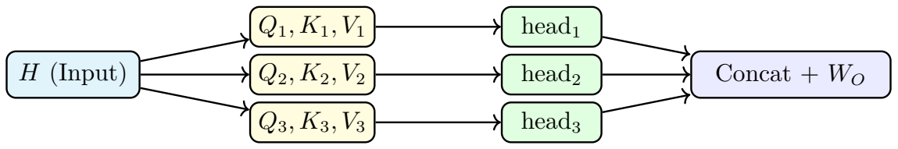<figcaption>多头注意力：输入 $H$ 被投影到多个子空间，各头独立计算注意力后再拼接。</figcaption></figure>
<aside class="fta-callout fta-example">
Example 8

在句子<code>The cat sat on the mat because it was tired</code>， "cat" 在位置 2，"it" 在位置 8。

当模型处理 "it" 时，一个注意力头可能主要关注位置 2 的 "cat"，用于判断代词 "it" 的指代对象；另一个注意力头可能关注位置 10 的 "tired"，用于理解 "it was tired" 这一状态描述；还有一些注意力头可能关注 "sat"、"mat" 等局部上下文信息。

因此，多头注意力并不是简单重复同一个注意力计算，而是通过不同的投影矩阵

\[\nW_Q^{(h)},\quad W_K^{(h)},\quad W_V^{(h)}\n\]

在不同表示子空间中计算注意力。不同 head 可以捕捉不同类型的关系，例如指代关系、主谓关系、局部短语关系和语义状态关系。

</aside>
<h4 id="section-9">FFN / Residual / LayerNorm</h4>

每个 Transformer 层除了注意力还包含<strong>前馈网络</strong>（Feed-Forward Network, FFN），也叫<strong>多层感知机</strong>（Multi-Layer Perceptron，MLP）：

\[
\begin{aligned}
\operatorname{FFN}(u) = W_2\,\sigma(W_1 u + b_1) + b_2,
\end{aligned}
\](1.35)

其中 $W_1\in\mathbb{R}^{d_{\rm ff}\times d}$，$W_2\in\mathbb{R}^{d\times d_{\rm ff}}$，$\sigma$ 是非线性激活函数（如 ReLU 或 GELU）。注意力负责位置间信息混合，FFN 负责每个位置内部的独立的非线性变换。

<figure class="fta-figure">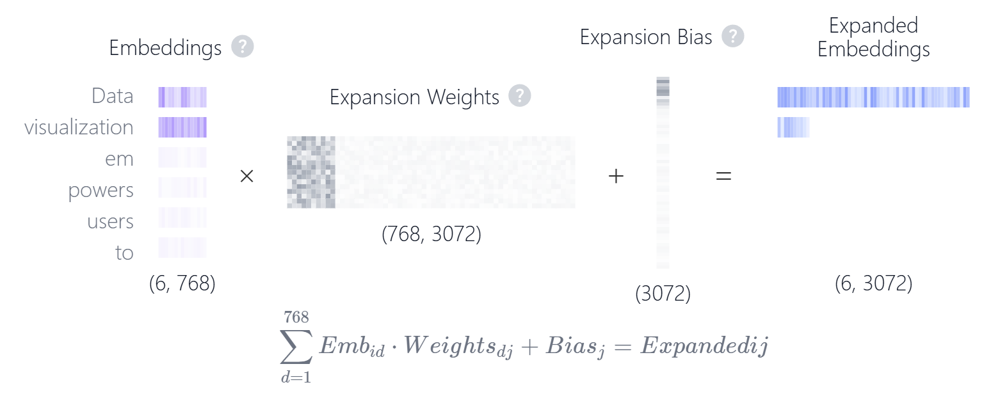<figcaption>Multi-Layer Perception</figcaption></figure>

<strong>残差连接</strong>和<strong>层归一化</strong>（Residual和Layer Normalization）确保深层网络可训练。

残差连接的思想是：与其让每一层"从头学习"输入到输出的完整映射，不如让它只学习"与输入的差异"（即残差 $\text{MHA}(H)=\text{Result}(H)-H$），让网络每一层只学习“要补充或修改什么”，而不是从零重建整个表示。这样梯度可以通过恒等路径直通浅层，避免深层网络因连续求导导致的梯度消失。

Residual 的核心操作是：输出=原输入+新计算出来的变化量。原来的表示是$H$, 多头注意力计算出的新信息是$\text{MHA}(H)$, 所以有$R(H)=H+\text{MHA}(H)$. 防止深层网络中数值越来越大、越来越小或分布漂移，使训练更稳定，还需要把每个 token 的向量$u=(u_1,u_2,\dots,u_d)$重新调整到稳定的数值范围$\mathrm{LayerNorm}(u)=\gamma\frac{u-\mu}{\sqrt{\sigma^2+\epsilon}}+\beta$。其中 $\mu$ 是这个向量内部各维度的均值，$\sigma^2$ 是方差，$\gamma,\beta$ 是可学习参数。直观来说，LayerNorm把这个 token 向量的均值拉到接近 $0$；把方差拉到稳定范围；再用可学习参数 $\gamma,\beta$ 允许模型自己决定最终尺度。所以有

\[
\begin{aligned}
H&#x27; = \operatorname{LayerNorm}(H + \operatorname{MHA}(H))
\end{aligned}
\](1.36)

在用MHA经过层归一化之后，FFN 对每个 token 又单独做非线性加工，所以需要再归一化一次

\[
\begin{aligned}
H&#x27;&#x27;= \operatorname{LayerNorm}(H&#x27; + \operatorname{FFN}(H&#x27;))
\end{aligned}
\](1.37)

<aside class="fta-callout fta-example">
Example 9

考虑翻译句子<code>The cat sat on the mat because it was tired</code>，共10个token。设某一层 Transformer 的输入隐状态为 $H\in\mathbb{R}^{10\times d}$，其中第 $t$ 行 $H_t\in\mathbb{R}^d$ 表示第 $t$ 个 token 的当前表示。

在多头自注意力层中，对于位置 $8$ 的 `it" ，某个注意力头可能让 `it" 吸收 `cat" 的信息，另一个头可能关注 “tired”，还有头关注 “because” 或 “mat”。多头注意力的输出记为 $\mathrm{MHA}(H)$，则对位置 $8$ 而言，第一次残差连接和层归一化为

\[
\begin{aligned}
H&#x27;_8 = \mathrm{LayerNorm}\bigl(H_8+\mathrm{MHA}(H)_8\bigr)
\end{aligned}
\](1.38)

其中 $H$保留了 `it" 自身的原始信息，而MHA$(H)$则包含从其他位置聚合来的上下文信息。因此，残差连接使得模型不是完全用注意力输出替换原表示，而是在原有表示基础上补充上下文信息。

对于位置 $8$ 的 `it"，FFN处理的是已经融合上下文后的向量 $H&#x27;_8$：

\[
\begin{aligned}
\mathrm{FFN}(H&#x27;_8) = W_2\sigma(W_1H&#x27;_8+b_1)+b_2.
\end{aligned}
\](1.39)

模型根据 `it" 已经获得的上下文信息，FFN进一步提取更高层的语义特征，例如 `it" 是一个代词、它可能指代 `cat"，并且 "tired" 描述的是这个被指代对象的状态。

最后，再进行一次残差连接和层归一化。对位置 $8$ 而言

\[
\begin{aligned}
H&#x27;&#x27;_8 = \mathrm{LayerNorm}\bigl(H&#x27;_8+\mathrm{FFN}(H&#x27;_8)\bigr).
\end{aligned}
\](1.40)

因此，经过一个完整的 Transformer 层后，`it" 的表示不仅保留了自身作为代词的信息，还融合了 `cat" 的指代信息、`because" 的因果结构信息以及 `tired" 的状态信息。这使得模型在翻译时更可能生成<code>这只猫坐在垫子上，因为它累了。</code> 而不是错误地把 `it" 理解为 `mat"。

这个例子体现了三者的分工：$\mathrm{MHA}$ 负责让不同 token 之间交换信息，$\mathrm{FFN}$ 负责对每个 token 的表示进行非线性加工，残差连接保留原有信息并帮助梯度传播，$\mathrm{LayerNorm}$ 则稳定每一层的数值分布，使深层 Transformer 更容易训练。

</aside>
<aside class="fta-callout fta-summary">
Summary

Transformer 层的完整结构：

\[
\begin{aligned}
H\to\mathrm{MHA}\to
\mathrm{Residual+LayerNorm}
\to\mathrm{FFN}
\to\mathrm{Residual+LayerNorm}
\to H&#x27;&#x27;
\end{aligned}
\](1.41)

然后H"进入下一层。注意力是位置间耦合，因果掩码防止信息从未来泄露，FFN 是位置内非线性，残差和归一化让深层网络可训练。

</aside>
<h4 id="section-10">Probability：从隐藏状态到下一个 token</h4>

经过多层 Transformer block 之后，模型得到当前位置的隐藏向量。对于生成任务，最后一层 Decoder 在第 $t$ 个位置输出隐藏向量 $h_t \in \mathbb{R}^{d}$。为了生成下一个 token，模型先通过一个线性输出层把隐藏向量映射到词表大小的 logit 向量：

\[
\begin{aligned}
z_t = W_{\mathrm{out}} h_t + b_{\mathrm{out}},
\quad z_t \in \mathbb{R}^{V}.
\end{aligned}
\](1.42)

其中 $V$ 是词表大小，$z_{t,j}$ 表示第 $j$ 个候选 token 的原始打分。Logit 本身不是概率，它可以为正、为负，也不要求所有分量之和为 $1$。为了把这些原始分数转化为概率分布，需要使用 softmax。

<figure class="fta-figure">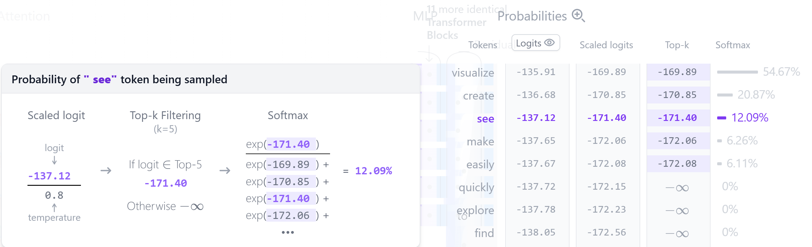<figcaption>Decoder</figcaption></figure>

Softmax 的作用是把一组任意实数logit转化为非负且总和为 $1$ 的概率分布。对于第 $t$ 个生成位置,若不使用额外采样策略，则直接对原始 logits $z_t$ 做归一化：

\[
\begin{aligned}
p_{t,j}
=
P_{\theta}(x_t=j\mid x_{&lt;t})
=
\frac{\exp(z_{t,j})}{\sum_{k=1}^{V}\exp(z_{t,k})},
\quad
\sum_{j=1}^{V}p_{t,j}=1.
\end{aligned}
\](1.43)

这里 $p_{t,j}$ 表示模型认为第 $t$ 个 token 取词表中第 $j$ 个候选 token 的概率。Logit 越大，经过指数函数和归一化之后，对应 token 的概率通常越大。

在实际解码时，模型通常会先对 logits 做温度缩放、Top-k 或 Top-p 过滤等不同策略，得到处理后的 logits $\tilde z_t$，再进行 softmax：

\[
\begin{aligned}
p_{t,j}=\frac{\exp(\tilde z_{t,j})}{\sum_{k=1}^{V}\exp(\tilde z_{t,k})}
\end{aligned}
\](1.44)

<ol>
<li>贪心解码</li>

贪心解码是最直接的解码方法：每一步都选择概率最大的 token。若当前位置的概率分布为 $p_t$，则输出 token 为：

\[
\begin{aligned}
x_t=\arg\max_{j\in\{1,\ldots,V\}} p_{t,j}
=\arg\max_{j\in\{1,\ldots,V\}} z_{t,j}.
\end{aligned}
\](1.45)

第二个等号成立是因为 softmax 不改变 logit 的大小顺序。也就是说，概率最大的 token 与 logit 最大的 token 是同一个。

贪心解码的优点是稳定、确定、速度快；缺点是过于保守。由于每一步都只选当前最优 token，它可能错过整体上更自然或更多样的句子。

<li>温度采样</li>

温度采样在 softmax 之前对 logit 做缩放：

\[
\begin{aligned}
p_{t,j}(\tau)
=\frac{\exp(z_{t,j}/\tau)}
{\sum_{k=1}^{V}\exp(z_{t,k}/\tau)},
\quad \tau&gt;0.
\end{aligned}
\](1.46)

其中 $\tau$ 是温度参数。若 $\tau&lt;1$，则不同 logit 之间的差距被放大，概率分布更尖锐，模型更倾向于选择高分 token；若 $\tau&gt;1$，则 logit 差距被压缩，概率分布更平坦，低分 token 也有更多机会被采样。

因此，温度控制的是生成的随机性：

\[
\begin{aligned}
\tau \downarrow \quad &amp;\Rightarrow \quad \text{分布更尖锐，输出更确定},\\
\tau \uparrow \quad &amp;\Rightarrow \quad \text{分布更平坦，输出更多样}.
\end{aligned}
\](1.47)(1.48)

当 $\tau \to 0$ 时，温度采样趋近于贪心解码；当 $\tau$ 较大时，模型会产生更多随机性，但也更容易生成不稳定或不合适的 token。

<li>Top-k 采样</li>

Top-k 采样先保留 logit 最高的 $k$ 个候选 token，其余 token 的 logit 设为 $-\infty$，然后再做 softmax。设 $\mathcal{K}_t$ 表示当前位置 logit 最大的 $k$ 个 token 的集合，则：

\[
\begin{aligned}
\tilde{z}_{t,j}
=
\begin{cases}
z_{t,j}, &amp; j\in \mathcal{K}_t,\\
-\infty, &amp; j\notin \mathcal{K}_t,
\end{cases}
\quad
p_{t,j}^{\mathrm{top}\text{-}k}
=
\frac{\exp(\tilde{z}_{t,j})}
{\sum_{r=1}^{V}\exp(\tilde{z}_{t,r})}.
\end{aligned}
\](1.49)

因为 $\exp(-\infty)=0$，所以不在 Top-k 集合中的 token 概率为 $0$。Top-k 的作用是限制采样范围，避免从大量低概率 token 中采到不合理结果。

例如图中的情形可以理解为：只保留前 $5$ 个候选 token，其余 token 的 logit 被设为 $-\infty$，最后 softmax 只在这 $5$ 个候选上重新分配概率。

<li>Top-p 采样</li>

Top-p 采样也叫 nucleus sampling。它不是固定保留 $k$ 个 token，而是按照概率从高到低排序，选择最小的候选集合，使这些 token 的累计概率至少达到 $p$。

设排序后的 token 索引为 $j_1,j_2,\ldots,j_V$，满足$p_{t,j_1}\ge p_{t,j_2}\ge \cdots \ge p_{t,j_V}$. Top-p 选择最小的 $m$，使：

\[
\begin{aligned}
\sum_{\ell=1}^{m}p_{t,j_{\ell}}\ge p.
\end{aligned}
\](1.50)

于是候选集合为：$\mathcal{P}_t=\{j_1,j_2,\ldots,j_m\}$. 然后与 Top-k 类似，只在 $\mathcal{P}_t$ 中重新归一化并采样。

Top-p 的优点是候选集合大小会自动变化。若模型非常确定，少数几个 token 的累计概率就能超过 $p$；若模型不确定，则会保留更多候选 token。因此 Top-p 通常比固定 Top-k 更灵活。

</ol>
<aside class="fta-callout fta-example">
Example 10

翻译例子：<code>``The cat sat on the mat because it was tired.&#x27;&#x27;</code>

目标输出可以是：<code>``猫坐在垫子上，因为它累了。&#x27;&#x27;</code>

Encoder 先读取完整英文句子，并形成上下文化表示。Decoder 在生成中文时是自回归的：它已经生成了前缀 "猫坐在垫子上，因为"，现在需要预测下一个中文 token。此时 Decoder 的最后一层输出隐藏向量 $h_t$，再通过输出层得到 logit：

\[
\begin{aligned}
z_t = W_{\mathrm{out}}h_t+b_{\mathrm{out}}.
\end{aligned}
\](1.51)

假设几个候选 token 的 logit 大致为：

\[
\begin{aligned}
z(\text{``它&#x27;&#x27;})=5.2,\quad
z(\text{``垫子&#x27;&#x27;})=3.1,\quad
z(\text{``猫&#x27;&#x27;})=2.8,\quad
z(\text{``很&#x27;&#x27;})=1.4.
\end{aligned}
\](1.52)

经过 softmax 后，"它" 的概率最大。这是因为前面的 Transformer 层已经通过 attention 让英文中的 "it" 关注到 "cat"，并且结合中文前缀 "因为" 判断下一个 token 很可能是代词 "它"。

如果使用贪心解码，模型会直接选择：

\[
\begin{aligned}
x_t=\arg\max_j p_{t,j}=\text{``它&#x27;&#x27;}.
\end{aligned}
\](1.53)

如果使用温度采样，当 $\tau&lt;1$ 时，"它" 的优势会被进一步放大，模型几乎一定生成 "它"；当 $\tau&gt;1$ 时，"猫" 或其他候选 token 的概率会相对上升，生成结果会更随机。

如果使用 Top-k，且 $k=3$，模型只会在 "它"、"垫子"、"猫" 这三个高分候选中重新归一化并采样，低分 token 直接被排除。

如果使用 Top-p，且 $p=0.9$，模型会从概率最高的 token 开始累加，直到累计概率超过 $0.9$。如果 "它" 和 "猫" 已经贡献了大部分概率，那么其他低概率 token 就不会进入采样集合。

因此，在这个翻译例子中，softmax 给出候选 token 的概率分布，而贪心解码、温度采样、Top-k 和 Top-p 决定模型最终如何从这些概率中选出下一个中文 token。

</aside>
<aside class="fta-callout fta-summary">
Summary

Softmax 负责把 logit 转化为概率分布；贪心解码直接选择概率最大的 token；温度采样通过 $\tau$ 控制分布的尖锐或平坦；Top-k 只保留概率最高的 $k$ 个候选；Top-p 保留累计概率达到阈值 $p$ 的最小候选集合。它们共同决定了模型从概率分布到实际输出 token 的方式。

</aside>
<h4 id="section-11">Encoder 与 Decoder：原始 Transformer 的两种模块</h4>

前面介绍的 tokenization、embedding、位置编码、self-attention、multi-head attention、FFN、残差连接和 LayerNorm，是原本 Transformer 的基本组成部分，可以分成两类：

<ul>
<li><strong>Encoder</strong>：负责把输入序列编码成上下文化表示；</li>
<li><strong>Decoder</strong>：负责在已有输出前缀的条件下逐步生成目标序列。</li>
</ul>

设源序列为 $x=(x_1,\dots,x_n)$，目标序列为 $y=(y_1,\dots,y_m)$。 Transformer 建模的是条件生成问题：

\[
\begin{aligned}
P(y|x) = \prod_{t=1}^{m} P(y_t \mid y_{&lt;t},x).
\end{aligned}
\](1.54)

其中，Encoder 负责处理完整输入 $x$，Decoder 负责根据已经生成的目标前缀 $y_{&lt;t}$ 和 Encoder 输出，预测下一个目标 token $y_t$。

<h5 id="pdf-encoder-context-representation">Encoder：把输入序列编码成上下文表示</h5>

源序列经过 tokenization、embedding 和位置编码后，得到初始隐藏状态：

\[
\begin{aligned}
H_{\rm enc}^{(0)} \in \mathbb{R}^{n\times d}.
\end{aligned}
\](1.55)

Encoder 的每一层主要包含两个部分：

<ul>
<li><strong>双向 self-attention</strong>：输入序列中的每个 token 都可以关注同一序列中的所有 token；</li>
<li><strong>FFN、残差连接和 LayerNorm</strong>：对每个位置的表示做非线性变换并稳定训练。</li>
</ul>

第 $\ell$ 层 Encoder 可以写成：

\[
\begin{aligned}
\widetilde{H}_{\rm enc}^{(\ell)}&amp; = \operatorname{LayerNorm}\!\left(H_{\rm enc}^{(\ell-1)}+\operatorname{MHA}\!\left(H_{\rm enc}^{(\ell-1)}\right)\right),\\
H_{\rm enc}^{(\ell)} &amp;= \operatorname{LayerNorm}\!\left(\widetilde{H}_{\rm enc}^{(\ell)}+\operatorname{FFN}\!\left(\widetilde{H}_{\rm enc}^{(\ell)}\right)\right).
\end{aligned}
\](1.56)(1.57)

经过 $L_{\rm enc}$ 层后，得到 Encoder 的最终输出：

\[
\begin{aligned}
Z = H_{\rm enc}^{(L_{\rm enc})} \in \mathbb{R}^{n\times d}.
\end{aligned}
\](1.58)

这里的 $Z$ 可以理解为输入序列 $x$ 的上下文化表示。$Z$ 的每一行仍然对应源序列中的一个 token，但每个位置已经融合了整句输入的信息。

<h5 id="pdf-decoder-conditional-generation">Decoder：在条件上下文下逐步生成输出</h5>

Decoder 的输入是目标序列的前缀。生成第 $t$ 个 token 时，Decoder 只能看到已经生成的 $y_{&lt;t}$，不能看到未来的 $y_t,y_{t+1},\dots$。

目标前缀经过 embedding 和位置编码后得到：

\[
\begin{aligned}
H_{\rm dec}^{(0)} \in \mathbb{R}^{t\times d}.
\end{aligned}
\](1.59)

Decoder 的每一层包含三部分：

<ul>
<li><strong>因果 self-attention</strong>：只允许当前位置关注过去位置；</li>
<li><strong>cross-attention</strong>：用 Decoder 当前表示作为 Query，读取 Encoder 输出 $Z$；</li>
<li><strong>FFN、残差连接和 LayerNorm</strong>：进一步加工每个位置的表示。</li>
</ul>

第 $\ell$ 层 Decoder 可以写成：

\[
\begin{aligned}
\widetilde{H}_{\rm dec}^{(\ell)} &amp;= \operatorname{LayerNorm}\!\left(H_{\rm dec}^{(\ell-1)}+\operatorname{MHA}_{\rm causal}\!\left(H_{\rm dec}^{(\ell-1)}\right)\right),\\
\widehat{H}_{\rm dec}^{(\ell)}&amp; = \operatorname{LayerNorm}\!\left(\widetilde{H}_{\rm dec}^{(\ell)}+\operatorname{CrossAttn}\!\left(\widetilde{H}_{\rm dec}^{(\ell)},Z\right)\right),\\
H_{\rm dec}^{(\ell)} &amp;= \operatorname{LayerNorm}\!\left(\widehat{H}_{\rm dec}^{(\ell)}+\operatorname{FFN}\!\left(\widehat{H}_{\rm dec}^{(\ell)}\right)\right).
\end{aligned}
\](1.60)(1.61)(1.62)

最后，Decoder 输出位置 $t$ 的隐藏向量 $h_t$，并通过线性层和 softmax 得到下一个 token 的概率：

\[
\begin{aligned}
p_t = \operatorname{softmax}(W_{\rm out}h_t).
\end{aligned}
\](1.63)

因此，下一个 token 的条件概率可以写成：

\[
\begin{aligned}
P(y_t \mid y_{&lt;t},x) = p_t[y_t].
\end{aligned}
\](1.64)

<aside class="fta-callout fta-explanation">
Explanation: Cross-Attention 的具体含义

在 Decoder 的 cross-attention 中，Query 来自 Decoder 当前状态，Key 和 Value 来自 Encoder 输出 $Z$。因此可以写成：

\[
\begin{aligned}
Q_{\rm dec} = \widetilde{H}_{\rm dec}^{(\ell)}W_Q,\quad K_{\rm enc}=ZW_K,\quad V_{\rm enc}=ZW_V.
\end{aligned}
\](1.65)

对应的 cross-attention 为：

\[
\begin{aligned}
\operatorname{CrossAttn}\!\left(\widetilde{H}_{\rm dec}^{(\ell)},Z\right) = \operatorname{softmax}\!\left(\frac{Q_{\rm dec}K_{\rm enc}^{\top}}{\sqrt{d_k}}\right)V_{\rm enc}.
\end{aligned}
\](1.66)

这说明，Decoder 在生成目标 token 时，并不是只看目标前缀 $y_{&lt;t}$，还会通过 cross-attention 动态读取源序列表示 $Z$。

因此，Decoder 有两种注意力：

<ul>
<li>因果 self-attention 负责“看已经生成的目标前缀”；</li>
<li>cross-attention 负责“看 Encoder 对源序列的编码结果”。</li>
</ul>
</aside>
<figure class="fta-figure" style="--fta-figure-width: 420px">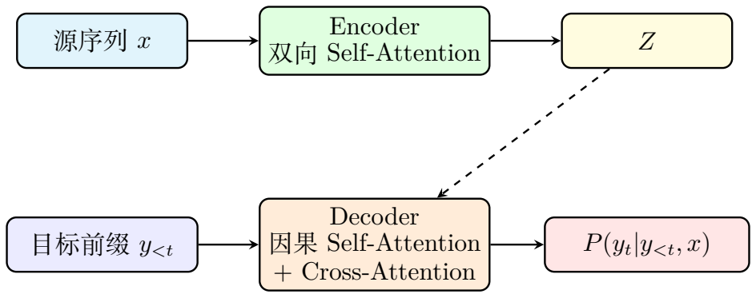<figcaption>原始 Transformer 的 Encoder--Decoder 流程：Encoder 编码源序列，Decoder 结合目标前缀和 Encoder 输出逐步生成目标 token。</figcaption></figure>
<aside class="fta-callout fta-example">
Example 11

在本文的翻译例子中，源句为："<code>The cat sat on the mat because it was tired.</code>" 目标句可以是：<code>“猫坐在垫子上，因为它累了。”</code>

Encoder 读取完整英文句子后，得到上下文化表示 $Z$。当 Decoder 生成中文中的“它”时：

<ul>
<li>因果 self-attention 只能看到已经生成的中文前缀，例如“猫 坐 在 垫子 上 ， 因为”；</li>
<li>cross-attention 可以读取英文源句的编码结果 $Z$，从而关注英文中的 "it"、"cat" 等位置。</li>
</ul>

因此，生成“它”这个 token 的条件概率可以写成：

\[
\begin{aligned}
P\!\left(\text{``它&#x27;&#x27;}\mid \text{``猫 坐 在 垫子 上 ， 因为&#x27;&#x27;},x\right).
\end{aligned}
\](1.67)

生成“累了”时，Decoder 会利用更长的中文前缀和同一个 Encoder 输出 $Z$，逐步完成整句翻译。

</aside>
<aside class="fta-callout fta-summary">
Summary

Encoder 和 Decoder 是原始 Transformer 的两类模块：

<ul>
<li>Encoder 负责对输入序列 $x$ 做双向上下文编码，得到 $Z$；</li>
<li>Decoder 负责根据目标前缀 $y_{&lt;t}$ 和 Encoder 输出 $Z$，逐步生成目标 token；</li>
<li>原始 Transformer 建模的是条件概率 $P(y|x)$。</li>
</ul>

因此，原始 Transformer 可以理解为：

\[
\begin{aligned}
\text{Encoder-Decoder Transformer} = \text{输入编码} + \text{条件自回归生成}.
\end{aligned}
\](1.68)

</aside>
<h4 id="section-12">Encoder-only、Decoder-only 与 Encoder-Decoder 架构</h4>

在原始 Transformer 中，Encoder 和 Decoder 同时存在。但在后续发展中，人们发现可以根据任务类型保留其中一部分结构，于是形成了三类常见架构：

<ul>
<li><strong>Encoder-only</strong>：只使用 Encoder，适合理解和表示学习任务；</li>
<li><strong>Decoder-only</strong>：只使用带因果掩码的 Decoder，适合自回归生成任务；</li>
<li><strong>Encoder-Decoder</strong>：同时使用 Encoder 和 Decoder，适合条件生成任务。</li>
</ul>

三者共享 Transformer block 的基本思想，但由于可见信息不同、训练目标不同，最终模型性质也不同。

<h5 id="pdf-encoder-only">Encoder-only：面向表示学习的架构</h5>

Encoder-only 架构只保留双向 self-attention。输入序列 $x=(x_1,x_2,\dots,x_n)$ 经过多层 Encoder 后，得到上下文化表示：

\[
\begin{aligned}
H^{(L)} = \operatorname{Encoder}(x_1,x_2,\dots,x_n).
\end{aligned}
\](1.69)

由于 Encoder 的 self-attention 是双向的，因此每个位置都可以看到整个输入序列。 这类模型更适合做理解型任务，例如：文本分类；命名实体识别；句子匹配；语义检索；表示学习。

典型训练目标是掩码语言建模（Masked Language Modeling, MLM）。设被遮住的位置集合为 $\mathcal{M}$，则训练目标可以写成：

\[
\begin{aligned}
\prod_{i\in\mathcal{M}} P(x_i \mid x_{\backslash \mathcal{M}}).
\end{aligned}
\](1.70)

代表模型是 BERT 类模型。

<h5 id="pdf-decoder-only">Decoder-only：面向自回归生成的架构</h5>

Decoder-only 架构保留带因果掩码的 self-attention，不再显式区分源序列和目标序列。 它直接对单个 token 序列建模：

\[
\begin{aligned}
P(x_1,x_2,\dots,x_n) = \prod_{t=1}^{n} P(x_t \mid x_{&lt;t}).
\end{aligned}
\](1.71)

这正是ALM的概率分解方式。 由于每一步都只依赖前文，因此 Decoder-only 模型可以自然地用于文本生成：给定 prompt；预测下一个 token；把生成的 token 接回上下文；继续预测下一个 token。

现代通用 LLM 大多采用 Decoder-only 架构，例如 GPT 类模型和 LLaMA 类模型。

<h5 id="pdf-encoder-decoder">Encoder-Decoder：面向条件生成的架构</h5>

Encoder-Decoder 架构同时保留 Encoder 和 Decoder。 它不是直接建模单个序列的联合概率，而是建模输入序列到输出序列的条件概率：

\[
\begin{aligned}
P(y|x) = \prod_{t=1}^{m} P(y_t \mid y_{&lt;t},x).
\end{aligned}
\](1.72)

这类架构适合输入和输出都比较明确的序列到序列任务，例如：机器翻译；文本摘要；条件问答生成；指令到结构化输出的转换。

代表模型包括原始 Transformer、T5、BART 等。

<aside class="fta-callout fta-explanation">
Explanation: 三类架构的关键差别：可见信息不同

三类 Transformer 架构的本质差别，不是是否使用 attention，而是每个位置允许看到哪些信息。

<ul>
<li><strong>Encoder-only</strong>：每个位置可以看到整个输入序列，所以适合理解；</li>
<li><strong>Decoder-only</strong>：每个位置只能看到前文，所以适合从左到右生成；</li>
<li><strong>Encoder-Decoder</strong>：Encoder 可以看完整输入，Decoder 只能看目标前缀，但可以通过 cross-attention 读取 Encoder 输出。</li>
</ul>

因此，三者对应三种不同的条件结构：

\[
\begin{aligned}
\text{Encoder-only:}&amp;\quad P(x_i \mid x_{\backslash \mathcal{M}})\\
\text{Decoder-only:}&amp;\quad P(x_t \mid x_{&lt;t}),\\
\text{Encoder-Decoder:}&amp;\quad P(y_t \mid y_{&lt;t},x).
\end{aligned}
\](1.73)(1.74)(1.75)

这也解释了为什么 BERT 更像“阅读理解模型”，GPT 更像“续写生成模型”，而原始 Transformer 更像“输入到输出的翻译模型”。

</aside>
<figure class="fta-figure" style="--fta-figure-width: 513px">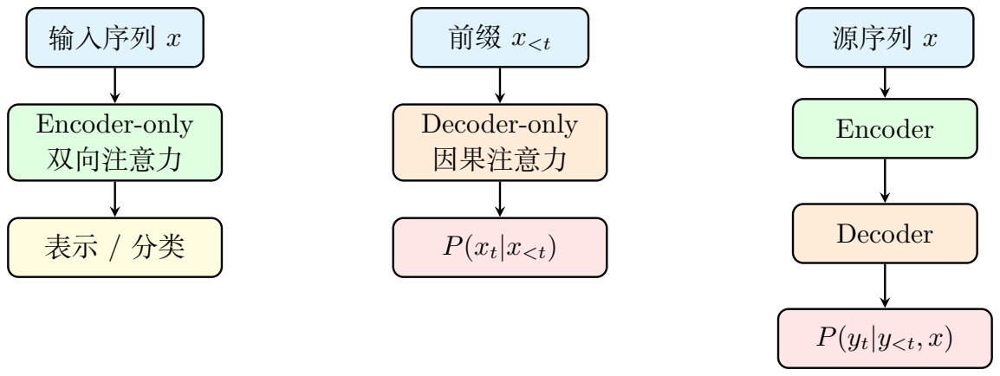<figcaption>三类常见 Transformer 架构：Encoder-only 偏重表示学习，Decoder-only 偏重自回归生成，Encoder-Decoder 偏重条件生成。</figcaption></figure>
<aside class="fta-callout fta-example">
Example 12

三类架构可以用同一个主题任务来比较。

<ul>
<li><strong>Encoder-only：理解任务</strong></li>

输入句子：<code>The cat was tired.</code>

任务是判断句子情感、识别实体或生成句向量。此时模型更关心整句表示 $H^{(L)}$，而不是逐步生成下一个 token。

<li><strong>Decoder-only：续写任务</strong></li>

输入前缀：<code>The cat sat on the mat because</code>

模型需要预测下一个 token：$P(x_t \mid x_{&lt;t}).$ 它可能继续生成 "it was tired"。这就是 GPT 类 LLM 的基本生成方式。

<li><strong>Encoder-Decoder：翻译任务</strong></li>

输入完整英文句子：<code>The cat sat on the mat because it was tired.</code>

输出中文句子：<code>“猫坐在垫子上，因为它累了。”</code>此时模型建模的是：

\[
\begin{aligned}
P(y|x) = \prod_{t=1}^{m} P(y_t \mid y_{&lt;t},x).
\end{aligned}
\](1.76)

</ul>

因此，三类架构的差别不在于是否基于 Transformer，而在于输入输出形式、可见信息范围和训练目标不同。

</aside>

<table class="fta-table"><tr><th><strong>架构</strong></th><th><strong>可见信息</strong></th><th><strong>主要目标</strong></th><th><strong>代表模型</strong></th></tr><tr><td>Encoder-only</td><td>整个输入序列，双向可见</td><td>表示学习、理解任务</td><td>BERT</td></tr><tr><td>Decoder-only</td><td>只能看见前文，单向生成</td><td>自回归生成 $P(x_t|x_{&lt;t})$</td><td>GPT, LLaMA</td></tr><tr><td>Encoder-Decoder</td><td>输入全可见，输出端单向生成</td><td>条件生成 $P(y_t|y_{&lt;t},x)$</td><td>Transformer, T5, BART</td></tr></table>

<aside class="fta-callout fta-summary">
Summary

Transformer 的三类典型组织方式如下：

<ul>
<li><strong>Encoder-only</strong>：只保留 Encoder，适合理解和表示学习；</li>
<li><strong>Decoder-only</strong>：只保留因果 Decoder，适合自回归文本生成，现代通用 LLM 的主流结构；</li>
<li><strong>Encoder-Decoder</strong>：同时使用 Encoder 和 Decoder，适合翻译、摘要等条件生成任务。</li>
</ul>

因此，encoding 和 decoding 可以分成两层理解：

<ul>
<li>在输入处理层面，tokenization、embedding 和位置编码属于输入 encoding；</li>
<li>在模型架构层面，Encoder 负责上下文化表示，Decoder 负责条件生成或自回归生成。</li>
</ul>

这也说明：BERT、GPT 和原始 Transformer 都基于 Transformer block，但它们的结构组织方式和任务目标不同。

</aside>
<h3 id="section-13">Transformer 的长上下文瓶颈</h3>
<h4 id="pdf-time-space-complexity">时间与空间复杂度的严格分析</h4>

设序列长度为 $T$，隐藏维度为 $d$。分析单层自注意力的计算复杂度。

<strong>步骤1：</strong> 先计算 $Q = HW_Q$，其中 $H\in\mathbb{R}^{T\times d}$，$W_Q\in\mathbb{R}^{d\times d_k}$。矩阵乘法复杂度为 $O(T d d_k)$。若 $d_k = d$，则为 $O(T d^2)$。再计算注意力分数矩阵 $S = QK^\top$，其中 $Q\in\mathbb{R}^{T\times d_k}$，$K^\top\in\mathbb{R}^{d_k\times T}$。复杂度为 $O(T^2 d_k)$。

<strong>步骤2：</strong> Softmax 操作时对 $T\times T$ 矩阵的每一行做归一化，复杂度 $O(T^2)$。再计算注意力加权求和 $O = AV$，其中 $A\in\mathbb{R}^{T\times T}$，$V\in\mathbb{R}^{T\times d_v}$。复杂度为 $O(T^2 d_v)$。

综合而言，自注意力的复杂度由 $T^2$ 项主导：

\[
\begin{aligned}
\text{Time} = O(T^2 d_k + T^2 d_v) = O(T^2 d).
\end{aligned}
\](1.77)

空间上，注意力矩阵 $A\in\mathbb{R}^{T\times T}$ 需要 $O(T^2)$ 的内存。

当 $T$ 很大（例如 $T=10^5$，一本书的长度），$T^2 = 10^{10}$，即使GPU高效，这也是巨大的负担。

<h5 id="pdf-attention-short-term-memory">为什么注意力本质上是一种"短期记忆"</h5>

从记忆系统的角度看：

<ul>
<li><strong>注意力的优点：</strong> 读取精确。当前位置可以直接与窗口内任意位置建立联系，权重由数据内容动态决定。这比固定卷积核或循环连接灵活得多。</li>
<li><strong>注意力的缺点：</strong> 窗口有限。即使使用 KV-cache 技术（缓存之前计算的 Key 和 Value 来避免重复计算），模型也必须在计算和存储上承担 $O(T^2)$ 的代价。实际部署中，上下文窗口受显存和延迟的强约束。</li>
</ul>

因此，注意力像一个"短期工作记忆"系统：在当前窗口里查找非常准确，但窗口外的信息只能靠压缩过的隐藏表示、摘要 token 或者额外的记忆模块来间接访问。

<h5 id="pdf-long-chain-dilemma">长链推理的矛盾</h5>

若上下文非常长，模型面临一个根本性的两难困境：

<ol>
<li><strong>保持大窗口：</strong> 精度高，但计算和存储成本以 $O(T^2)$ 增长，迅速变得不可承受；</li>
<li><strong>压缩/截断：</strong> 效率高，但压缩过程中必然丢失细节信息，长距离依赖被削弱。</li>
</ol>

这正引出了 Titans 试图解决的核心问题：<strong>能否保留注意力的短程精确性，同时引入一个可持续更新的长期记忆模块来弥补远处历史的信息损失？</strong>

<aside class="fta-callout fta-example">
Example 13

在我们的翻译例子中，假设源句后面还有一整段话（共100个 token）。纯 Transformer 要翻译第100个位置时，注意力矩阵是 $100\times 100$ 的。如果源句是整篇文章（10000 token），注意力矩阵就是 $10000^2 = 10^8$ 级别，显存无法承受。

具体到 "it→cat" 的代词消解：如果 "cat" 在第2个位置而 "it" 在第1000个位置，中间隔了998个 token，纯注意力需要存储 $1000\times 1000$ 的矩阵才能建立这个连接。而 Titans 的思路是：当模型读到 "cat" 时，就把它写入长期记忆；读到 "it" 时，从长期记忆中召回 "cat"——不再需要在注意力矩阵中显式保存998个中间 token 的依赖关系。

</aside>
<aside class="fta-callout fta-summary">
Summary

Transformer 的核心瓶颈不是"不会建模依赖"，而是"只能在有限上下文中高精度建模依赖"。长链推理需要的信息往往分布在很远的位置，因此必须有某种机制把远处历史压缩并保留下来。这正是 Titans 试图解决的。

</aside>
<h3 id="section-14">记忆视角：Attention、KV Cache、线性记忆</h3>
<aside class="fta-callout fta-summary">
Summary

从记忆视角看，Attention 是窗口内的精确读取机制；KV-cache 是推理时对历史 Key/Value 的缓存机制；线性记忆则进一步把历史压缩进可更新的矩阵参数中。Titans 的长期神经记忆正是在这个方向上，把线性记忆推广为非线性、可在线更新的神经网络记忆。

</aside>

在引入 Titans 的神经长期记忆之前，我们先看一个更简单、更直观的线性记忆模型，它奠定了后续所有讨论的基础。

假设我们持续收到键值对 $(k_1,v_1),(k_2,v_2),\dots$，其中 $k_t\in\mathbb{R}^{d_k}$（key 向量），$v_t\in\mathbb{R}^{d_v}$（value 向量）。我们想设计一个<em>记忆矩阵</em> $M_t\in\mathbb{R}^{d_k\times d_v}$，它通过不断"写入"新的键值对来累积历史信息。

最简单的写入规则是<strong>外积相加</strong>：

\[
\begin{aligned}
M_t = M_{t-1} + k_t^\top v_t,
\end{aligned}
\](1.78)

其中 $k_t^\top v_t$ 是 $d_k\times 1$ 与 $1\times d_v$ 的外积，得 $d_k\times d_v$ 矩阵。

给定查询 $q_t\in\mathbb{R}^{d_k}$，从记忆中读取：

\[
\begin{aligned}
y_t = q_t M_t \in \mathbb{R}^{d_v}.
\end{aligned}
\](1.79)

展开这个递推关系（假设 $M_0=0$）：

\[
\begin{aligned}
y_t = q_t \left(\sum_{j=1}^{t} k_j^\top v_j\right) = \sum_{j=1}^{t} (q_t \cdot k_j) v_j.
\end{aligned}
\](1.80)

这个展开的结果非常优雅：读出等于所有历史 value 的加权和，权重由查询与各 key 的点积决定。这与注意力机制的形式高度相似，但关键区别在于——<strong>历史信息被写入参数 $M_t$，而不是全部显式保存在上下文窗口中</strong>。

<h4 id="pdf-linear-memory-least-squares">线性记忆与最小二乘的对偶关系</h4>

线性记忆还有一个更深层的数学解释：它等价于在线性回归问题上的在线梯度下降。

假设我们希望找到一个线性映射 $M\in\mathbb{R}^{d_k\times d_v}$，使得对所有已见样本 $j=1,\dots,t$，有 $k_j M \approx v_j$。定义最小二乘损失：

\[
\begin{aligned}
\mathcal{L}_t(M) = \frac{1}{2}\sum_{j=1}^{t} \|k_j M - v_j\|_2^2.
\end{aligned}
\](1.81)

令 $K_t\in\mathbb{R}^{t\times d_k}$ 为所有已见 key 堆叠而成的矩阵，$V_t\in\mathbb{R}^{t\times d_v}$ 为所有已见 value 堆叠的矩阵。则损失可简洁地写为

\[
\begin{aligned}
\mathcal{L}_t(M) = \frac{1}{2}\|K_t M - V_t\|_F^2.
\end{aligned}
\](1.82)

对 $M$ 求导并令其为零（正规方程）：

\[
\begin{aligned}
\nabla_M \mathcal{L}_t = K_t^\top(K_t M - V_t) = 0 \quad\Longrightarrow\quad K_t^\top K_t M = K_t^\top V_t.
\end{aligned}
\](1.83)

若 $K_t^\top K_t$ 可逆，则最优解为

\[
\begin{aligned}
M_t^\star = (K_t^\top K_t)^{-1} K_t^\top V_t.
\end{aligned}
\](1.84)

在线性记忆的外积更新规则下，$M_t = K_t^\top V_t$（假设初始 $M_0=0$）。因此线性记忆实际上存储了 $K_t^\top V_t$。若要得到真正的最小二乘解，还需要左乘 $(K_t^\top K_t)^{-1}$——这就是线性注意力中各种归一化方案的数学根源。

<h5 id="pdf-linear-to-nonlinear">从线性到非线性：Titans 的核心洞察</h5>

线性记忆的表达能力受限于"线性映射"这一函数类。若历史中的有效规律需要非线性组合、条件化、门控——例如"若主语是阴性，则代词用 she；若是阳性，用 he"——线性记忆无法很好地捕捉。

Titans 的核心洞察是：<strong>将记忆矩阵 $M$ 替换为一个深度神经网络 $\mathcal{M}_\phi$，参数 $\phi$ 在测试时持续在线更新</strong>。这样一来，记忆不再是简单的外积累加，而是一个能够表达复杂非线性关系、并且能够"选择性地记住和遗忘"的神经模块。

<aside class="fta-callout fta-example">
Example 14

在我们的翻译例子中，线性记忆的工作方式如下。设 $d_k = d_v = 3$，处理前三个 token 时：

\[
\begin{aligned}
k_1=[1,0,0], v_1=[0.8, 0.1, 0.1] &amp;\quad (\text{&quot;The&quot;})\\
k_2=[0,1,0], v_2=[0.2, 0.7, 0.1] &amp;\quad (\text{&quot;cat&quot;})\\
k_3=[0,0,1], v_3=[0.1, 0.1, 0.8] &amp;\quad (\text{&quot;sat&quot;})
\end{aligned}
\](1.85)(1.86)(1.87)

记忆矩阵累积为 $M_3 = k_1^\top v_1 + k_2^\top v_2 + k_3^\top v_3 = \begin{bmatrix}0.8&amp;0.1&amp;0.1\\ 0.2&amp;0.7&amp;0.1\\ 0.1&amp;0.1&amp;0.8\end{bmatrix}$。

当处理到 "it"（第8个 token）时，查询 $q_8=[0.1, 0.9, 0.0]$（高度倾向 "cat" 相关），则读出为 $y_8 = q_8 M_8$，结果会包含大量与 "cat" 相关的信息。

但线性记忆的问题在于：它"平等地"累加所有 token 的信息，无法"选择性遗忘"不重要内容（如冠词 "the"）。Titans 的神经记忆通过 surprise 驱动的梯度更新，自动给重要 token（如实词、实体）更高的写入权重。

</aside>
<aside class="fta-callout fta-summary">
Summary

线性记忆把历史压缩进矩阵参数 $M_t$ 中：外积写入、点积读取。它等价于在线最小二乘回归器。Titans 把这个思想从线性映射推广到深度神经网络，获得了更强的表达能力和选择性记忆/遗忘能力。

</aside>
<h3 id="section-15">Titans 的长期神经记忆</h3>
<h4 id="section-16">Key-Value associative memory</h4>

Titans 的长期记忆可以先从 key--value associative memory 的角度理解：输入中的关键信息被写入某种可查询的记忆结构，后续位置通过 query 从该结构中读取相关历史。线性记忆使用矩阵 $M_t$ 表示这种关联；Titans 则把它推广为神经网络 $\mathcal{M}_\phi$。

<h4 id="section-17">Surprise</h4>

Titans 的创新之一是用<strong>梯度范数</strong>来衡量一个新输入的"意外程度"（surprise）。直觉如下：如果当前记忆网络已经很好地"预测"了新输入，那么关于这个输入的损失应该很小，梯度也很小；反之，如果新输入违反了记忆网络的预期，梯度就会很大。

形式化地，设记忆网络为 $\mathcal{M}_\phi$（$\phi$ 是该网络的可训练参数集合），在第 $t$ 步接收输入 $x_t$，输出它根据"已有记忆"做出的预测。定义一个关联记忆的损失函数：

\[
\begin{aligned}
\ell_t(\phi) = \ell\!\left(\mathcal{M}_\phi(x_t),\, \text{target}_t\right).
\end{aligned}
\](1.88)

其中 $\text{target}_t$ 是某种监督信号——可以是将 $x_t$ 本身作为重建目标（自编码器风格），也可以是预测下一个 token（自回归设置）。

设 $\phi_t$ 是更新前的参数，定义 <strong>surprise</strong> 为损失函数对参数的梯度的 L2 范数：

\[
\begin{aligned}
s_t = \|\nabla_\phi \ell_t(\phi_t)\|_2.
\end{aligned}
\](1.89)

$s_t$ 越大说明梯度越大，当前输入和已有记忆不匹配——这是一个 surprise 事件，更值得被写入记忆。$s_t$ 越小说明模型已经很熟悉这个输入，不需要重点更新记忆。Titans 使用这个 surprise 分数来控制记忆更新的强度。

<aside class="fta-callout fta-example">
Example 15

在我们的翻译例子中，计算每个英文 token 的 surprise 分数。简化词表为 $\{\text{The},\text{cat},\text{sat},\text{mat},\text{it}\}$，记忆网络为一个单层模型 $\mathcal M_\phi(x)=W h_t$（其中 $\phi=W\in\mathbb R^{5\times d}$ 是记忆参数矩阵，$h_t$ 是归一化的隐藏表示，$\|h_t\|_2=1$）。使用交叉熵损失，surprise 为 $s_t = \|p_t - e_{c_t}\|_2$。

计算 "cat"（第2个 token，正确类别下标=2）的 surprise。假设当前记忆产生的 logit 为：

\[
\begin{aligned}
z_{\text{cat}} = [2.0,\; 0.3,\; 0.1,\; -0.2,\; -0.4]^\top.
\end{aligned}
\](1.90)

Softmax 后：$p_{\text{cat}} = [0.652,\; 0.119,\; 0.098,\; 0.072,\; 0.059]^\top$。正确类别的 one-hot 为 $e_{\text{cat}} = [0, 1, 0, 0, 0]^\top$，因此

\[
\begin{aligned}
s_{\text{cat}} = \|p_{\text{cat}} - e_{\text{cat}}\|_2 \approx 1.104.
\end{aligned}
\](1.91)

而对冠词 "The"（第1个 token），模型已经非常熟悉这类高频功能词，若其概率接近正确值：

\[
\begin{aligned}
p_{\text{The}} = [0.847,\; 0.070,\; 0.042,\; 0.026,\; 0.016]^\top.
\end{aligned}
\](1.92)

则 $s_{\text{The}} \approx 0.176$。

名词 "cat" 的 surprise（1.104）远大于冠词 "The" 的 surprise（0.176）——实体名词和需要消解的代词产生更大的 surprise，从而被更强烈地写入长期记忆。

</aside>
<h4 id="section-18">Momentum</h4>

Titans 的记忆更新规则可以写成一种带有动量（momentum）和权重衰减（weight decay，即遗忘）的在线梯度下降。

令 $g_t = \nabla_\phi \ell_t(\phi_t)$ 为第 $t$ 步的梯度。动量项 $m_t$ 累积过去的梯度：

\[
\begin{aligned}
m_t = \beta m_{t-1} + g_t
= g_t + \beta g_{t-1} + \beta^2 g_{t-2} + \cdots
\end{aligned}
\](1.93)

其中 $\beta\in[0,1)$ 是动量系数，决定过去梯度的惯性贡献。$\beta$ 大则旧梯度影响持续更久；$\beta=0$ 退化为普通 SGD；$\beta$ 接近1时动量提供很强的"惯性"，使参数更新方向更平滑。

参数更新规则为：

\[
\begin{aligned}
\phi_{t+1} = (1-\lambda)\phi_t - \eta\, m_t.
\end{aligned}
\](1.94)

各项的物理意义：

<ul>
<li>$\lambda \in [0,1)$：<strong>遗忘率</strong>（weight decay），防止记忆无限累加。$\lambda$ 大则遗忘快、记忆容量有效但历史丢失快；$\lambda$ 小则保留时间长但可能饱和。</li>
<li>$\eta &gt; 0$：<strong>学习率</strong>，新信息写入速度。$\eta$ 大则写入快但噪声大；$\eta$ 小则写入慢但稳定。</li>
</ul>
<h4 id="section-19">动量项与遗忘项的闭式展开</h4>

动量是对过去梯度的<strong>指数加权平均</strong>。

从递推 $m_t = \beta m_{t-1} + g_t$ 出发（设 $m_0=0$）：

\[
\begin{aligned}
m_t = \sum_{j=0}^{t-1} \beta^j g_{t-j}.
\end{aligned}
\](1.95)

旧梯度的权重以指数速度衰减，半衰期约为 $\tau_{1/2} = \ln(1/2) / \ln \beta$ 步。例如 $\beta=0.9$ 时，$\tau_{1/2}\approx 6.6$ 步——约7步前的梯度权重衰减到一半。

若暂时忽略动量（设 $m_t = g_t$），只看遗忘（设 $\phi_1$ 为初始参数）：

\[
\begin{aligned}
\phi_{t+1} = (1-\lambda)\phi_t - \eta g_t
= (1-\lambda)^t \phi_1 - \eta\sum_{j=1}^{t} (1-\lambda)^{t-j} g_j.
\end{aligned}
\](1.96)

这揭示了遗忘机制的关键性质：初始参数的贡献以 $(1-\lambda)^t$ 指数衰减；旧梯度以 $(1-\lambda)^{t-j}$ 加权——越新的梯度权重越大；有效记忆时间约为 $\tau_{\text{mem}} \approx 1/\lambda$ 步。

<aside class="fta-callout fta-explanation">
Explanation: 有效记忆时间的推导

当 $\lambda$ 比较小时，$\ln(1-\lambda) \approx -\lambda$，所以 $(1-\lambda)^k = e^{k\ln(1-\lambda)} \approx e^{-\lambda k}$。遗忘近似于指数衰减：$w_k \approx e^{-\lambda k}$。指数衰减的典型时间尺度定义为衰减到 $1/e$ 需要的步数。令 $e^{-\lambda \tau_{\text{mem}}} = e^{-1}$，得 $\tau_{\text{mem}} \approx 1/\lambda$。

</aside>
<aside class="fta-callout fta-example">
Example 16

翻译时，模型按顺序读入英文 token，surprise 机制决定哪些 token 被更强地写入长期记忆。

设 $\eta=0.01$，$\beta=0.9$，$\lambda=0.001$。各 token 的 surprise 和写入强度：

<table class="fta-table"><tr><th>Token</th><th>词性</th><th>Surprise $s_t$</th><th>写入强度 $\eta s_t$</th></tr><tr><td>The</td><td>冠词</td><td>0.05</td><td>0.0005</td></tr><tr><td>cat</td><td>名词</td><td>0.85</td><td>0.0085</td></tr><tr><td>sat</td><td>动词</td><td>0.62</td><td>0.0062</td></tr><tr><td>on</td><td>介词</td><td>0.10</td><td>0.0010</td></tr><tr><td>the</td><td>冠词</td><td>0.03</td><td>0.0003</td></tr><tr><td>mat</td><td>名词</td><td>0.78</td><td>0.0078</td></tr><tr><td>because</td><td>连词</td><td>0.45</td><td>0.0045</td></tr><tr><td>it</td><td>代词</td><td>0.91</td><td>0.0091</td></tr><tr><td>was</td><td>助动词</td><td>0.08</td><td>0.0008</td></tr><tr><td>tired</td><td>形容词</td><td>0.55</td><td>0.0055</td></tr></table>

关键观察："cat"（名词，surprise=0.85）和 "it"（代词，surprise=0.91）被赋予最高的写入强度。动量机制确保 "cat" 的记忆不会在被 "on"、"the" 等低 surprise token 冲刷后立即消失——$\beta=0.9$ 意味着 "cat" 的梯度在约7步后仍保留一半的影响。而遗忘率 $\lambda=0.001$ 意味着有效记忆时间约为1000步——在该翻译例子中，"cat" 的记忆在数百步后仍然保留。

</aside>
<aside class="fta-callout fta-summary">
Summary

若没有遗忘，长期记忆会像没有耗散的系统一样不断积累，最终饱和甚至失真。Titans 中的 weight decay 提供了一个耗散通道，动量提供惯性，使记忆系统在"可塑性"（写入新信息）和"稳定性"（保留旧信息）之间保持平衡。Surprise 机制确保"意外"信息比"可预期"信息被更强烈地写入。

</aside>
<h4 id="section-20">Test-time learning</h4>
<h5 id="pdf-train-inference-separation">训练与推理的参数更新分离</h5>

传统 Transformer 在推理时参数完全固定——只有隐藏状态和 KV-cache 在变化，权重矩阵保持不变。Titans 的不同之处在于：<strong>长期记忆模块的参数 $\phi_t$ 在测试时继续根据输入进行更新</strong>。

这并非"训练-推理不分"，而是一种架构设计选择：

<ul>
<li><strong>核心注意力模块</strong>的参数（$W_Q, W_K, W_V, W_O$ 等）在训练后固定，推理时不更新——这部分负责"短期精确建模"。</li>
<li><strong>长期记忆模块</strong>的参数 $\phi_t$ 在推理时随输入在线更新——这部分负责"持续写入远期历史"。</li>
</ul>
<h5 id="pdf-read-write-separation">读取与写入的分离</h5>

Titans 将长期记忆的操作明确分为两种模式：

<strong>写入模式（Write）：</strong> 用当前输入更新记忆参数，

\[
\begin{aligned}
\phi_t \mapsto \phi_{t+1}, \quad \text{通过梯度下降 } \phi_{t+1} = (1-\lambda)\phi_t - \eta m_t.
\end{aligned}
\](1.97)

<strong>读取模式（Read）：</strong> 给定查询 $q_t = x_t W_Q$，用当前记忆参数做前向传播（不更新参数），

\[
\begin{aligned}
y_t = \mathcal{M}_{\phi_t}^\ast(q_t).
\end{aligned}
\](1.98)

其中星号 $\ast$ 明确表示"只读取、不更新"的前向使用方式。

这个读写分离与计算机的内存架构完全对应：写入是 update（改变存储状态），读取是 query（检索信息而不改变存储状态）。

<h5 id="pdf-rnn-memory-difference">与 RNN 和记忆网络的本质区别</h5>

若只看"参数随时间变化"这一点，Titans 的长期记忆确实像一种递推系统。但关键区别在于：

<ol>
<li><strong>普通 RNN</strong>：将历史压缩到一个固定维度的隐藏状态 $h_t\in\mathbb{R}^d$ 中——容量受限于维度 $d$。</li>
<li><strong>神经图灵机 / 记忆网络</strong>：用一个外部记忆矩阵，通过注意力式读写操作访问——矩阵大小可扩展。</li>
<li><strong>Titans</strong>：将历史压缩到一个神经网络参数 $\phi_t$ ——参数空间是高维函数空间，容量远超单个向量。</li>
</ol>

可以这样类比：RNN 记住的是一个"摘要向量"；线性记忆记住的是一个"关联矩阵"；Titans 记住的是一个"逐步适应历史数据的函数"。

<aside class="fta-callout fta-explanation">
Explanation: RNN和Transformer关系

普通 RNN 和 Transformer 都是用于处理序列数据的神经网络模型。它们的共同目标是：把输入序列中的每个 token 转换成包含上下文信息的表示。区别在于，普通 RNN 通过时间步递推来传递信息，而 Transformer 通过自注意力机制直接建模 token 与 token 之间的关系。

普通 RNN 的核心递推形式为

\[
\begin{aligned}
h_t &amp;= \phi(W_xx_t+W_hh_{t-1}+b),
\end{aligned}
\](1.99)

其中 $x_t$ 是第 $t$ 个 token 的输入向量，$h_t$ 是第 $t$ 步的隐藏状态，$h_{t-1}$ 是上一时刻传来的历史信息，$\phi$ 是非线性激活函数。因此，RNN 处理序列时具有明显的时间顺序：

\[
\begin{aligned}
h_1 \rightarrow h_2 \rightarrow h_3 \rightarrow \cdots \rightarrow h_n.
\end{aligned}
\](1.100)

第 $t$ 个位置的信息需要依赖前面所有状态逐步传递过来。这种结构天然包含顺序信息，但也导致两个问题：第一，训练时不容易并行；第二，长距离信息在多步传递中容易衰减。

Transformer 不再使用这样的递推结构，而是将整个输入序列的向量堆叠为矩阵 $X\in\mathbb{R}^{n\times d}$，然后一次性计算

\[
\begin{aligned}
Q = XW_Q,\quad
K = XW_K,\quad
V = XW_V.
\end{aligned}
\](1.101)

接着通过自注意力计算所有 token 之间的关系：

\[
\begin{aligned}
\mathrm{Attention}(Q,K,V)
&amp;=
\mathrm{softmax}\left(\frac{QK^\top}{\sqrt{d_k}}\right)V.
\end{aligned}
\](1.102)

其中，$QK^\top\in\mathbb{R}^{n\times n}$ 是注意力分数矩阵。它的第 $(i,j)$ 个元素表示第 $i$ 个 token 对第 $j$ 个 token 的关注程度。也就是说，Transformer 可以让任意两个位置的 token 直接建立联系，而不需要像 RNN 那样一层一层沿时间方向传递信息。

因此，可以把二者的核心区别概括为：

普通 RNN 是“顺序递推模型”，当前状态 $h_t$ 依赖上一状态 $h_{t-1}$；Transformer 是“注意力直连模型”，每个 token 可以直接和其他 token 计算关系。

</aside>
<aside class="fta-callout fta-example">
Example 17

考虑翻译句子<code>The cat sat on the mat because it was tired</code>. 各 token 的位置为

\[
\begin{aligned}
\text{The}_1,\ \text{cat}_2,\ \text{sat}_3,\ \text{on}_4,\ \text{the}_5,\ \text{mat}_6,\
\text{because}_7,\ \text{it}_8,\ \text{was}_9,\ \text{tired}_{10}.
\end{aligned}
\](1.103)

在这个句子中，模型需要理解位置 $8$ 的 "it" 指代的是位置 $2$ 的 "cat"，而不是位置 $6$ 的 "mat"。

如果使用普通 RNN，"cat" 的信息需要从位置 $2$ 开始，经过多个隐藏状态逐步传递到位置 $8$：

\[
\begin{aligned}
h_2 \rightarrow h_3 \rightarrow h_4 \rightarrow h_5 \rightarrow h_6 \rightarrow h_7 \rightarrow h_8.
\end{aligned}
\](1.104)

也就是说，"cat" 对 "it" 的影响必须经过中间多个位置。如果句子更长， "cat" 和 "it" 相距更远，那么相关信息就需要经过大量递推步骤才能传到后面，这容易导致长距离依赖信息衰减。

而在 Transformer 中，位置 $8$ 的 "it" 可以通过自注意力直接关注位置 $2$ 的 "cat"。设位置 $8$ 的 query 向量为 $q_8$，位置 $2$ 的 key 向量为 $k_2$，则二者的注意力分数为

\[
\begin{aligned}
S_{8,2} &amp;= q_8^\top k_2.
\end{aligned}
\](1.105)

如果 $S_{8,2}$ 较大，则表示模型认为 "it" 与 "cat" 之间关系较强。经过 softmax 归一化后，位置 $8$ 的表示会更多地吸收位置 $2$ 的 value 信息。

因此，RNN 中的信息路径是

\[
\begin{aligned}
\text{cat} \rightarrow \text{sat} \rightarrow \text{on} \rightarrow \text{the}
\rightarrow \text{mat} \rightarrow \text{because} \rightarrow \text{it},
\end{aligned}
\](1.106)

而 Transformer 中的信息路径可以直接写成

\[
\begin{aligned}
\text{it} \rightarrow \text{cat}.
\end{aligned}
\](1.107)

这说明 Transformer 更容易建模长距离依赖。在翻译时，模型因此更可能生成<code>这只猫坐在垫子上，因为它累了</code>, 而不是错误地把 "it" 理解为 "mat"，生成类似“垫子累了”的错误翻译。

</aside>
<aside class="fta-callout fta-example">
Example 18

在我们的翻译例子中，"测试时学习"的具体工作流程如下：

<strong>训练阶段：</strong> 模型在大量双语语料上训练，学习注意力参数 $W_Q, W_K, W_V$ 和记忆网络的初始参数 $\phi_0$。此时记忆网络学会了"如何从上下文提取和存储实体信息"这一通用技能。

<strong>推理阶段（翻译新句子时）：</strong>

<ol>
<li>读入 "The cat sat..."，每读一个 token 就更新长期记忆参数 $\phi_t \to \phi_{t+1}$；</li>
<li>读到 "it" 时，$\phi_8$ 已经包含了 "cat" 的信息；</li>
<li>用 $q_8$（"it" 的 query）从 $\mathcal{M}_{\phi_8}$ 中读取：$y_8 = \mathcal{M}_{\phi_8}^\ast(q_8)$；</li>
<li>读出结果 $y_8$ 强烈激活了 "cat" 的语义表示，帮助模型决定用"它"（动物代词）来翻译。</li>
</ol>

如果模型在推理时不更新记忆参数，$\phi$ 保持不变，那么它就只是一个"静态特征提取器"——输入 "cat" 时的参数和输入 "it" 时的参数完全相同，无法实现"根据上下文积累实体信息"的功能。

</aside>
<aside class="fta-callout fta-summary">
Summary

Titans 的"测试时学习"不是 bug 而是 feature：它把长期记忆模块设计为一个在线适应子系统，参数在推理时根据输入动态调整，从而实现对远期历史的持续积累和选择性召回。这与人类阅读时的"边读边记"过程有结构上的相似性。

</aside>
<h5 id="pdf-parallel-training">训练时的并行化策略</h5>

虽然推理时长期记忆是顺序更新的（$\phi_t$ 依赖于 $\phi_{t-1}$），但 Titans 设计了一种巧妙的训练并行化方案。

关键思想是：<strong>训练时不需要严格模拟推理时的在线更新过程</strong>。在训练阶段，我们可以将整个序列分成若干段（segments），对每段独立地训练记忆模块，然后用某种方式保证段之间的连续性。

具体来说，设训练序列被分为 $S$ 段，每段长度为 $L$。第 $s$ 段内的记忆更新可以并行计算，段与段之间只传递记忆参数的最终状态。这种分段策略将原本 $O(T)$ 的串行更新时间降低到 $O(S)$ 的段间通信，而 $S = T/L \ll T$。

<h5 id="pdf-persistent-memory">Persistent Memory：任务级先验知识</h5>

除了与输入相关的长期记忆，Titans 还引入了一类特殊的<strong>持久记忆</strong>（Persistent Memory）参数：

\[
\begin{aligned}
P = [p_1, p_2, \dots, p_{N_p}],
\end{aligned}
\](1.108)

其中 $p_i \in \mathbb{R}^{d}$ 是可训练的向量，$N_p$ 是持久记忆的"槽位"数。

持久记忆的特点：

<ul>
<li>与输入无关——它们对所有样本都是相同的；</li>
<li>在训练中学习，推理时保持不变（不像长期记忆那样在线更新）；</li>
<li>作用类似于"任务先验"或"固定参考系"——为模型提供与具体输入无关的基础知识。</li>
</ul>
<aside class="fta-callout fta-example">
Example 19

在我们的翻译例子中，持久记忆可以存储与翻译任务相关的通用知识：

<ul>
<li>$p_1$ 可能编码"英语的 SVO（主-谓-宾）语序 $\to$ 中文的 SVO 语序"这一先验；</li>
<li>$p_2$ 可能编码"英语代词需要根据先行词确定中文翻译"；</li>
<li>$p_3$ 可能编码"被动语态的中文转换规则"。</li>
</ul>

这些持久记忆在训练中从大量翻译数据中学习得到，对每个新翻译句子都是相同的。而长期记忆则存储当前句子的具体实体信息（如 "cat" 是主语、是动物等）。

</aside>
<h3 id="section-21">Titans 三种架构</h3>

Titans 提出了三种将长期记忆与注意力结合的具体架构。

<h4 id="section-22">MAC</h4>

MAC 的核心思想是：<strong>把长期记忆的读出结果当作额外的上下文 token 拼接到当前输入中，让注意力机制决定如何利用这些历史信息</strong>。

对于第 $t$ 个输入段 $S^{(t)}$，MAC 的计算流程为：

<strong>步骤1 —— 从记忆中读取历史摘要：</strong>

\[
\begin{aligned}
q_t &amp;= S^{(t)} W_Q \quad \text{(query 投影)}\\
h_t &amp;= \mathcal{M}_{\phi_{t-1}}^\ast(q_t) \quad \text{(读取，不更新)}
\end{aligned}
\](1.109)(1.110)

<strong>步骤2 —— 构造增强输入序列：</strong>

\[
\begin{aligned}
\widetilde{S}^{(t)} = [P \,\|\, h_t \,\|\, S^{(t)}],
\end{aligned}
\](1.111)

即将持久记忆 $P$（任务先验）、历史摘要 $h_t$（长期记忆读出）、当前输入 $S^{(t)}$ 按顺序拼接。

<strong>步骤3 —— 注意力处理：</strong>

\[
\begin{aligned}
y_t = \Attn(\widetilde{S}^{(t)}),
\end{aligned}
\](1.112)

让注意力在增强序列上自由决定如何分配权重。

<strong>步骤4 —— 更新记忆并融合输出：</strong>

\[
\begin{aligned}
\mathcal{M}_{\phi_t} &amp;= \text{Update}(\mathcal{M}_{\phi_{t-1}}, y_t),\\
o_t &amp;= y_t \otimes \mathcal{M}_{\phi_t}^\ast(y_t).
\end{aligned}
\](1.113)(1.114)

其中 $\otimes$ 是某种融合操作（如门控或加性组合）。

MAC 的直观意义是：<strong>先让长期记忆"提名"相关历史，再让注意力"决定"如何确切使用这些历史。</strong>

<figure class="fta-figure" style="--fta-figure-width: 437px">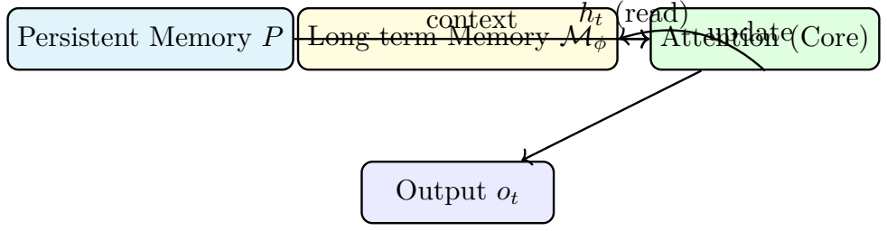<figcaption>MAC 架构：长期记忆读出作为注意力上下文。</figcaption></figure>
<h4 id="section-23">MAG</h4>

MAG 的核心思想是：<strong>用滑动窗口注意力处理局部上下文，用长期记忆处理远期依赖，最后通过门控机制动态融合两者的输出。</strong>

\[
\begin{aligned}
\widetilde{x} &amp;= [P \,\|\, x] \quad \text{(将持久记忆拼接到输入前)}\\
y_{\text{local}} &amp;= \text{SW-Attn}(\widetilde{x}) \quad \text{(滑动窗口注意力，只看局部)}\\
y_{\text{mem}} &amp;= \mathcal{M}(\widetilde{x}) \quad \text{(长期记忆的全局读出)}
\end{aligned}
\](1.115)(1.116)(1.117)

门控融合使用一个可学习的门控标量 $g\in(0,1)$：

\[
\begin{aligned}
g &amp;= \sigma(W_g [y_{\text{local}}; y_{\text{mem}}] + b_g),\\
o &amp;= g \odot y_{\text{local}} + (1-g) \odot y_{\text{mem}}.
\end{aligned}
\](1.118)(1.119)

其中 $\sigma(u) = 1/(1+e^{-u})$ 是 sigmoid 函数，$\odot$ 是逐元素乘法。

门控的好处是：<strong>模型可以动态决定在当前上下文中，应该更依赖局部精确的注意力信息（$g$ 大），还是更依赖压缩的长期记忆（$g$ 小）。</strong>

<h4 id="section-24">MAL</h4>

MAL 是最简洁的一种：把长期记忆模块当作一层神经网络，先压缩再注意力。

\[
\begin{aligned}
\widetilde{x} &amp;= [P \,\|\, x],\\
y_{\text{mem}} &amp;= \mathcal{M}(\widetilde{x}),\\
o &amp;= \text{SW-Attn}(y_{\text{mem}}).
\end{aligned}
\](1.120)(1.121)(1.122)

MAL 将压缩放在前面——先让长期记忆模块对整个输入做非线性变换，然后再让注意力处理。这种设计更适合"记忆作为预处理"的场景，但牺牲了 MAC 那种"先召回再决策"的互补性。

<h4 id="section-25">三者对比表</h4>
<figure class="fta-table-figure"><figcaption>MAC、MAG、MAL 三种 Titans 架构对比</figcaption>
<table class="fta-table"><tr><th>架构</th><th>记忆如何接入</th><th>优点</th><th>代价或适用边界</th></tr><tr><td>MAC</td><td>长期记忆读出后作为额外上下文 token 拼接到注意力输入中</td><td>结构透明，注意力可以直接选择是否使用记忆读出</td><td>增强上下文会带来额外 token 与注意力计算</td></tr><tr><td>MAG</td><td>局部注意力分支与长期记忆分支并行，再用门控融合</td><td>能动态选择依赖局部上下文还是长期记忆</td><td>门控质量会影响融合效果，训练稳定性更关键</td></tr><tr><td>MAL</td><td>把长期记忆模块作为网络中的一层，先变换再交给注意力处理</td><td>形式简洁，容易嵌入层级结构</td><td>长期记忆与注意力的互补关系不如 MAC 直观</td></tr></table>
</figure>
<aside class="fta-callout fta-summary">
Summary

三种架构的核心差异：

<ol>
<li><strong>MAC</strong>：长期记忆读出 $\to$ 拼接为上下文 $\to$ 注意力决定怎么用——"先回忆，再判断"；</li>
<li><strong>MAG</strong>：注意力与长期记忆并行计算 $\to$ 门控融合——"两条通路，动态选择"；</li>
<li><strong>MAL</strong>：长期记忆作为预处理层 $\to$ 注意力后处理——"先压缩，再精细"。</li>
</ol>

从"短期精确 + 长期压缩"的互补性看，MAC 往往最自然，也是实验中最强的变体。

</aside>
<aside class="fta-callout fta-example">
Example 20

在我们的翻译句子中，三种架构处理 "it$\to$cat" 依赖的方式：

<strong>MAC</strong>（效果最好）：读到第8个 token "it" 时，$q_8$ 从长期记忆中读取出 "cat" 的语义向量 $h_8$。然后 $h_8$ 作为额外 token 拼入当前注意力窗口。注意力机制可以自由地让 "it" 直接关注这个代表 "cat" 的历史摘要——就像在上下文窗口中凭空插入了一个"cat 的记忆 token"。

<strong>MAG</strong>：局部滑动窗口注意力只看 "it" 附近的 token（如 "because it was"），不直接看到 "cat"。但长期记忆分支从累积参数中检索到 "cat" 信息。门控机制判断代词的翻译更需要长期记忆（$g\approx 0.2$，偏向记忆分支），从而正确输出。

<strong>MAL</strong>：所有输入先经过记忆模块压缩变换，此时 "cat" 的信息已经融入变换后的表示中，即使后续注意力窗口有限，处理 "it" 时也能感知到 "cat"。

可以看出，MAC 的方案最透明：长期记忆的读出就是一个"虚拟 token"，注意力可以直接看到它。这就是为什么 MAC 在长程依赖任务上表现最优。

</aside>
<h3 id="section-26">为什么 Titans 适合长链推理</h3>
<h4 id="pdf-multistep-information-fidelity">把长链推理写成多步信息保真问题</h4>

设一个推理任务需要用到 $L$ 个分散在长上下文中的关键事实。对纯有限窗口 Transformer，在时刻 $t$ 能直接访问的只是最近 $W$ 个 token 内的内容。窗口外的事实只能通过压缩过的隐藏状态间接获取。

可以将总推理误差粗略分解为：

\[
\begin{aligned}
\epsilon_{\text{total}} \approx \epsilon_{\text{retrieve}} + \epsilon_{\text{compress}} + \epsilon_{\text{reason}}.
\end{aligned}
\](1.123)

其中 $\epsilon_{\text{retrieve}}$ 是检索不到相关事实导致的误差，$\epsilon_{\text{compress}}$ 是压缩历史时丢失关键细节导致的误差，$\epsilon_{\text{reason}}$ 是推理步骤本身的误差。

对于长链任务，纯 Transformer 的主要瓶颈通常不在 $\epsilon_{\text{reason}}$，而在前两项——检索不到足够远的事实，或者压缩时丢失了关键细节。

Titans 的优势：

<ol>
<li>当前窗口内仍用注意力做 $O(W^2)$ 的高精度关系建模——$\epsilon_{\text{reason}}$ 不受影响；</li>
<li>远期历史通过长期记忆持续写入参数——$\epsilon_{\text{compress}}$ 由 surprise 机制保证重要信息被保留；</li>
<li>读取时根据当前 query 有针对性召回——$\epsilon_{\text{retrieve}}$ 通过记忆查询而非窗口扩展得到改善。</li>
</ol>
<h5 id="pdf-information-theory">信息论视角</h5>

将远期历史记为随机变量 $H$，当前上下文记为 $C$，任务输出记为 $Y$。

纯有限窗口 Transformer 主要利用的是当前上下文与输出的互信息 $I(C;Y)$ 及少量被压缩的历史信息。当任务高度依赖远程事实时，会损失条件互信息：

\[
\begin{aligned}
I(H;Y \mid C) = I(H,C;Y) - I(C;Y).
\end{aligned}
\](1.124)

这一项度量了"在已知当前上下文 $C$ 之后，远期历史 $H$ 还能为预测 $Y$ 提供多少额外信息"。

Titans 的长期记忆模块 $M$（其参数 $\phi_t$ 中编码了历史 $H$ 的压缩版本）相当于构造了一个额外信息通道，使得：

\[
\begin{aligned}
I(M;Y \mid C) &gt; 0.
\end{aligned}
\](1.125)

这部分互信息补偿了纯 Transformer 中因为窗口有限而丢失的 $I(H;Y\mid C)$。

<h5 id="pdf-dynamical-stability">动力系统稳定性分析</h5>

将记忆参数更新写为离散动力系统：

\[
\begin{aligned}
\phi_{t+1} = A_t \phi_t + b_t,
\end{aligned}
\](1.126)

其中 $A_t \approx (1-\lambda)I$，$b_t \approx -\eta m_t$。

系统矩阵 $A_t$ 的特征值均为 $1-\lambda$。稳定性条件为 $\rho(A_t) = |1-\lambda| &lt; 1$。由于 $\lambda\in[0,1)$，该条件自动满足。这意味着系统具有<strong>耗散性</strong>：初始条件的影响以指数速率衰减，过去的扰动不会无限放大。

Titans 在稳定性与可塑性之间的平衡由三个超参数控制：

<ul>
<li>$\lambda$ 太大：记忆太快遗忘，系统趋近于"无记忆"；</li>
<li>$\lambda$ 太小：记忆接近饱和，旧信息难以被覆盖；</li>
<li>$\eta$ 太大：更新噪声放大，系统可能震荡；</li>
<li>$\eta$ 太小：写入太慢，重要信息来不及编码；</li>
<li>$\beta$ 合理：提供惯性平滑，把局部 surprise 累积成稳定的长期信号。</li>
</ul>
<aside class="fta-callout fta-example">
Example 21

回到翻译例子中的 "it$\to$cat" 长程依赖。假设序列被扩展到100个 token：

纯 Transformer 注意力矩阵为 $100\times 100$，需要计算10000个注意力权重。而 Titans (MAC) 的做法是：

<ol>
<li>读入 "cat"（位置2）时，由于 surprise 高（0.85），长期记忆 $\mathcal{M}_\phi$ 被显著更新；</li>
<li>接下来98个 token 中，由于 $\beta=0.9$ 和 $\lambda=0.001$，"cat" 的记忆痕迹以每步 $1-\lambda\approx 0.999$ 的因子缓慢衰减，98步后仍有 $0.999^{98}\approx 0.907$ 的保留——几乎没忘！</li>
<li>读到 "it"（位置100）时，$q_{100}$ 从长期记忆中检索到 "cat" 的强记忆痕迹，将其作为虚拟 token 拼入注意力窗口；</li>
<li>注意力机制在虚拟 token "cat 记忆" 和当前窗口内的实际 token 之间建立关联，正确翻译。</li>
</ol>

纯 Transformer 需要在 $100\times 100$ 的注意力矩阵中让位置100直接关注位置2——这是可以做到的，但代价是 $O(T^2)$ 的计算和存储。而 Titans 用了 $O(W)$ 的注意力窗口 + $O(1)$ 的记忆查询就达到了同样的效果。

</aside>
<h3 id="section-27">实验结果与适用边界</h3>
<h4 id="section-28">从本文机制分析得到的实验预期</h4>

原文件没有给出具体 benchmark 数字，因此本节不新增外部实验表格，而是把前文机制分析整理为"实验结果应当如何理解"。若实验任务需要跨很长距离保留实体、事实或中间结论，Titans 的长期记忆模块更可能体现优势；若任务主要依赖短窗口内的局部语法、局部匹配或固定格式转换，额外的长期记忆机制未必带来明显收益。

<aside class="fta-callout fta-explanation">
Explanation: 如何理解"实验结果与适用边界"

对 Titans 这类架构，实验结果不能只看平均分，还要看任务是否真的需要长期记忆。若测试集中大多数样本只需要短程依赖，那么 Transformer 的短期注意力已经足够强；若样本需要从很早的位置召回关键信息，或者需要把多个分散事实串成推理链，长期记忆机制的价值才会显现出来。

</aside>
<figure class="fta-table-figure"><figcaption>Titans 更可能发挥优势与收益有限的任务类型</figcaption>
<table class="fta-table"><tr><th>任务类型</th><th>预期表现与原因</th></tr><tr><td>长文问答、长上下文检索、长链推理</td><td>更可能发挥优势，因为远期历史可以通过 surprise 驱动写入长期记忆，并在需要时按 query 召回。</td></tr><tr><td>实体跟踪、代词消解、跨段一致性保持</td><td>更可能发挥优势，因为实体名词、关键事件和异常信息往往具有较高 surprise，适合被选择性写入。</td></tr><tr><td>短句分类、局部语法判断、短窗口翻译</td><td>收益可能有限，因为普通注意力已经能在窗口内精确建立依赖。</td></tr><tr><td>需要可验证外部知识的任务</td><td>参数内记忆不能完全替代显式检索；此类任务仍可能需要 RAG 或数据库。</td></tr></table>
</figure>
<aside class="fta-callout fta-summary">
Summary

实验结果的关键解释不是"Titans 是否总是更强"，而是"任务是否真的需要长期记忆"。Titans 的优势主要来自短期精确注意力与长期可更新记忆的互补；其边界也来自同一机制：在线更新带来超参数敏感性、稳定性和可解释性问题。

</aside>
<h4 id="section-29">成功之处</h4>
<ol>
<li><strong>短期与长期分工明确</strong>：注意力负责当前窗口内的高精度依赖建模，神经记忆负责远期历史的压缩与按需召回。这种分工避免了"一刀切"：不是让注意力硬扛 $O(T^2)$，也不是粗暴截断历史。</li>
<li><strong>测试时学习</strong>：模型能在新样本上动态写入长期记忆，而不是完全依赖预训练的固定参数。这类似于人类阅读长文时的"边读边记"。</li>
<li><strong>surprise 驱动的选择性写入</strong>：不是所有信息都平等地写入记忆——更值得记住的内容（高 surprise）产生更强的更新。这类似于人类对"惊讶"事件记得更牢。</li>
<li><strong>遗忘机制</strong>：防止记忆无限膨胀和饱和，提供耗散通道，使系统保持可更新。</li>
<li><strong>可并行训练</strong>：通过分段训练策略，训练效率没有大幅下降。</li>
</ol>
<h3 id="section-30">局限、开放问题与总结</h3>
<h4 id="section-31">不足与开放问题</h4>
<ol>
<li><strong>稳定性与超参数敏感性</strong>：测试时更新参数带来新的不稳定来源。$\eta, \beta, \lambda$ 的选择对效果影响显著。</li>
<li><strong>可解释性有限</strong>：长期记忆参数到底记住了什么、以什么形式编码，仍然难以直接解释。</li>
<li><strong>任务适配性</strong>：不是所有任务都需要长期记忆。若任务主要依赖局部语法和短窗口关系，Titans 的额外机制可能收益有限。</li>
<li><strong>与外部检索的关系</strong>：Titans 通过参数内记忆解决远程依赖，但对于需要精确、可验证、可编辑知识的场景，参数记忆与显式外部检索（如 RAG）仍是不完全重叠的路线。</li>
<li><strong>理论分析不足</strong>：目前对 Titans 的理解以经验性为主，关于 surprise 指标的最优形式、动量与遗忘的最优调度、记忆容量的信息论分析，仍缺乏系统的理论基础。</li>
</ol>
<aside class="fta-callout fta-summary">
Summary

Titans 不是"无限上下文的魔法"，而是一种更合理的记忆架构设计：让模型把有限窗口里最擅长的事（高精度局部依赖）继续交给注意力，把长历史的压缩与按需召回交给可在线更新的神经长期记忆模块。它代表了从"更大的上下文窗口"到"更聪明的记忆系统"的范式转移。

</aside>
<h4 id="section-32">结论：给数学物理学生的统一理解框架</h4>

如果把整件事压缩成一个统一的数学图像：

<ol>
<li><strong>Transformer</strong>：基于数据依赖核的积分型离散算子，在有限窗口内做高精度条件平均。核心计算：$o_t = \sum_j A_{tj} v_j$，其中 $A_{tj} = \operatorname{softmax}(q_t\cdot k_j / \sqrt{d_k})$。</li>
<li><strong>线性记忆</strong>：将历史压缩进矩阵参数的在线回归器。写入：$M_t = M_{t-1} + k_t^\top v_t$；读取：$y_t = q_t M_t$。等价于在线最小二乘。</li>
<li><strong>Titans 长期记忆</strong>：将历史压缩进神经网络参数的在线优化系统。写入通过梯度下降（带动量+遗忘）；读取通过前向传播；选择性由 surprise（梯度范数）控制。</li>
<li><strong>Surprise 梯度</strong>：$s_t = \|\nabla_\phi \ell_t(\phi_t)\|$ 决定什么信息值得写入——意外事件留下更深记忆痕迹。</li>
<li><strong>动量与遗忘</strong>：分别提供惯性与耗散——动量（$\beta$）平滑更新方向，遗忘（$\lambda$）防止记忆饱和。</li>
<li><strong>长链推理优势</strong>：来自"局部精确注意力（$O(W^2)$）+ 远程可更新长期记忆（$O(1)$ per query）"的互补——不需要在两者之间二选一。</li>
</ol>

因此，Titans 真正重要的思想不是某一个具体公式，而是<strong>把测试时学习重新引入序列模型，并把它系统化为长期记忆模块</strong>。这使得模型在面对超长上下文时，不必在"全部显式保留"（昂贵）和"完全遗忘历史"（信息丢失）之间二选一。

<aside class="fta-callout fta-example">
Example 22

回到我们的翻译例子，全章总结如下：

<strong>问题：</strong> 翻译 "The cat sat on the mat because it was tired." 核心难点是让 "it" 正确指代 "cat"（相隔6个 token）。

<strong>Transformer 的解决方式：</strong> 在 $10\times 10$ 的注意力矩阵中，让 $A_{8,2}$（"it" 对 "cat" 的注意力）获得高权重。这在短句中完美工作，但如果句子长达10000 token，$10000^2$ 的注意力矩阵不可承受。

<strong>Titans 的解决方式：</strong>

<ol>
<li>读入 "cat" 时，由于 surprise 高（新实体），长期记忆 $\mathcal{M}_\phi$ 被显著更新；</li>
<li>接下来读入 "sat on the mat because" 时，记忆参数持续累积，但 "cat" 的信息因动量（$\beta=0.9$）得以保留；</li>
<li>读入 "it" 时，$q_8$ 查询长期记忆，$\mathcal{M}_{\phi_8}^\ast(q_8)$ 返回与 "cat" 匹配的历史信息；</li>
<li>注意力在包含记忆读出的增强上下文中完成最后的精细化决策。</li>
</ol>

<strong>本质：</strong> Titans 不试图在注意力矩阵中显式存储所有位置对之间的依赖关系（$O(T^2)$），而是让一个可在线更新的神经记忆模块作为"后台"，在需要时按需检索——复杂度从 $O(T^2)$ 降为 $O(WT)$（注意力窗口 $W$ 乘序列长度 $T$）。

</aside>
<h3 id="section-33">数学附录</h3>
<h4 id="section-34">概率建模基础</h4>
<h5 id="pdf-autoregressive-factorization">自回归分解的严格推导</h5>

给定一个由 $T$ 个 token 组成的序列 $x_{1:T}=(x_1,x_2,\dots,x_T)$，其中每个 $x_t$ 取自有限词表 $\mathcal{V}$（$|\mathcal{V}|=V$）。所谓"语言模型"，就是一个能够为任意 token 序列分配概率的函数 $P(x_{1:T})$。

根据概率论的<strong>链式法则</strong>（chain rule），任意联合概率分布都可以分解为条件概率的乘积。从两个变量开始：对任意两个随机变量 $X_1,X_2$，

\[
\begin{aligned}
P(X_1=x_1, X_2=x_2) = P(X_1=x_1)\,P(X_2=x_2\mid X_1=x_1).
\end{aligned}
\]

这是因为条件概率的定义 $P(X_2\mid X_1)=P(X_1,X_2)/P(X_1)$。对 $T$ 个变量重复应用此恒等式：

\[
\begin{aligned}
P(x_{1:T}) &amp;= P(x_1)\,P(x_2\mid x_1)\,P(x_3\mid x_1,x_2)\,\cdots\,P(x_T\mid x_1,\dots,x_{T-1})\\
&amp;= \prod_{t=1}^{T} P(x_t \mid x_{&lt;t}).
\end{aligned}
\](1.127)(1.128)

其中 $x_{&lt;t}$ 是 $x_{1:t-1}$ 的简写。当 $t=1$ 时 $x_{&lt;1}$ 为空序列，$P(x_1\mid x_{&lt;1})$ 就是 $x_1$ 的先验概率。

自回归语言模型的思想是用参数化函数 $P_\theta$ 来近似每一个条件概率 $P(x_t\mid x_{&lt;t})$，其中 $\theta$ 表示模型的所有可训练参数（权重矩阵、偏置向量等）的集合。

<aside class="fta-callout fta-explanation">
Explanation: 链式法则与翻译

在我们 EN$\to$ZH 的翻译例子中，输入序列为 $x=(\text{The, cat, sat, on, the, mat, because, it, was, tired})$，共 $T=10$ 个 token。自回归翻译模型按顺序生成中文 token：

\[
\begin{aligned}
P_\theta(\text{猫, 坐, 在, }\ldots \mid \text{The, cat, }\ldots) = \prod_{t=1}^{T&#x27;} P_\theta(y_t \mid y_{&lt;t}, x_{1:T}).
\end{aligned}
\](1.129)

这里 $y_t$ 是第 $t$ 个中文输出 token，$x_{1:T}$ 是整个英文源句（作为条件上下文）。输出长度 $T&#x27;$ 不一定等于输入长度 $T$：中文"猫坐在垫子上"只需约6个 token 即可表达英文10个 token 的语义。

</aside>
<h5 id="pdf-negative-log-likelihood">负对数似然损失</h5>

训练时，我们希望找到参数 $\theta$ 使得训练数据在模型下的概率最大。设训练集 $\mathcal{D}=\{x^{(1)},x^{(2)},\dots,x^{(N)}\}$ 包含 $N$ 条独立同分布序列，则似然函数为

\[
\begin{aligned}
\mathcal{J}(\theta) = \prod_{i=1}^{N} P_\theta(x^{(i)}).
\end{aligned}
\](1.130)

最大似然估计（Maximum Likelihood Estimation, MLE）选择

\[
\begin{aligned}
\theta^\star = \operatorname*{arg\,max}_{\theta} \mathcal{J}(\theta).
\end{aligned}
\](1.131)

乘积在数值上容易下溢（很多小于1的数相乘趋近于0），取对数：

\[
\begin{aligned}
\theta^\star = \operatorname*{arg\,max}_{\theta} \sum_{i=1}^{N} \log P_\theta(x^{(i)}).
\end{aligned}
\](1.132)

机器学习中将优化写成"最小化损失"，定义<strong>负对数似然损失</strong>（Negative Log-Likelihood, NLL）：

\[
\begin{aligned}
\mathcal{L}_{\text{NLL}}(\theta) = -\frac{1}{N}\sum_{i=1}^{N} \log P_\theta(x^{(i)}).
\end{aligned}
\](1.133)

$1/N$ 是归一化因子，使损失在不同大小的数据集上可比。将自回归分解代入：

\[
\begin{aligned}
\mathcal{L}_{\text{NLL}}(\theta) = -\frac{1}{N}\sum_{i=1}^{N}\sum_{t=1}^{T_i} \log P_\theta(x_t^{(i)}\mid x_{&lt;t}^{(i)}).
\end{aligned}
\](1.134)

这意味着：训练时，模型在每一个位置都执行一次"根据前文预测下一个 token"的分类任务。

<h5 id="pdf-softmax-logit-probability">Softmax：从 logit 到概率</h5>

模型对下一个 token 的预测产生一个实数向量 $z_t\in\mathbb{R}^V$，称为<strong>logit</strong>（未归一化对数概率）。logit 的第 $j$ 个分量 $z_{t,j}$ 是第 $j$ 个候选 token 的原始打分。Logit 本身不满足概率公理：其值可以为负，且各分量之和不必等于1。

<strong>softmax</strong> 函数将 logit 转化为概率分布：

\[
\begin{aligned}
P_\theta(x_t = j \mid x_{&lt;t}) = \frac{\exp(z_{t,j})}{\sum_{k=1}^{V} \exp(z_{t,k})}, \quad j=1,\dots,V.
\end{aligned}
\](1.135)

Softmax 保证输出非负且和为1。从统计物理的角度看，若定义能量 $E_j=-z_{t,j}$ 并令逆温度 $\beta=1$，则 softmax 就是 Gibbs/Boltzmann 分布：

\[
\begin{aligned}
p_j = \frac{\exp(-\beta E_j)}{\sum_k \exp(-\beta E_k)}.
\end{aligned}
\](1.136)

这个类比在分析训练稳定性和采样策略时非常有用。

<h5 id="pdf-softmax-jacobian-full">Softmax 雅可比矩阵的完整推导</h5>

令 $p = \operatorname{softmax}(z)$，即 $p_i = e^{z_i} / \sum_k e^{z_k}$。记 $S = \sum_k e^{z_k}$。对任意 $i,j$，用商法则求导：

\[
\begin{aligned}
\frac{\partial p_i}{\partial z_j}
= \frac{\partial}{\partial z_j}\left(\frac{e^{z_i}}{S}\right)
= \frac{\mathbb{1}_{i=j}\, e^{z_i}\, S - e^{z_i}\, e^{z_j}}{S^2}
= \frac{e^{z_i}}{S}\left(\mathbb{1}_{i=j} - \frac{e^{z_j}}{S}\right)
= p_i(\delta_{ij} - p_j).
\end{aligned}
\](1.137)

其中 $\delta_{ij}$ 是 Kronecker delta（$i=j$ 时为1，否则为0）。

写成矩阵形式：

\[
\begin{aligned}
J_{\operatorname{softmax}}(z) = \operatorname{diag}(p) - p p^\top \;\in\; \mathbb{R}^{V\times V}.
\end{aligned}
\](1.138)

其中 $\operatorname{diag}(p)$ 是以 $p$ 为对角元素的对角矩阵，$p p^\top$ 是外积矩阵（第 $(i,j)$ 元为 $p_i p_j$）。

这个雅可比矩阵具有半正定性。对任意向量 $u\in\mathbb{R}^V$，

\[
\begin{aligned}
u^\top J_{\operatorname{softmax}} u
= \sum_i p_i u_i^2 - \sum_{i,j} p_i p_j u_i u_j
= \sum_i p_i u_i^2 - \left(\sum_i p_i u_i\right)^2
= \mathrm{Var}_{i\sim p}(u_i) \ge 0.
\end{aligned}
\](1.139)

所以 softmax 雅可比矩阵本质上是<strong>以 $p$ 为概率分布的协方差矩阵</strong>。当 $p$ 接近 one-hot（即某个 $p_i\approx 1$）时，方差趋近于0，雅可比矩阵接近零矩阵——这是梯度消失的一个来源。

<aside class="fta-callout fta-explanation">
Explanation: 统计物理直觉

从统计物理角度看，softmax 的梯度矩阵本质上是在一个离散 Gibbs 分布下的协方差矩阵。当某个 logit 远远大于其余项时，分布几乎塌缩到一个状态（类似低温极限），协方差趋小，梯度变弱。这就是后面解释为什么点积注意力要除以 $\sqrt{d_k}$ 的关键物理直觉。

</aside>
<aside class="fta-callout fta-example">
Example 23

在翻译例子中，假设在生成中文 token "猫" 时，模型的 logit 向量（简化到5个候选）为：

\[
\begin{aligned}
z = [3.0,\; 0.5,\; -1.0,\; -2.0,\; 0.2]^\top.
\end{aligned}
\](1.140)

计算 softmax：$S=e^{3.0}+e^{0.5}+e^{-1.0}+e^{-2.0}+e^{0.2}\approx 20.086+1.649+0.368+0.135+1.221=23.459$。

\[
\begin{aligned}
p = [0.856,\; 0.070,\; 0.016,\; 0.006,\; 0.052]^\top.
\end{aligned}
\](1.141)

模型对"猫"（第1个候选）有85.6%的置信度。雅可比矩阵为：

\[
\begin{aligned}
J = \begin{bmatrix}
0.123 &amp; -0.060 &amp; -0.014 &amp; -0.005 &amp; -0.045\\
-0.060 &amp; 0.065 &amp; -0.001 &amp; -0.0004 &amp; -0.004\\
-0.014 &amp; -0.001 &amp; 0.016 &amp; -0.0001 &amp; -0.001\\
-0.005 &amp; -0.0004 &amp; -0.0001 &amp; 0.006 &amp; -0.0003\\
-0.045 &amp; -0.004 &amp; -0.001 &amp; -0.0003 &amp; 0.049
\end{bmatrix}.
\end{aligned}
\](1.142)

对角线元素 $J_{11}=p_1(1-p_1)=0.856\times 0.144=0.123$ 最大（因为 $p_1$ 最接近0.5），而非对角元素为负。这意味着优化时增大 $z_1$ 会增大 $p_1$ 而减小其他 $p_j$。

</aside>
<aside class="fta-callout fta-summary">
Summary

语言建模的核心是将离散符号序列的概率建模转化为一系列条件概率的乘积。Softmax 是连接 logit 和概率的桥梁，其雅可比矩阵的协方差结构直接影响训练梯度。翻译任务中，模型在每一个输出位置都在词表上做一次 softmax 分类。

</aside>
<h4 id="section-35">更深的数学：深记忆为什么比线性记忆更强？</h4>
<h5 id="pdf-linear-memory-limit">线性记忆的表达能力上限</h5>

线性记忆本质上实现的是 $y = qM = \sum_{j=1}^{t} (q \cdot k_j) v_j$。这是关于 $q$ 的<strong>线性函数</strong>。对于需要非线性组合、条件化、门控的复杂规律——例如"如果主语是阴性单数，使用代词 she；如果是阳性单数，使用 he；如果是复数，使用 they"——线性记忆无法很好地捕捉。

<h5 id="pdf-two-layer-mlp-gradient">两层 MLP 记忆模块的梯度分析</h5>

设记忆模块为一个带隐藏层的 MLP：

\[
\begin{aligned}
\mathcal{M}_\phi(x) = W_2\,\sigma(W_1 x + b_1) + b_2,
\end{aligned}
\](1.143)

其中 $W_1\in\mathbb{R}^{h\times d}$，$W_2\in\mathbb{R}^{d\times h}$，$\sigma$ 是逐元素非线性激活函数（如 ReLU 或 GELU）。

对于均方误差损失 $\ell(\phi) = \frac{1}{2}\|\mathcal{M}_\phi(x) - t\|^2$，记 $a = W_1 x + b_1$（预激活），$h = \sigma(a)$（隐藏层输出），$\hat{y} = W_2 h + b_2$（最终输出），$e = \hat{y} - t$（误差向量）。

对 $W_2$ 的梯度：

\[
\begin{aligned}
\frac{\partial \ell}{\partial W_2} = e \cdot h^\top = e \cdot \sigma(W_1 x + b_1)^\top.
\end{aligned}
\](1.144)

对 $W_1$ 的梯度：

\[
\begin{aligned}
\frac{\partial \ell}{\partial W_1} = \left[(W_2^\top e) \odot \sigma&#x27;(W_1 x + b_1)\right] x^\top.
\end{aligned}
\](1.145)

其中 $\odot$ 是逐元素乘法，$\sigma&#x27;$ 是激活函数的导数。

关键观察：$W_1$ 的梯度依赖于三项的乘积——$W_2^\top e$（反向传播的误差）、$\sigma&#x27;(a)$（激活函数的导数，即"门控"）、$x$（当前输入）。这意味着：

<ul>
<li>如果 $\sigma&#x27;(a)\approx 0$（神经元处于饱和区），该神经元的 $W_1$ 几乎不更新——这是一种自然的"选择性遗忘"；</li>
<li>$W_2^\top e$ 依赖于当前输出层的误差——更新是"状态依赖"的；</li>
<li>$x$ 提供了输入方向——更新沿着与输入对齐的方向进行。</li>
</ul>
<h5 id="pdf-function-approximation">从函数逼近论看深记忆的优势</h5>

根据通用逼近定理，具有足够隐藏单元的两层 MLP 可以在紧集上逼近任意连续函数。而线性记忆只能逼近线性函数。

对于长链推理中的记忆需求，模型本质上是在学习一个<strong>函数逼近问题</strong>：

\[
\begin{aligned}
f_{\text{ideal}}: (\text{当前 query } q) \longmapsto (\text{需要从历史中检索的信息}).
\end{aligned}
\](1.146)

线性记忆给出 $f(q) = qM$ 只能表达线性检索规则；深记忆可以表达非线性、条件化的检索规则——例如"如果 query 中检测到代词，检索先行词；如果 query 中检测到数学符号，检索上一公式"。

<aside class="fta-callout fta-example">
Example 24

在我们的翻译例子中，比较线性记忆和深层记忆对于 "it$\to$cat" 代词消解的效果。

<strong>线性记忆：</strong> 输出 $y_8 = q_8 M_8$，其中 $M_8 = \sum_{j=1}^{8} k_j^\top v_j$。因为线性记忆平等地累加所有 token，"it" 的读出结果会是所有前文 value 的加权混合——除了 "cat" 之外，"The"、"sat"、"mat" 等 token 的信息也混入其中。代词消解需要从嘈杂的混合信号中提取出正确的先行词，这可能不可靠。

<strong>深层记忆（两层 MLP）：</strong> 读入 "cat"（位置2）时，记忆网络的梯度更新为：

\[
\begin{aligned}
\Delta W_1 \propto [(W_2^\top e) \odot \sigma&#x27;(a)] \cdot x_{\text{cat}}^\top.
\end{aligned}
\](1.147)

这个更新将 "cat" 的信息以非线性方式编码进网络参数。当后续 query $q_8$（"it" 的 query）进入时，网络通过前向传播 $\mathcal{M}_{\phi_8}(q_8)$ 自动"判断"：这个 query 的特征（第三人称单数、有生命）与之前编码的 "cat" 最匹配。非线性的激活函数 $\sigma$ 自然地抑制了不匹配的信息（如 "mat"、"sat"），放大了匹配的信息。

这就是深层记忆的核心优势：它不仅仅是"记住"所有信息，而是学会了"根据 query 选择性地提取相关信息"。

</aside>
<h4 id="section-36">符号表</h4>
<figure class="fta-table-figure"><figcaption>符号说明</figcaption>
<table class="fta-table"><tr><th>序号</th><th>符号</th><th>含义</th></tr><tr><td>1</td><td>$T$</td><td>序列长度</td></tr><tr><td>2</td><td>$d$ 或 $d_{\text{model}}$</td><td>模型隐藏维度</td></tr><tr><td>3</td><td>$Q, K, V$</td><td>Query, Key, Value 矩阵</td></tr><tr><td>4</td><td>$d_k, d_v$</td><td>Key / Value 的维度</td></tr><tr><td>5</td><td>$\mathcal{M}_\phi$</td><td>长期记忆神经网络，参数为 $\phi$</td></tr><tr><td>6</td><td>$g_t$</td><td>第 $t$ 步记忆损失梯度</td></tr><tr><td>7</td><td>$m_t$</td><td>动量累积项</td></tr><tr><td>8</td><td>$\eta$</td><td>学习率</td></tr><tr><td>9</td><td>$\beta$</td><td>动量系数</td></tr><tr><td>10</td><td>$\lambda$</td><td>遗忘 / 权重衰减系数</td></tr><tr><td>11</td><td>$P = [p_1,\dots,p_{N_p}]$</td><td>Persistent memory 参数组</td></tr><tr><td>12</td><td>$s_t$</td><td>Surprise 分数 $= \|\nabla_\phi \ell_t\|$</td></tr><tr><td>13</td><td>$H$</td><td>多头注意力头数</td></tr><tr><td>14</td><td>$A_{tj}$</td><td>注意力权重矩阵 $A$ 的元素</td></tr><tr><td>15</td><td>$x_{1:T}$</td><td>token 序列 $(x_1,\dots,x_T)$</td></tr><tr><td>16</td><td>$\mathcal{V}$</td><td>词表（vocabulary）</td></tr></table>
</figure>
<h4 id="section-37">参考文献</h4>
<h2 id="section-38">LLM与Agent：从概率模型到闭环智能系统</h2>
<aside class="fta-callout fta-summary">
Summary

本章的核心思想是：<strong>LLM 是一个从数据中学到的条件概率模型；Agent 是把这个概率模型接入外部世界后的闭环控制系统。</strong> 两者结合，模型才能从"只会续写文本"变成"能感知、规划、执行、校验"的智能系统。

本章的目标不是介绍软件工具，而是回答以下更深的问题：

<ol>
<li>LLM 的训练目标到底是什么？预训练、指令微调、RLHF 各自改变了模型的什么性质？</li>
<li>LLM 如何从概率分布中"生成"文本？不同采样策略（温度、Top-k、Top-p）背后的统计物理直觉是什么？</li>
<li>LLM 为什么会"幻觉"？从概率和信息论的角度如何理解并缓解？</li>
<li>Agent 的数学定义是什么？它与 MDP、Bellman 方程、闭环控制系统的关系是什么？</li>
<li>工具调用、RAG、安全约束如何让 Agent 变得可靠？</li>
</ol>

本章假设读者已通过第一章掌握了 Transformer 和自注意力的基本结构。这里不再重复 Q/K/V、多头注意力、FFN、残差连接等细节，仅在需要时引用第一章的结论。

</aside>
<aside class="fta-callout fta-example">
Example 25

我们以<strong>一维谐振子的数值分析</strong>为统一例子。具体来说，用户向 Agent 提出以下请求：

<blockquote>

"我想用数值方法分析一维谐振子的运动，并比较 Euler 法和 RK4 法的能量守恒表现。初始条件 $x_0=1$, $v_0=0$, $\omega=1$，模拟10个周期。帮我实现代码并分析结果。"

</blockquote>

这个例子的精妙之处在于：它天然包含了物理建模（谐振子方程）、数值方法（Euler vs RK4）、代码生成与执行、守恒量校验（能量 $E=\frac{1}{2}v^2+\frac{1}{2}\omega^2x^2$ 的漂移）、可视化比较——恰好覆盖了 LLM Agent 从概率建模到工具闭环的所有核心概念。

</aside>
<h3 id="section-39">本章总览：为什么 LLM 需要变成 Agent</h3>

本章按照三层结构展开：

第一层把 LLM 视为条件概率生成模型，说明它如何被训练以及如何生成文本；

第二层把 Agent 视为闭环决策系统，说明状态、目标、行动和反馈如何共同构成任务执行过程；

第三层把二者连接起来，形成 LLM Agent 的六步工作流：理解任务、任务分解、行动选择、工具调用、观察校验与最终输出。

<aside class="fta-callout fta-summary">
Summary

本章的推荐阅读主线是：<strong>LLM 是概率底座，Agent 是闭环结构，工具与校验让系统接入外部世界。</strong> 因此，前半章回答“模型为什么能生成”，中段回答“系统如何决策”，后半章回答“如何通过工具、RAG、安全层和物理校验让任务结果可信”。

</aside>
<h3 id="section-40">第一层：LLM 作为概率生成模型</h3>
<h4 id="section-41">概率建模基础回顾</h4>

在深入 LLM 的训练和推理之前，我们简要回顾第一章建立的核心概率结构。给定 token 序列 $x_{1:T}=(x_1,\dots,x_T)$，自回归语言模型将其联合概率分解为条件概率的乘积（链式法则）：

\[
\begin{aligned}
P_\theta(x_{1:T}) = \prod_{t=1}^{T} P_\theta(x_t \mid x_{&lt;t}).
\end{aligned}
\](2.1)

训练目标是最小化负对数似然（Negative Log-Likelihood, NLL）：

\[
\begin{aligned}
\mathcal{L}_{\rm NLL}(\theta) = -\frac{1}{N}\sum_{i=1}^{N}\sum_{t=1}^{T_i} \log P_\theta(x_t^{(i)}\mid x_{&lt;t}^{(i)}).
\end{aligned}
\](2.2)

每个 $P_\theta(x_t\mid x_{&lt;t})$ 由 softmax 从 logit $z_t$ 计算得到：

\[
\begin{aligned}
P_\theta(x_t=j\mid x_{&lt;t}) = \frac{\exp(z_{t,j})}{\sum_{k=1}^{V}\exp(z_{t,k})}, \qquad j=1,\dots,V.
\end{aligned}
\](2.3)

Softmax 交叉熵梯度的核心结果（已在第一章详细推导）为：

\[
\begin{aligned}
\frac{\partial\ell}{\partial z_j} = p_j - \mathbb{1}_{j=y}.
\end{aligned}
\](2.4)

即<strong>梯度 = 模型概率 - 真实标签</strong>。这一简洁形式贯穿所有 LLM 训练。

从信息论角度，NLL 的最小化等价于最小化模型分布与数据分布之间的 KL 散度：

\[
\begin{aligned}
D_{KL}(P_{\rm data}\Vert P_\theta) = \mathbb{E}_{x\sim P_{\rm data}}\log\frac{P_{\rm data}(x)}{P_\theta(x)} \ge 0.
\end{aligned}
\](2.5)

<aside class="fta-callout fta-summary">
Summary

第一章的重点是 Transformer 如何将上下文编码为向量并计算条件概率得到自回归模型——这是"计算引擎"层面的问题。

本章的重点是：（1）如何训练这个概率模型（预训练、指令微调、RLHF）；（2）如何从这个概率模型中生成文本（推理策略）；（3）如何将这个概率模型嵌入更大的闭环系统（Agent）。两者互补：第一章讲"引擎内部如何运转"，本章讲"引擎如何被训练、如何使用、如何接入外部世界"。

</aside>
<aside class="fta-callout fta-example">
Example 26

在我们的谐振子数值分析例子中，用户请求 "我想用数值方法分析一维谐振子的运动..." 经过 tokenization 后成为 token 序列。LLM 对每个 token 计算其在上下文中的条件概率。例如，在 "一维谐振子的运动，并比较" 之后，模型需要判断下一个 token 是 "Euler" 的概率——这取决于模型在预训练中是否见过足够多的数值方法相关文本。

如果模型在大量物理数值计算文本上训练过，它会给出 $P_\theta(\text{Euler}\mid\text{上下文})\approx 0.7$（因为 Euler 法是最基础的数值积分方法），而 $P_\theta(\text{Verlet}\mid\text{上下文})\approx 0.1$（Verlet 法虽然也是数值积分方法但不如 Euler 基础）。这个概率分布的质量直接决定了 Agent 后续生成的代码是否合理。

</aside>
<aside class="fta-callout fta-summary">
Summary

语言模型 = 自回归条件概率分解 + softmax 输出 + NLL 训练。这是本章所有讨论的基础。第一章讲过的东西（Transformer 内部机制）不再重复，本章聚焦于这个概率模型如何被训练、使用和嵌入更大的系统。

</aside>
<h4 id="section-42">LLM 的训练：预训练、指令微调与偏好优化</h4>

LLM 的训练通常分三个阶段。每一阶段改变模型的不同性质。

<h5 id="section-43">预训练：学习语言的统计结构</h5>

设训练语料包含 $N$ 条序列，第 $i$ 条序列长度为 $T_i$。自回归预训练损失以每个 token 为一次预测任务：

\[
\begin{aligned}
\mathcal{L}_{\rm pre}(\theta) = -\frac{1}{\sum_{i=1}^{N} T_i}
\sum_{i=1}^{N}\sum_{t=1}^{T_i} \log P_{\theta}(x_t^{(i)}\mid x_{&lt;t}^{(i)}).
\label{pretrain_loss}
\end{aligned}
\](2.6)

分母使用 token 总数，使高频序列不会过度主导训练。$P_\theta$ 来自 Transformer 输出的 softmax；$\theta$ 包含所有嵌入、注意力、FFN、归一化和输出层参数。

预训练的本质是拟合一个巨大的条件概率模型。数据不直接存储为可寻址记录，而是通过梯度分布式地改变参数。一个事实（如"谐振子能量 $E=\frac{1}{2}mv^2+\frac{1}{2}kx^2$"）被无数相关文本片段共同编码进参数中——类似凝聚态中宏观性质由大量自由度的集体行为决定。

<strong>尺度律（Scaling Laws）：</strong> 经验研究发现，语言模型性能与参数量 $N$、数据量 $D$、计算量 $C$ 之间常呈现近似幂律关系 [kaplan2020scaling; hoffmann2022training]：

\[
\begin{aligned}
\mathcal{L}(N,D,C) \approx \mathcal{L}_{\infty} + a N^{-\alpha} + b D^{-\beta} + c C^{-\gamma}.
\end{aligned}
\](2.7)

这不是第一性原理定律，而是在某些范围内描述经验趋势。揭示宏观趋势但不替代微观机制。

<aside class="fta-callout fta-example">
Example 27

在我们的谐振子例子中，预训练阶段对 Agent 的能力有决定性影响：

<ul>
<li><strong>物理知识：</strong> 模型在大量物理教材、论文、习题解答上训练后，知道谐振子方程 $\ddot x + \omega^2 x = 0$ 的解析解为 $x(t)=A\cos(\omega t+\phi)$，能量守恒为 $E=\frac{1}{2}v^2+\frac{1}{2}\omega^2 x^2$。</li>
<li><strong>数值方法：</strong> 模型在数值分析教材和代码仓库（如 SciPy、NumPy 文档）上训练后，知道 Euler 法是一阶方法、RK4 是四阶方法，二者的局部截断误差分别为 $O(\Delta t^2)$ 和 $O(\Delta t^5)$。</li>
<li><strong>编程能力：</strong> 模型在 Python 代码上训练后，能够生成正确的 <code>numpy</code> 数组操作和 <code>matplotlib</code> 绘图代码。</li>
</ul>

如果预训练语料中缺少数值方法的系统性内容，模型可能写出语法正确但算法错误的 RK4 代码——这恰恰说明预训练阶段的知识覆盖对下游任务至关重要。

</aside>
<h5 id="section-44">指令微调：让模型学会"按指令办事"</h5>

预训练模型主要学会"续写文本"——给定前文，生成最可能的后续内容。但用户需要的是"按照指令完成任务"。例如 "帮我写一段谐振子 Euler 积分的 Python 代码"，模型需要理解这是代码生成请求而非对话续写。

指令微调（Instruction Tuning）使用 <code>(instruction, input)</code>$\to$ <code>response</code> 格式的数据集继续训练模型。训练方式与预训练相同（下一个 token 的交叉熵），但数据分布不同：

<ul>
<li><strong>预训练数据：</strong> 例如语料中出现的文本："谐振子是物理学中最基本的模型之一。一维谐振子的运动方程为..."</li>
<li><strong>指令微调数据：</strong> 使用 (指令, 输入) $\to$ 输出 的格式配对。例如：</li>
</ul>
<pre class="fta-code"><code>[指令] 用 Python 实现一维谐振子的 Euler 法数值积分。
[输入] 初始条件 x0=1, v0=0, omega=1, 步长 dt=0.01。
[输出] &quot;&quot;&quot;用 Euler 法求解一维谐振子&quot;&quot;&quot;
      import numpy as np
      def euler_harmonic_oscillator(x0, v0, omega, dt, n_steps):
      t = np.zeros(n_steps + 1)
      x = np.zeros(n_steps + 1)
      v = np.zeros(n_steps + 1)
    ...</code></pre>

指令微调不引入新的模型架构或损失函数——它只是改变了条件分布 $P_\theta(\text{response}\mid\text{instruction})$ 的统计性质，使模型学会将指令映射到有用的输出格式。

<h5 id="section-45">RLHF：用人类偏好校准模型（Reinforcement Learning from Human Feedback ）</h5>

即使指令微调后的模型能完成任务，其输出未必符合人类偏好。例如，对于 "实现谐振子数值积分" 指令：

<ul>
<li>回答 A：代码有文档字符串、变量名清晰、包含能量守恒检验（$y^+$偏好）</li>
<li>回答 B：代码无注释、变量名随意、只画图不检验能量（$y^-$非偏好）</li>
</ul>

基于人类反馈的强化学习（RLHF）通过以下流程引入偏好信号 [ouyang2022training]：

<strong>步骤1——收集偏好数据：</strong> 对同一提示 $x$，生成两个回答 $y^+$和 $y^-$，由人类标注者做出选择。

<strong>步骤2——训练奖励模型：</strong> 使用 Bradley-Terry 模型将偏好概率参数化为

\[
\begin{aligned}
P(y^+ \succ y^- \mid x) = \sigma(r_\phi(x, y^+) - r_\phi(x, y^-)),
\end{aligned}
\](2.8)

其中 $r_\phi$ 是奖励模型（reward model），$\sigma(u)=\frac{1}{1+e^{-u}}$ 是 sigmoid 函数。通过最大化偏好数据的对数似然$L_{\text{RM}} = -\log \sigma\left(r_\phi(x,y^+) - r_\phi(x,y^-)\right)$来训练 $r_\phi$。

<strong>步骤3——强化学习微调：</strong> 使用 近端策略优化（Proximal Policy Optimization，PPO）等算法微调 LLM，使其生成高奖励回答，同时用 KL 散度惩罚防止模型偏离指令微调后的分布太远：

\[
\begin{aligned}
\underbrace{\mathcal{L}_{\rm RL}(\theta)}_{\text{强化学习的损失}} = \underbrace{-\mathbb{E}_{y\sim P_\theta}\!\left[r_\phi(x,y)\right]}_{\text{奖励项}} + \underbrace{\beta\,D_{KL}(P_\theta(y\mid x) \,\Vert\, P_{\theta_{\rm SFT}}(y\mid x))}_{\text{约束项}}.
\end{aligned}
\](2.9)

其中 $P_{\theta_{\rm SFT}}$ 是指令微调后的模型，$\beta$ 控制惩罚强度。

如果只最大化奖励而不加约束，模型可能退化：它可能学会生成奖励模型给高分但毫无意义的文本（奖励模型也是可被"欺骗"的神经网络）。KL 惩罚确保模型不会偏离"基本合理"的行为模式太远——这类似于正则化项防止过拟合。

<aside class="fta-callout fta-example">
Example 28

用户提示 $x$：

<pre class="fta-code"><code>分析一维谐振子：x&#x27;&#x27; + w²x = 0。初始条件 x0 = 1, v0 = 0, w = 1。
模拟 10 个周期，比较 Euler 法和 RK4 法的能量守恒表现。
请给出代码和分析。</code></pre>

物理上：$\dot{x} = v , \dot{v} = -\omega^2 x$. 因为 $\omega=1$，所以：$\dot{v} = -x$ 能量是：$E(t) = \frac{1}{2}v(t)^2 + \frac{1}{2}\omega^2 x(t)^2$.

初始能量：$E_0 = 0.5$. 真实解析解中，谐振子能量应该严格守恒。

<ol>
<li>步骤 1：收集偏好数据</li>

RLHF 第一步不是直接训练模型，而是先让模型对同一个 prompt 生成多个回答，然后让人类比较哪个（收集偏好对）。对于这个提示 $x$，模型可能生成两个[EulerRK4]：

回答 A：人类偏好的回答 $y^+$

<pre class="fta-code"><code>1. 正确写出 dx/dt = v, dv/dt = -ω²x
2. 同时实现 Euler 和 RK4
3. 计算能量 E(t) = 1/2 v² + 1/2 ω²x²
4. 计算相对能量误差
5. 画出 x(t)、相图、能量误差曲线
6. 如果 Euler 能量漂移超过 1%，主动提醒
7. 解释 Euler 不守恒，RK4 更稳定</code></pre>

这类回答符合物理任务的核心要求：

<strong>不只是生成代码，还要检查守恒量。</strong>

回答 B：非偏好的回答 $y^-$

<pre class="fta-code"><code>1. 只实现 Euler 法
2. 只画 x(t)
3. 没有 RK4
4. 没有能量计算
5. 没有能量守恒误差
6. 没有指出 Euler 法能量漂移</code></pre>

它可能“看起来能跑”，但对于物理数值分析来说是不完整的。

<li>步骤 2：训练奖励模型</li>
<ul>
<li>RLHF 的第二步是训练一个奖励模型：$r_\phi(x,y)$.</li>

它输入 prompt $x$ 和回答 $y$，输出一个分数。分数越高，表示这个回答越符合人类偏好。

文档中用 Bradley-Terry 模型（$\sigma(u) = \frac{1}{1+e^{-u}}$）：

\[
\begin{aligned}
P(y^+ \succ y^- | x) = \sigma\left(r_\phi(x,y^+) - r_\phi(x,y^-)\right)
\end{aligned}
\](2.10)

<li>给奖励模型设计一个教学版特征</li>

为了手算，我们假设奖励模型不是复杂神经网络，而是一个线性打分器：

\[
\begin{aligned}
r_\phi(x,y) = w \cdot f(x,y)
\end{aligned}
\](2.11)

其中 $f(x,y)$ 是回答的特征。设 6 个特征：

<table class="fta-table"><tr><th>特征</th><th>含义</th><th>特征</th><th>含义</th></tr><tr><td>$f_1$</td><td>物理方程是否正确</td><td>$f_4$</td><td>是否计算相对能量误差</td></tr><tr><td>$f_2$</td><td>是否同时实现 Euler 和 RK4</td><td>$f_5$</td><td>是否给出能量漂移警告</td></tr><tr><td>$f_3$</td><td>是否计算能量</td><td>$f_6$</td><td>代码是否清晰、有注释</td></tr></table>

回答 A 的特征：$f^+ = [1,1,1,1,1,1]$, 回答 B 的特征：$ f^- = [1,0,0,0,0,0.4]$

解释：回答 B 至少方程可能是对的，所以 $f_1=1$；但它没有 RK4、没有能量、没有误差、没有警告；代码清晰度勉强给 0.4。

设初始权重：$w = [0.2,0.2,0.2,0.2,0.2,0.2]$

那么奖励模型给 A 的分数是：$r_\phi(x,y^+) = 1.2$ 给 B 的分数是：$r_\phi(x,y^-) = 0.28$

所以分数差：$\Delta r = r_\phi(x,y^+) - r_\phi(x,y^-) = 1.2 - 0.28 = 0.92$

偏好概率：

\[
\begin{aligned}
P(y^+ \succ y^- | x) = \sigma(0.92) = \frac{1}{1+e^{-0.92}} \approx 0.715
\end{aligned}
\](2.12)

也就是说，当前奖励模型认为："A 比 B 好的概率约为 71.5%"; 但人类标签是："A 确实比 B 好". 所以我们希望这个概率更接近 1。

奖励模型的损失是：

\[
\begin{aligned}
L_{\text{RM}} = -\log \sigma\left(r_\phi(x,y^+) - r_\phi(x,y^-)\right)\approx 0.335
\end{aligned}
\](2.13)

训练奖励模型的目标就是降低这个损失。

<li>一次梯度更新的直觉</li>

因为人类选择了 A，所以训练会让：

\[
\begin{aligned}
r_\phi(x,y^+) \ \text{变大}, \quad r_\phi(x,y^-) \ \text{变小}
\end{aligned}
\](2.14)

注意 A 和 B 的差别主要在：

<pre class="fta-code"><code>是否有 RK4, 能量检查, 相对误差, 能量漂移警告, 代码清晰</code></pre>

所以训练后，奖励模型会提高这些特征的权重。

例如更新后权重可能变成：

\[
\begin{aligned}
w&#x27; = [0.2,\ 0.343,\ 0.343,\ 0.343,\ 0.343,\ 0.286]
\end{aligned}
\](2.15)

这时：$r_{'}(x,y^+) = 1.858, r_{'}(x,y^-) = 0.314$

分数差：$\Delta r&#x27; = 1.858 - 0.314 = 1.544$

偏好概率变成：$\sigma(1.544) \approx 0.824$

损失变成：$L_{RM}=-\log(0.824) \approx 0.194$

所以训练后奖励模型更确信："包含能量守恒检查、RK4 对比、误差分析的答案更好".

</ul>
<li>步骤 3：用奖励模型强化学习微调 LLM</li>
<ul>
<li>第三步把 LLM 看成一个策略：$P_\theta(y|x)$.给定提示$x$，模型生成回答$y$的概率。</li>

RLHF 希望模型更常生成高奖励回答。

文档里的目标函数是：

\[
\begin{aligned}
L_{\text{RL}}(\theta) = -\mathbb{E}_{y\sim P_\theta}[r_\phi(x,y)] + \beta \, D_{KL}\left( P_\theta(y|x) \| P_{\theta_{\text{SFT}}}(y|x) \right)
\end{aligned}
\](2.16)

这有两部分：

<table class="fta-table"><tr><th>项</th><th>含义</th></tr><tr><td>$-\mathbb{E}[r_\phi]$</td><td>希望奖励越高越好，所以损失里加负号</td></tr><tr><td>$\beta D_{KL}$</td><td>不希望模型离 SFT 模型太远</td></tr></table>

<li>简化成三个候选回答</li>

为了手算，我们假设模型只可能生成三类回答：

<table class="fta-table"><tr><th>回答</th><th>内容</th><th>奖励 $r_\phi(x,y)$</th></tr><tr><td>$y_A$</td><td>高质量：Euler + RK4 + 能量误差 + 警告</td><td>4.8</td></tr><tr><td>$y_B$</td><td>普通：只写 Euler，只画图</td><td>1.0</td></tr><tr><td>$y_C$</td><td>有些花哨，但分析不严谨</td><td>2.8</td></tr></table>

指令微调后的 SFT 模型分布为：$P_{\theta_{\text{SFT}}} = [0.30,\ 0.60,\ 0.10]$, 意思是：

<pre class="fta-code"><code>SFT 模型有 30% 概率生成高质量回答 A，
60% 概率生成普通回答 B，
10% 概率生成花哨但不严谨回答 C。</code></pre>

RLHF 后，我们希望模型更多生成 A。

假设当前 RLHF 模型分布为：$P_\theta = [0.70,\ 0.20,\ 0.10]$, 也就是：

<pre class="fta-code"><code>A 的概率从 30% 提高到 70%,B 的概率从 60% 降到 20%,C 保持 10%</code></pre>
<li>计算期望奖励</li>

\[
\begin{aligned}
\mathbb{E}_{y\sim P_\theta}[r_\phi(x,y)] = 0.70 \cdot 4.8 + 0.20 \cdot 1.0 + 0.10 \cdot 2.8= 3.84
\end{aligned}
\](2.17)

所以奖励项是：$-\mathbb{E}[r_\phi] = -3.84$, 模型越偏向 A，这一项越小，训练越喜欢。

<li>计算 KL 惩罚（代入三类回答）</li>

\[
\begin{aligned}
D_{KL}(P_\theta \| P_{\text{SFT}}) = \sum_y P_\theta(y|x) \log\frac{P_\theta(y|x)}{P_{\text{SFT}}(y|x)}
    =0.373
\end{aligned}
\](2.18)

如果取：$\beta = 0.2$, 则 KL 惩罚为：$\beta D_{KL} = 0.2 \times 0.373 = 0.0746$, 最终 RLHF 损失：

\[
\begin{aligned}
L_{\text{RL}} = -3.84 + 0.0746 = -3.7654
\end{aligned}
\](2.19)

这个损失比原来的 SFT 分布更低。

原 SFT 分布: 期望奖励是：$\mathbb{E}_{y\sim P_\theta}[r_\phi(x,y)] = P_{\theta_{SFT}}\cdot r_\phi=2.32$, $D_{KL}=0$.

所以：$L_{\text{SFT-like}} = -2.32$, RLHF 后：$L_{\text{RLHF}} \approx -3.765$

因为我们在最小化损失，所以 RLHF 更偏好新的分布。

</ul>
<li>这个过程到底改变了什么？</li>
<ul>
<li>RLHF 后，模型不是“更懂谐振子方程”了。</li>

1)谐振子的基本知识来自预训练：

<pre class="fta-code"><code>x&#x27;&#x27; + ω²x = 0
E = 1/2 v² + 1/2 ω²x²
Euler 一阶
RK4 四阶</code></pre>

2)RLHF 改变的是模型的 <strong>输出偏好</strong>。

它让模型更倾向于输出：

<pre class="fta-code"><code>不仅给代码，还要做物理校验；
不仅跑数值，还要检查能量守恒；
不仅给图，还要指出 Euler 和 RK4 的差异。</code></pre>

所以对于谐振子任务，RLHF 学到的是：<code>高质量物理计算答案应该包含守恒量检查。</code>

<li>三步总结</li>

<table class="fta-table"><tr><th>RLHF 步骤</th><th>在谐振子例子里具体是什么</th><th>数学形式</th></tr><tr><td>步骤1：收集偏好数据</td><td>人类选择完整物理分析的回答</td><td>$y^+ \succ y^-$</td></tr><tr><td>步骤2：训练奖励模型</td><td>奖励模型给高质量回答高分</td><td>$P(y^+ \succ y^-) = \sigma(r_+ - r_-)$</td></tr><tr><td>步骤3：强化学习微调</td><td>模型更常生成高奖励回答</td><td>$-\mathbb{E}[r_\phi] + \beta D_{KL}$</td></tr></table>

一句话：

<strong>RLHF 在谐振子例子中的作用，是把模型从“会写一段能跑的代码”，推向“会写一段物理上可信、带能量守恒校验、能比较 Euler 与 RK4 的高质量分析”。</strong>

</ul>
</ol>
</aside>
<aside class="fta-callout fta-summary">
Summary

LLM 的三阶段训练：

<ul>
<li>预训练让模型学会语言的统计结构和领域知识；</li>
<li>指令微调让模型学会从指令到输出的映射格式；</li>
<li>RLHF 让模型的输出更符合人类对质量、安全性和实用性的偏好。</li>

三个阶段分别改变模型的<strong>知识分布</strong>、<strong>行为格式</strong>和<strong>价值偏好</strong>。

<h4 id="section-46">LLM 的推理：自回归生成与采样策略</h4>

"生成"不是一次性吐出完整答案，而是重复执行：给定上下文，计算下一个 token 分布，选择/采样一个 token，加入上下文，再继续。不同采样策略改变输出的稳定性和多样性。

<h5 id="section-47">自回归生成循环</h5>

设用户输入 tokenized 后为 $x_{1:n}$。生成循环为：

<ol>
<li>计算 $P_{\theta}(x_{n+1}\mid x_{1:n})$——模型对第 $n+1$ 个位置所有可能 token 的概率分布；</li>
<li>选择一个 token $\hat{x}_{n+1}$——通过贪心、采样或搜索策略；</li>
<li>追加到上下文：$x_{1:n+1} = (x_1,\dots,x_n,\hat{x}_{n+1})$；</li>
<li>重复直到遇到结束 token、达到长度上限或触发停止条件。</li>
</ol>

LLM 的回答是一个随机/确定性解码过程。早期 token 的选择会改变后续上下文，从而影响后续所有概率——这被称为"蝴蝶效应"：一个早期的采样选择可能完全改变后文的语义方向。

<h5 id="section-48">贪心解码、温度采样、Top-k 与 Top-p</h5>

<strong>贪心解码（Greedy）：</strong> 每步选择概率最高的 token，

\[
\begin{aligned}
\hat{x}_{t+1} = \operatorname*{arg\,max}_v P_{\theta}(v\mid x_{\leq t}).
\end{aligned}
\](2.20)

稳定但可能重复、死板——一旦进入循环模式，"贪心"会一直维持同一局部最优路径。

<strong>温度采样（Temperature Sampling）：</strong> 将 logit 除以温度 $\tau&gt;0$ 后做 softmax：

\[
\begin{aligned}
p_j(\tau) = \frac{\exp(z_j/\tau)}{\sum_{k=1}^{V}\exp(z_k/\tau)}.
\end{aligned}
\](2.21)

$\tau\to 0$：分布趋近 one-hot（贪心模式，输出确定但单一）。 $\tau\to\infty$：分布趋近均匀（完全随机，输出多样但可能无意义）。 $\tau=1$：原始 softmax 分布。

统计物理直觉：logit $z_j$ 类比负能量 $-E_j$，$\tau$ 类比温度 $k_B T$。低温时系统"冻结"到最低能量状态（最可能的 token）；高温时有"热涨落"使低概率 token 也有机会被选中。合理选择 $\tau$ 相当于在不同"温度"下从 Gibbs 分布中采样。

<strong>Top-k 采样：</strong> 只保留概率最高的 $k$ 个 token，重归一化后采样。$k$ 固定——但不同上下文的概率分布形状差异巨大，固定 $k$ 可能不合理。

<strong>Top-p（Nucleus）采样：</strong> 选择最小集合使累计概率达到阈值 $p_0$，动态调整候选集合大小。这比固定 $k$ 更灵活：当分布集中时选少量 token，分布平坦时选较多 token。

<aside class="fta-callout fta-example">
Example 29

在我们的谐振子例子中，当 Agent 生成代码时：

<strong>场景：</strong> 上下文为

<pre class="fta-code"><code>def harmonic_oscillator_rk4(x0, v0, omega, dt, n_steps):
用 RK4 方法求解一维谐振子
Args:x0: 初始位置;v0: 初始速度;omega: 角频率;dt: 时间步长
n_steps: 步数
Returns:t, x, v: 时间、位置、速度数组</code></pre>

模型现在需要预测下一个 token。一个合理的下一步是 `t = np.zeros` 或 `x = np.zeros`。

设模型（$\tau=0.8$）对下一个 token 的概率分布（简化到5个候选）为：

\[
\begin{aligned}
p(\text{&quot;t&quot;}) = 0.45,\,
p(\text{&quot;x&quot;}) = 0.30,\,
p(\text{&quot;\#&quot;}) = 0.02,\,
p(\text{&quot;import&quot;}) = 0.05,\,
p(\text{&quot;def&quot;}) = 0.01.
\end{aligned}
\](2.22)

（其余概率分布在其他 token 上）

用 Top-p（$p_0=0.9$）采样：累积 "t"(0.45) + "x"(0.30) = 0.75。继续加 "import"(0.05) = 0.80。继续加 "\#"(0.02) = 0.82。再加 "def"(0.01) = 0.83 &lt; 0.9，继续加入更多候选直到累计超过 0.9。

对于代码生成任务，合理的采样策略至关重要：温度太高可能生成语法错误的代码（如随机插入不存在的函数名），温度太低则代码过于模板化（所有函数都写成一模一样的风格，缺少针对具体物理问题的适配）。对于代码生成，使用较低的 $\tau$（0.2--0.5）和较高的 $p_0$（0.9--0.95）比较合理。

</aside>
<aside class="fta-callout fta-summary">
Summary

生成 = 重复采样。贪心 = 确定性最可能路径；温度 = 控制"热涨落"大小；Top-k/Top-p = 截断低概率噪声。采样策略的统计物理直觉：softmax 定义 Gibbs 分布，温度控制熵，截断相当于排除高能态。

</aside>
<h4 id="section-49">LLM 的能力与局限：推理与幻觉</h4>
<h5 id="section-50">推理能力从何而来</h5>

LLM 可以表现出推理能力，但其基本机制仍是条件概率建模。推理能力来自多个因素的复合：

<ol>
<li>大规模语料中的推理示例（数学推导、代码逻辑、因果论证）；</li>
<li>Transformer 的表示能力（通过注意力建立长程依赖，已在第一章详述）；</li>
<li>训练目标对序列中远期依赖关系的压力（预测下一 token 需要理解前文的逻辑结构）；</li>
<li>指令微调中的结构化解题数据（如 Chain-of-Thought 逐步推理 [wei2022cot]）；</li>
<li>解码时显式的 Chain-of-Thought 提示（让模型在生成答案前先生成中间推理步骤）。</li>
</ol>

从数学角度看，模型学习的是 $P_{\theta}(\text{答案}\mid\text{题目、上下文、示例})$。如果训练和上下文中有大量正确推导模式，模型可能生成类似推导；但这不等于每一步都经过形式化验证。

<h5 id="section-51">幻觉的概率解释</h5>

"幻觉"（hallucination）指模型生成看似合理但事实错误的内容。从概率角度，这是条件概率模型的自然现象：

\[
\begin{aligned}
\hat{x}_{1:T} \sim P_{\theta}(x_{1:T}\mid c).
\end{aligned}
\](2.23)

生成目标只要求序列在模型分布下概率高，而非保证命题真实。高概率序列可能是流畅的、常见的，但未必与真实世界一致。

为什么模型会在"不懂"的时候仍然自信地生成？因为训练目标（NLL）奖励的是"概率分布接近训练数据分布"，而不是"不确定时表达不确定"。如果训练数据中很少有"我不知道"的示例，模型就学会了——无论什么输入，都应当输出一个"看起来合理"的回答。

<aside class="fta-callout fta-explanation">
Explanation: 幻觉的统计物理类比

把 LLM 的生成看作在条件概率曲面上的随机游走。当上下文提供的约束（低能区）不够窄时，有很多条"高概率路径"——其中只有一部分对应事实正确的命题。模型可能在一条高概率但非事实的路径上越走越远，相当于在自由能曲面上滑进了一个"错误但流畅"的局部极小值。

</aside>
<aside class="fta-callout fta-summary">
Summary

LLM 可以表现出推理能力，但机制仍是条件概率。幻觉源于模型在缺乏证据时仍生成高概率序列。因此，可靠的 LLM Agent 不能把一次生成直接当作最终答案，而需要在后续工作流中引入工具执行、物理量检查、来源验证等外部校验闭环。

</aside>
<h3 id="section-52">第二层：Agent 作为闭环决策系统</h3>
<h4 id="section-53">Agent 的状态、目标与行动</h4>

LLM 是强大的，但它只是一个会生成文本的模型。Agent 是更大的系统——它使用 LLM 作为认知核心，但额外包含了状态维护、目标分解、工具执行、环境反馈、错误恢复和安全约束。

<h5 id="section-54">Agent 的抽象定义</h5>

定义第 $t$ 步 Agent 的内部状态为

\[
\begin{aligned}
s_t = (c_t, m_t, r_t),
\end{aligned}
\](2.24)

其中 $c_t$ 是当前上下文（对话历史、工具返回），$m_t$ 是长期或外部记忆（检索到的文档、已确认的事实），$r_t$ 是任务进度记录（哪些子目标已完成、哪些待做）。

策略给出行动分布（用户目标记为 $g$）：

\[
\begin{aligned}
a_t \sim \pi_{\theta}(a_t \mid s_t, g).
\end{aligned}
\](2.25)

这里 $a_t$ 可以是一个结构化的行动：可能是"直接输出文本回答"、"调用搜索工具"、"运行 Python 代码"、"读取文件"或"请求人工确认"。

执行行动后，环境或工具返回观测

\[
\begin{aligned}
o_{t+1} = E(s_t, a_t)
\end{aligned}
\](2.26)

状态更新函数 $U$ 将旧状态、行动和新观测合成为新状态：

\[
\begin{aligned}
s_{t+1} = U(s_t, a_t, o_{t+1}).
\end{aligned}
\](2.27)

Agent 的闭环可以写为状态机的演化：$s_0 \xrightarrow{a_0,o_1} s_1 \xrightarrow{a_1,o_2} \cdots \xrightarrow{a_{M-1},o_M} s_M \in \mathcal{G}$.其中$\mathcal{G}$ 是目标状态集合（任务完成）， 是完成任务需要的总步数。

<figure class="fta-figure" style="--fta-figure-width: 386px">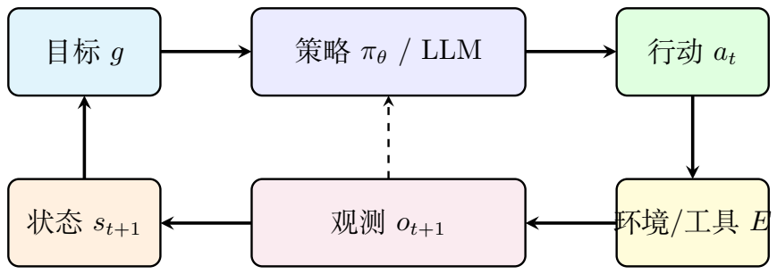<figcaption>Agent 的闭环：策略产生行动，环境返回观测，状态更新后再次影响策略。这等价于一个带反馈的离散动力系统。</figcaption></figure>
<h4 id="section-55">MDP 与 Bellman 方程</h4>

Agent 的决策过程可以形式化为马尔可夫决策过程（MDP），定义在五元组 $(\mathcal{S}, \mathcal{A}, P, R, \gamma)$ ：

<ul>
<li>$\mathcal{S}$：状态空间（Agent 所有可能的内外部状态）；</li>
<li>$\mathcal{A}$：行动空间（所有可执行的操作）；</li>
<li>$P(s_{t+1}\mid s_t, a_t)$：状态转移概率（环境/工具的响应不确定时）；</li>
<li>$R(s_t, a_t)$：奖励函数（衡量行动对目标的推进程度）；</li>
<li>$\gamma\in[0,1)$：折扣因子（近期奖励比远期奖励重要）。</li>
</ul>

目标是最大化折扣回报 $G_t = \sum_{k=0}^{\infty}\gamma^k R(s_{t+k}, a_{t+k})$。值函数 $V^{\pi}(s) = \mathbb{E}_{\pi}[G_t\mid s_t=s]$ 满足 Bellman 方程：

\[
\begin{aligned}
V^{\pi}(s) = \sum_{a}\pi(a\mid s)\sum_{s&#x27;}P(s&#x27;\mid s,a)\left[R(s,a) + \gamma V^{\pi}(s&#x27;)\right].
\label{bellman}
\end{aligned}
\](2.28)

最优值函数 $V^\star(s) = \max_{\pi} V^{\pi}(s)$ 满足 Bellman 最优方程：

\[
\begin{aligned}
V^\star(s) = \max_{a}\sum_{s&#x27;}P(s&#x27;\mid s,a)\left[R(s,a) + \gamma V^\star(s&#x27;)\right].
\end{aligned}
\](2.29)

<aside class="fta-callout fta-explanation">
Explanation: Agent 不一定是 RL 训练的

大多数当前 Agent 并非通过显式求解 Bellman 方程来决策——它们使用 LLM 来隐式估计"什么行动在当前状态下最有用"。但 MDP 形式帮助我们理解：Agent 的行动应该考虑未来反馈（通过 $V^\star$ 中的递归期望），而非只优化当前 token 概率。LLM 的上下文窗口和 Chain-of-Thought 推理可以被看作一种隐式的、基于模型的 roll-out 和规划。

</aside>
<h4 id="section-56">Agent 的模块结构</h4>

一个实用 Agent 常包含七个模块：

<ol>
<li><strong>感知模块</strong>：接收用户输入、文件、工具返回$0_{t+1}$；</li>
<li><strong>状态模块</strong>：维护当前任务状态 $s_t,s_{t+1}$；</li>
<li><strong>记忆模块</strong>：保存短期上下文和长期资料（含 RAG 知识库）, $s_t$ 或$U$ 的一部分 ；</li>
<li><strong>规划模块</strong>：把目标 $g$ 分解为子目标序列，$g$到$\pi_\theta$的过程；</li>
<li><strong>策略模块</strong>：选择行动 $a_t$（通常由 LLM + 提示词 + 工具协议实现）；</li>
<li><strong>工具模块</strong>：执行搜索、计算、代码、读写文件、调用 API；</li>
<li><strong>反馈与安全模块</strong>：检查结果、处理错误、限制危险行动。</li>
</ol>
<aside class="fta-callout fta-example">
Example 30

在我们的谐振子数值分析任务中，Agent 使用 MDP 框架的形式化如下：

<strong>目标 $g$：</strong> 分析一维谐振子运动，比较 Euler 和 RK4 的能量守恒。

<strong>初始状态 $s_0$：</strong>

\[
\begin{aligned}
c_0 &amp;= \text{[用户请求: &quot;我想用数值方法分析一维谐振子的运动...&quot;]},\\
m_0 &amp;= \emptyset,\\
r_0 &amp;= \text{&quot;未开始&quot;}.
\end{aligned}
\](2.30)(2.31)(2.32)

<strong>子目标分解（规划模块）：</strong>

\[
\begin{aligned}
g \to (g_1,\dots,g_6) = (\text{理解物理系统}, \text{实现Euler法h和RK4法}, \text{运行模拟}, \text{分析能量守恒}, \text{生成报告}).
\end{aligned}
\](2.33)

<strong>闭环过程：</strong>

<table class="fta-table"><tr><th>$t$</th><th>行动 $a_t$</th><th>观测 $o_{t+1}$</th><th>状态更新</th></tr><tr><td>0</td><td>解析用户请求，提取参数</td><td>$\{x_0=1,v_0=0,\omega=1,T=10\text{周期}\}$</td><td>$r_1$: 参数已提取</td></tr><tr><td>1</td><td>生成 Euler 法 Python 代码</td><td>代码片段</td><td>$b_1$: Euler 代码</td></tr><tr><td>2</td><td>执行 Euler 代码</td><td>$\{t,x,v\}$ 数组，能量漂移 5.2%</td><td>$b_2$: Euler 结果已记录</td></tr><tr><td>3</td><td>生成 RK4 法 Python 代码</td><td>代码片段</td><td>$b_3$: RK4 代码</td></tr><tr><td>4</td><td>执行 RK4 代码</td><td>$\{t,x,v\}$ 数组，能量漂移 0.0008%</td><td>$b_4$: RK4 结果已记录</td></tr><tr><td>5</td><td>生成对比分析（含相位图）</td><td>分析文本 + 图表</td><td>$b_5$: 对比完成</td></tr><tr><td>6</td><td>校验：解析解 vs 数值解残差</td><td>残差正常</td><td>Done=1</td></tr></table>

在 $t=6$ 时，所有校验通过，Agent 输出最终结论："RK4 方法在 $\Delta t=0.01$ 下模拟10个周期后能量相对漂移仅为 $8\times10^{-6}$，远优于 Euler 法的 $5.2\times10^{-2}$。Euler 法的能量单调递增（系统表现如同被持续注入能量），这是辛积分缺失的典型表现；RK4 虽然不是严格辛方法，但其高阶精度在实际中保持了很好的长期能量稳定性。"

</aside>
<aside class="fta-callout fta-summary">
Summary

Agent = 状态 $s_t$ + 策略 $\pi_\theta$ + 工具 $E$ + 状态更新 $U$。LLM 实现策略的大部分，但 Agent 还需要显式的状态管理、目标分解和反馈处理。MDP 和 Bellman 方程为理解 Agent 的序贯决策提供了理论框架。

</aside>
<h3 id="section-57">第三层：LLM Agent 的六步工作流</h3>

将 LLM 放入 Agent 系统后，一个完整任务不是一次性生成答案，而是一个可重复的闭环过程：

\[
\begin{aligned}
\text{任务输入}
\to \text{目标理解}
\to \text{任务分解}
\to \text{行动选择}
\to \text{工具调用}
\to \text{观察校验}
\to \text{最终输出}.
\end{aligned}
\](2.34)

<aside class="fta-callout fta-summary">
Summary

LLM Agent 的六步闭环可以概括为：

<ol>
<li><strong>理解任务：</strong> 从用户输入中提取目标、约束、参数和输出格式；</li>
<li><strong>任务分解：</strong> 将大目标拆成可执行、可观测、可校验的子目标；</li>
<li><strong>行动选择：</strong> 根据当前状态决定直接回答、调用工具、检索资料、执行代码或请求人工确认；</li>
<li><strong>工具调用：</strong> 把行动转化为外部工具的结构化输入；</li>
<li><strong>观察与校验：</strong> 读取工具返回，检查代码错误、数值误差、事实来源和物理约束；</li>
<li><strong>终止与输出：</strong> 当目标完成且校验通过时，生成最终答案或报告。</li>
</ol>
</aside>
<h4 id="section-58">理解任务</h4>

理解任务是把用户的自然语言请求转换为结构化目标。Agent 至少需要识别：目标 $g$、已知条件、约束条件、可用工具和期望输出形式。若这些信息不足，Agent 应先请求澄清，而非直接执行。

<aside class="fta-callout fta-example">
Example 31

本节将谐振子数值分析的完整 Agent 工作流展开，展示从用户请求到最终报告的全过程。

用户请求：

<blockquote>

"我想用数值方法分析一维谐振子的运动，并比较 Euler 法和 RK4 法的能量守恒表现。初始条件 $x_0=1$, $v_0=0$, $\omega=1$，模拟10个周期。帮我实现代码并分析结果。"

</blockquote>

物理系统：一维谐振子 $\ddot x + \omega^2 x = 0$，等价一阶系统$ x = v, v = -^2 x$.

解析解：$x(t) = x_0\cos(\omega t) + (v_0/\omega)\sin(\omega t) = \cos t$（在给定初始条件下）。

守恒量：$E(t) = \frac{1}{2}v(t)^2 + \frac{1}{2}\omega^2 x(t)^2 \equiv E_0 = 0.5$（在给定初始条件下）。

<strong>解析任务参数</strong>

Agent 从用户请求中提取关键参数：

\[
\begin{aligned}
\text{params} = \{x_0=1,\; v_0=0,\; \omega=1,\; T_{\rm sim}=10\times \frac{2\pi}{\omega} \approx 62.8,\; \text{methods}=[\text{Euler}, \text{RK4}]\}.
\end{aligned}
\](2.35)

</aside>
<h4 id="section-59">分解规划</h4>
<h5 id="section-60">任务分解的形式化</h5>

给定目标 $g$，规划模块找到子目标序列 $g \to (g_1, g_2, \dots, g_K)$。每个子目标 $g_k$ 对应行动序列 $a_{k,1},\dots,a_{k,n_k}$，完整任务变成轨迹（可执行序列）$\tau = (a_1, a_2, \dots, a_M)$.

<ol>
<li>每步可执行（行动在当前状态下是可行的）；</li>
<li>每步结果可观测（执行后有明确的成功/失败信号）；</li>
<li>失败时可回滚或修正（不因单步失败导致全局失败）；</li>
<li>子目标之间的依赖关系明确（某些步骤必须在前序步骤完成后才能开始）。</li>
</ol>
<h5 id="section-61">搜索树</h5>

每个状态 $s$ 是搜索树节点，每个行动 $a$ 是边。规划是寻找从初态 $s_0$ 到目标集合 $\mathcal{G}$ 的路径。

现实中状态空间巨大且环境不确定，无法精确求解最优路径。因此常使用启发式规划：LLM 生成候选步骤，工具执行和反馈修正。

<aside class="fta-callout fta-example">
Example 32

在我们的谐振子数值分析任务中，目标可以分解为：

\[
\begin{aligned}
g \to (g_1,\dots,g_6)
= (\text{理解系统}, \text{检索数值方法}, \text{生成执行代码}, \text{校验结果}, \text{可视化}, \text{输出报告}).
\end{aligned}
\](2.36)

这个分解满足要求：失败时可以回到对应步骤修正。例如，如果 RK4 代码执行失败，Agent 不需要重做问题理解，而只需要回到“生成并执行代码”这一步。

</aside>
<h4 id="section-62">行动选择</h4>

行动选择是在当前状态 $s_t$ 下决定下一步做什么。可选行动包括继续推理、直接回答、调用检索、执行代码、读取文件、生成图表或请求人工确认。行动选择的关键是：下一步操作必须能推进目标状态，而不仅仅是生成一段流畅文字。

<h5 id="section-63">ReAct：推理与行动交替</h5>

ReAct（Reasoning + Acting）[yao2023react] 是一种将推理和行动交替进行的范式：

\[
\begin{aligned}
\text{Thought}_t &amp;\leftarrow f_{\theta}(s_t, g) \quad \text{(LLM 生成&quot;思考&quot;)},\\
a_t &amp;\leftarrow \text{ActionParser}(\text{Thought}_t) \quad \text{(将文本解析为工具调用)},\\
o_{t+1} &amp;\leftarrow E(s_t, a_t) \quad \text{(执行工具)},\\
s_{t+1} &amp;\leftarrow U(s_t, a_t, o_{t+1}) \quad \text{(状态更新)}.
\end{aligned}
\](2.37)(2.38)(2.39)(2.40)

<aside class="fta-callout fta-explanation">
Explanation: ReAct 中的"思考"不是神秘主义

"思考"步骤相当于把模型的中间推理过程显式化为文本。它的作用包括：

<ul>
<li>分析当前状态和目标之间的差距；</li>
<li>检查上一步工具返回的结果是否合理；</li>
<li>决定下一步应该做什么（信息检索、计算、还是直接回答）；</li>
<li>在复杂决策点（方法选择、参数设置）记录推理依据。</li>
</ul>

这本质上是一种用自然语言实现的、可检查的中间工作区。

</aside>
<aside class="fta-callout fta-example">
Example 33

在我们的谐振子例子中，Agent 使用 ReAct 模式处理"分析数值结果"这个阶段：

<strong>Thought$_t$：</strong> "Euler 法代码已成功运行。输出数据显示10个周期后的能量相对误差为 0.052（5.2%），且系统总能量单调递增，出现能量漂移。下一步运行 RK4 代码，预期其能量误差应远小于 Euler 法，因为 RK4 是四阶方法。也需要检查时间步长是否满足稳定性条件 $\Delta t &lt; 2/\omega = 2$。

<strong>Action$_t$：</strong> <code>execute(&quot;python rk4_harmonic_oscillator.py&quot;)</code>

<strong>Observation$_{t+1}$：</strong> RK4 运行成功，10周期后能量相对误差 $=8\times10^{-6}$（$0.0008\%$），相位图显示轨道闭合，无明显漂移。

<strong>Thought$_{t+1}$：</strong> "RK4 的能量误差（$8\times10^{-6}$）比 Euler 法（$5.2\times10^{-2}$）小约 6500 倍，符合四阶方法 vs 一阶方法的预期。现在需要：(1) 用不同步长验证收敛阶；(2) 生成对比图；(3) 撰写分析报告。先做收敛阶测试——用 $\Delta t = 0.05, 0.02, 0.01, 0.005$ 分别跑 RK4 和 Euler，记录每个步长的全局误差，拟合法验证收敛阶。"

关键在于：每一步思考不仅描述了"做什么"，还包含了物理判断（"能量单调递增意味着非辛"、"稳定性条件的检查"）——这些判断引导着后续的行动选择。

</aside>
<h4 id="section-64">工具调用</h4>

LLM 自身不能执行代码、搜索网络或查询数据库。工具调用使 LLM 从"只会生成文本"变成"能请求外部计算和信息"。

设系统有工具集合 $\mathcal{T} = \{\mathcal{T}_1,\dots,\mathcal{T}_R\}$。第 $r$ 个工具 $\mathcal{T}_r$ 接受参数 $u$，返回结果 $y = \mathcal{T}_r(u)$。Agent 的行动拆分为两部分：$a_t = (r_t, u_t)$——选择工具编号 $r_t$ 和参数 $u_t$。

工具调用的可靠性是关键。令 $o_{t+1} = (y_{t+1}, e_{t+1})$，其中 $e_{t+1}$ 是错误状态。若 $e_{t+1}\neq 0$，Agent 必须识别错误并选择恢复行动。

<aside class="fta-callout fta-explanation">
Explanation: 工具调用与实验仪器

在物理实验中，仪器读数需要校准、误差条和故障检测。工具调用也是如此：搜索引擎返回的结果可能过时，代码执行器可能因语法错误而失败，计算器可能因表达式错误而报错。Agent 的可靠性不只取决于 LLM 本身，还取决于工具链是否可观测、可校验、可追踪。

</aside>
<aside class="fta-callout fta-example">
Example 34

<strong>检索相关知识（RAG）</strong>

Agent 从知识库中检索 Euler 法和 RK4 法的数学定义：

<ul>
<li>Euler 法：$y_{n+1} = y_n + h f(t_n, y_n)$，一阶方法，局部截断误差 $O(h^2)$；</li>
<li>RK4 法：$y_{n+1} = y_n + \frac{h}{6}(k_1+2k_2+2k_3+k_4)$，四阶方法，局部截断误差 $O(h^5)$。</li>
</ul>

<strong>生成并执行代码</strong>

Agent 生成 Python 代码，包含：Euler 一步更新函数；RK4 一步更新函数；主循环（时间推进 + 能量计算）；结果保存。

代码通过 Python 工具执行器运行。如果执行出错，Agent 阅读错误信息并修正代码。

</aside>
<h4 id="section-65">观察、校验与修正</h4>

工具执行后，Agent 读取观测 $o_{t+1}$，并将其写回状态 $s_{t+1}$。观察不是被动地“看结果”，而是要检查结果是否满足任务约束：代码是否报错、数值是否稳定、物理量是否守恒、事实是否有来源、输出是否符合格式。若校验失败，Agent 应回到任务分解、行动选择或工具调用阶段进行修正。

<h5 id="section-66">外部校验：让语言模型进入实验闭环</h5>

可靠使用 LLM 的正确方式与物理实验相同——引入独立可观测量的校验。对于不同类型的任务：

\[
\begin{aligned}
\text{数学推导} &amp;\to \text{代数检验或数值代入},\\
\text{代码任务} &amp;\to \text{运行测试},\\
\text{事实问题} &amp;\to \text{检索可信来源},\\
\text{物理计算} &amp;\to \text{守恒量检查与量纲分析}.
\end{aligned}
\](2.41)(2.42)(2.43)(2.44)

这是 Agent 思想的入口：不把一次生成当最终答案，而是让模型生成行动，再用环境反馈校验。

<aside class="fta-callout fta-example">
Example 35

在我们的谐振子数值分析中，Agent 生成了 Euler 法和 RK4 法的 Python 代码并运行。完整的校验闭环包括：

<strong>校验1——解析解对比：</strong> 谐振子有精确解析解 $x_\mathbf{exact}(t)=A\cos(\omega t+\phi)$。Agent 计算$|x_{\rm num}(t) - x_{\rm exact}(t)|$。Euler 法的最大偏差应随 $\Delta t$ 减小而一阶减小；RK4 应四阶减小。如果 Euler 法的误差随 $t$ 线性增长（$O(\Delta t)$ 全局误差）而 RK4 的误差保持极小（$O(\Delta t^4)$ 全局误差），说明数值方法实现正确。

<strong>校验2——能量守恒：</strong> 谐振子系统总能量 $E(t)=\frac{1}{2}v(t)^2+\frac{1}{2}\omega^2 x(t)^2$ 理论上守恒。Agent 自动计算10个周期后 $\max_t|E(t)-E(0)|/E(0)$：

<ul>
<li>Euler 法：能量漂移 $\approx 5\%$（$\Delta t=0.01$ 时）——说明一阶方法的能量不守恒是固有缺陷；</li>
<li>RK4 法：能量漂移 $\approx 0.001\%$——四阶方法几乎完美保持能量守恒。</li>
</ul>

<strong>校验3——步长收敛性：</strong> Agent 用不同步长（$\Delta t = 0.1, 0.05, 0.01, 0.005$）重复实验，验证 Euler 法的全局误差与 $\Delta t^1$ 成正比、RK4 与 $\Delta t^4$ 成正比。

如果上述任一校验失败（如 RK4 的能量漂移异常大），Agent 应标记该结论为"[需人工审查：数值结果异常]"——这就是外部校验闭环的价值：代码的成功执行不等于物理结果的正确性。

</aside>
<h4 id="section-67">终止条件与最终输出</h4>

终止条件决定 Agent 何时停止闭环。可靠的 Agent 不应仅凭模型自称“完成了”就结束，而应显式检查任务目标、工具执行、校验结果、错误状态和步数上限。

可靠终止需满足：目标已输出、必要工具已运行、校验已通过、无未处理错误、步数未超上限 $T_{\max}$。

<aside class="fta-callout fta-example">
Example 36

谐振子分析 Agent 的实现：

<strong>初始化：</strong>

\[
\begin{aligned}
s_0 = (g=\text{&quot;分析谐振子 Euler、 RK4 能量&quot;},\; h_0=\text{[用户请求]},\; \ell_0=\emptyset,\; b_0=\{ \text{&quot;start&quot;}\}).
\end{aligned}
\](2.45)

<strong>停止条件：</strong>

\[
\begin{aligned}
\operatorname{Done}(s_t) = \begin{cases}
1, &amp; \text{Euler 和 RK4 代码均已成功执行 } \land \text{ 能量分析已完成 } \land \text{ 校验已通过},\\
1, &amp; t \ge T_{\max}=20,\\
0, &amp; \text{其他}.
\end{cases}
\end{aligned}
\](2.46)

通过显式维护 $b_t$（黑板），Agent 始终知道自己完成了什么、还需要做什么——这是一种"可审计"（auditable）的状态管理方式。

</aside>
<aside class="fta-callout fta-example">
Example 37

<strong>生成可视化与报告</strong>

Agent 生成：

<ul>
<li>相位图 $(x(t), v(t))$——Euler 轨道螺旋外扩（能量增加），RK4 轨道闭合（能量守恒）；</li>
<li>能量相对误差随时间的变化曲线；</li>
<li>收敛阶对数图（$\log(\text{error})$ vs $\log(h)$，斜率 $\approx$ 方法阶数）。</li>
</ul>

<strong>最终输出</strong>

Agent 输出一份结构化的分析报告，包含：

<ul>
<li>方法概述（Euler 一阶显式 vs RK4 四阶显式）；</li>
<li>数值结果摘要（能量漂移对比表）；</li>
<li>物理解释（Euler 不是辛积分器 $\to$ 能量漂移；RK4 的高阶精度在有限时间内提供了良好的能量守恒近似）；</li>
<li>建议（对长期哈密顿系统模拟，推荐使用辛积分器如 Verlet/leapfrog——这可以在后续扩展中实现）。</li>
</ul>
</aside>
<h3 id="section-68">RAG 与外部知识</h3>

RAG 可以看作工具调用的一种重要形式，但由于它涉及文档切分、向量嵌入、相似度检索和证据注入，因此单独展开。

RAG（Retrieval-Augmented Generation，检索增强生成）[lewis2020rag] 解决"上下文有限"和"知识需要外部更新"的问题。其数学形式为：文档被切成块 $d_i$，嵌入模型 $\phi$ 将文本块映射为向量 $z_i = \phi(d_i)\in\mathbb{R}^m$。查询 $q$ 的向量为 $z_q = \phi(q)$。余弦相似度：

\[
\begin{aligned}
\operatorname{sim}(q, d_i) = \frac{z_q \cdot z_i}{\|z_q\|\,\|z_i\|}.
\end{aligned}
\](2.47)

检索取相似度最高的 $K$ 个块：$\mathcal{D}_K(q) = \operatorname*{arg\,topK}_{d_i} \operatorname{sim}(q, d_i)$。然后将这些块拼接进 prompt：

\[
\begin{aligned}
y \sim P_{\theta}(y\mid q, \mathcal{D}_K(q)).
\end{aligned}
\](2.48)

RAG 有三类误差值得关注：（1）<strong>检索误差</strong>——相关文档未被检索到；（2）<strong>证据误差</strong>——检索到的文档本身过时或错误；（3）<strong>生成误差</strong>——模型未忠实使用证据，或将多个来源错误混合。

<aside class="fta-callout fta-example">
Example 38

在我们的谐振子例子中，RAG 用于检索数值方法的相关知识：

<strong>场景：</strong> 用户问 "RK4 法为什么比 Euler 法能量守恒更好？"

<strong>检索过程：</strong>

<ol>
<li>Agent 将查询映射为向量 $z_q$；</li>
<li>在知识库（数值分析教材、物理计算手册）中检索 Top-3 片段：</li>
<ul>
<li>片段1："Euler 法是一阶 Runge-Kutta 方法，局部截断误差 $O(h^2)$，全局误差 $O(h)$。该方法不保持辛结构，长期积分导致能量漂移。"</li>
<li>片段2："经典四阶 Runge-Kutta 方法（RK4）的局部截断误差为 $O(h^5)$，全局误差为 $O(h^4)$。对谐振子等周期系统，RK4 的数值耗散远小于低阶方法。"</li>
<li>片段3："辛积分器（如 Verlet 法）专为哈密顿系统设计，精确保持相空间体积和能量。RK4 虽非严格辛方法，但在小步长下能量漂移可忽略。"</li>
</ul>
<li>Agent 将这三个片段放入 prompt，在回答中准确引用："根据 [1]，Euler 法的全局误差为 $O(h)$......根据 [3]，更严格的能量守恒需要辛积分器......"</li>
</ol>

<strong>如果没有 RAG：</strong> 模型可能只能给出模糊的回答，如 "RK4 更精确因为它是高阶方法"——缺少了局部截断误差的具体阶数、辛结构的重要性、以及与其他方法（如 Verlet）的比较。这些细节正是区分"大致正确"和"严格正确"的关键。

</aside>
<h3 id="section-69">安全、对齐与可靠性</h3>

Agent 的风险高于普通聊天模型，因为它可能执行工具、修改文件或影响真实系统。

<h4 id="section-70">为什么Agent需要安全层</h4>

LLM 输出文本时，错误主要表现为错误答案；Agent 执行行动时，错误可能变成删除文件、发送邮件、运行危险命令或泄露敏感信息。因此需要约束行动集合：

\[
\begin{aligned}
\mathcal{A}_{\rm allowed}(s_t) \subseteq \mathcal{A}.
\end{aligned}
\](2.49)

策略生成的行动 $a_t$ 必须通过安全过滤器 $\operatorname{Safe}(a_t, s_t) = 1$ 才能执行。

<h4 id="section-71">目标错配与评估指标</h4>

如果用户目标 $g$ 表达不完整，Agent 可能优化错误目标。设真实目标为 $g^\star$，模型理解的目标为 $\hat g$。当 $\hat g\neq g^\star$ 时，即使行动序列对 $\hat g$ 最优，也可能对用户有害。

Agent 评估不能只看最终回答是否流畅。关键指标包括：

\[
\begin{aligned}
\text{成功率} &amp;= \frac{\text{完成任务数}}{\text{总任务数}},\quad
\text{工具错误率} = \frac{\text{失败工具调用数}}{\text{总工具调用数}},\quad
\text{校验通过率} = \frac{\text{通过外部检查的输出数}}{\text{输出总数}}.
\end{aligned}
\](2.50)

对物理任务还应关注：单位一致性、量纲检查、数值误差范围、引用准确性和假设清晰度。

<aside class="fta-callout fta-example">
Example 39

在我们的谐振子例子中，安全考虑包括：

<strong>代码执行安全：</strong>

<ol>
<li>Agent 在执行任何 Python 代码前，应先在沙箱环境中测试；</li>
<li>代码中不能包含 <code>import os</code>、<code>import subprocess</code> 等系统调用模块——工具执行器应自动拒绝包含这些导入的代码；</li>
<li>设置执行超时（如 30 秒），防止无限循环。</li>
</ol>

<strong>物理可靠性校验：</strong>

<ol>
<li>检查能量漂移是否在合理范围内（RK4 在 $\Delta t=0.01$ 下 10 周期能量漂移 $&gt;1\%$ 即有 bug）；</li>
<li>检查步长是否满足数值稳定性条件（$\Delta t$ 小于系统的最短时间尺度）；</li>
<li>检查相位图中轨道是否闭合（不闭合说明积分不准确）；</li>
<li>对每一个数值结论（如"RK4 是四阶方法"）附上收敛阶测试作为证据。</li>
</ol>

<strong>目标错配风险：</strong> 用户的目标 $g^\star$ 是"理解 Euler 和 RK4 的能量守恒差异"，但如果 Agent 的隐式目标是"生成最长的分析报告"（$\hat g$），它可能写出大量关于数值方法历史的无关内容而忽略了核心的数值比较——表面上"内容丰富"，实则未触及核心问题。缓解措施是将任务分解为明确、可评估的子目标，并在每一步检查子目标是否确实完成。

</aside>
<h4 id="section-72">准确性评估（Precision / Recall / F1）</h4>

对于开放式问题，模型的回答通常不是简单的“对”或“错”，而是包含多个可以逐条判断的事实点。因此，可以先把标准答案拆成若干个<strong>原子事实</strong>，再把模型回答逐条比对。设：

<ul>
<li><strong>正确的事实点数量</strong>：模型回答说对了，且对应标准答案关键内容的事实点数量；</li>
<li><strong>错误的事实点数量</strong>：模型回答中说错了、没有证据支持，或者额外编造出来的事实点数量；</li>
<li><strong>被遗漏的事实点数量</strong>：标准答案中应该出现，但模型没有覆盖到的关键事实点数量。</li>
</ul>

则定义：

\[
\begin{aligned}
\text{Precision} &amp;= \frac{\text{正确的事实点数量}}{\text{正确的事实点数量}+\text{错误的事实点数量}}, \\
\text{Recall} &amp;= \frac{\text{正确的事实点数量}}{\text{正确的事实点数量}+\text{被遗漏的事实点数量}}, \\
F_1 &amp;= \frac{2 \cdot \text{Precision} \cdot \text{Recall}}{\text{Precision}+\text{Recall}}.
\end{aligned}
\]

其中，Precision 衡量“模型说出来的内容有多少是对的”，Recall 衡量“标准答案中的关键内容模型覆盖了多少”，$F_1$ 则是二者的综合平衡。

<aside class="fta-callout fta-example">
Example 40

可以把标准答案拆成如下 8 个原子事实：

<ol>
<li>任务对象是一维谐振子；</li>
<li>目标是比较 Euler 法和 RK4 法；</li>
<li>初始条件为 $x_0=1, v_0=0, \omega=1$；</li>
<li>模拟时间为 10 个周期；</li>
<li>Agent 需要生成并执行数值模拟代码；</li>
<li>需要计算谐振子能量$E(t)=\frac{1}{2}v(t)^2+\frac{1}{2}\omega^2x(t)^2$;</li>
<li>需要比较能量相对漂移$\Delta E_{\mathrm{rel}}=\max_t \frac{|E(t)-E_0|}{E_0}$;</li>
<li>结论：Euler 法能量漂移明显，而 RK4 法能量漂移很小，因此 RK4 的长期数值稳定性更好。</li>
</ol>

假设模型 A 的回答是：

<blockquote>

这个 Agent 会先识别任务是一维谐振子问题，提取参数 $x_0=1, v_0=0, \omega=1$， 并设置模拟 10 个周期。然后它分别实现 Euler 法和 RK4 法，运行代码得到 $x(t)$ 和 $v(t)$。 接着计算能量$E(t)=\frac{1}{2}v(t)^2+\frac{1}{2}\omega^2x(t)^2$ 以及相对能量漂移。通常 Euler 法会出现明显能量漂移，而 RK4 法的能量漂移很小， 所以 RK4 在这个任务中更可靠。

</blockquote>

模型 A 命中了 8 个标准事实，没有明显错误，也没有遗漏关键点。因此：

\[
\begin{aligned}
\begin{aligned}
\text{模型 A 的正确的事实点数量} &amp;= 8, \\
\text{模型 A 的错误的事实点数量} &amp;= 0, \\
\text{模型 A 的被遗漏的事实点数量} &amp;= 0.
\end{aligned}
\to
\left\{\begin{aligned}
\text{Precision}_A &amp;= \frac{8}{8+0} = 1.00, \\
\text{Recall}_A &amp;= \frac{8}{8+0} = 1.00, \\
F_{1,A} &amp;= \frac{2 \times 1.00 \times 1.00}{1.00+1.00} = 1.00.
\end{aligned}\right.
\end{aligned}
\](2.51)

再假设模型 B 的回答是：

<blockquote>

这个 Agent 会用神经网络训练一个谐振子模型，然后只需要看最后的位置误差。 Euler 法通常比 RK4 更稳定，因为 Euler 法更简单。这个任务不需要检查能量守恒， 只要代码能运行就说明结果正确。

</blockquote>

模型 B 中有一些问题：

<ul>
<li>“用神经网络训练一个谐振子模型”不是本文这个例子的核心任务；</li>
<li>只看最后的位置误差，遗漏了能量守恒校验；</li>
<li>“Euler 法通常比 RK4 更稳定”是错误判断；</li>
<li>“代码能运行就说明结果正确”也是错误的，因为本文强调需要外部校验；</li>
<li>它没有明确给出 $x_0=1, v_0=0, \omega=1$；</li>
<li>它没有说明模拟 10 个周期；</li>
<li>它没有写出能量公式；</li>
<li>它没有比较能量相对漂移。</li>
</ul>

模型 B 只命中了“任务与谐振子有关”这一点，其余关键点要么遗漏，要么说错。因此：

\[
\begin{aligned}
\begin{aligned}
\text{模型 B 的正确的事实点数量} &amp;= 1, \\
\text{模型 B 的错误的事实点数量} &amp;= 4, \\
\text{模型 B 的被遗漏的事实点数量} &amp;= 7.
\end{aligned}
\to
\left\{\begin{aligned}
\text{Precision}_B &amp;= \frac{1}{1+4} = 0.20, \\
\text{Recall}_B &amp;= \frac{1}{1+7} = 0.125, \\
F_{1,B} &amp;= \frac{2 \times 0.20 \times 0.125}{0.20+0.125} \approx 0.154.
\end{aligned}\right.
\end{aligned}
\](2.52)

因此，在这个谐振子 Agent 任务上，模型 A 明显比模型 B 更准确。

这个例子说明：判断一个回答是否准确，不能只看它是否“说得像样”，而要看它是否正确覆盖了任务目标、物理模型、数值方法、参数设置、能量公式、误差指标和最终结论。

</aside>
<h3 id="section-73">实现一个最小 Agent</h3>

一个最小 Agent 不需要复杂框架。只要有状态 $s_t$、策略 $\pi$、工具执行 $E$ 和状态更新 $U$ 四部分，就能形成闭环。

<h4 id="section-74">系统状态设计</h4>

一个简单但完整的状态可以写成

\[
\begin{aligned}
s_t = (g,\, h_t,\, \ell_t,\, b_t),
\end{aligned}
\](2.53)

$g$ 是目标，$h_t$ 是对话历史，$\ell_t$ 是执行日志，$b_t$ 是当前任务黑板（中间结果、文件路径、错误信息等）。

状态更新函数可拆为三步：

\[
\begin{aligned}
\ell_{t+1} &amp;= \ell_t \oplus (a_t, o_{t+1}) \quad \text{(追加日志)},\\
f_{t+1} &amp;= \operatorname{Extract}(o_{t+1}) \quad \text{(抽取结构化事实)},\\
b_{t+1} &amp;= \operatorname{Merge}(b_t, f_{t+1}) \quad \text{(合并到黑板)}.
\end{aligned}
\](2.54)(2.55)(2.56)

本节侧重最小 Agent 的状态设计与参考架构。

<h4 id="section-75">从零实现的参考架构</h4>

一个可实现的 Agent 架构需要清晰的模块边界和数据流。

<figure class="fta-figure" style="--fta-figure-width: 409px">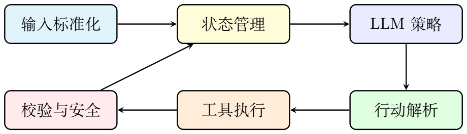<figcaption>最小可实现 Agent 架构：每条箭头都应有明确数据结构。箭头上的数据依次为：输入文本、状态摘要、策略提示、结构化行动、工具参数、工具返回、校验结果。</figcaption></figure>

策略模型接收的提示拆为五部分：

\[
\begin{aligned}
\text{Prompt}_t = (I, R, S, T, F),
\end{aligned}
\](2.57)

其中 $I$ 是系统指令（角色定义），$R$ 是可用工具规则（工具描述、参数格式），$S$ 是当前状态摘要（已完成、待做），$T$ 是任务目标，$F$ 是输出格式约束（如 "以 JSON 格式输出行动"）。

每个模块的功能可单独测试：输入标准化独立于 LLM 策略；工具执行独立于状态管理；校验模块独立于规划。这种模块化设计使得 Agent 的调试和增量改进变得可控。

<h3 id="section-76">结论：概率层、推理层、控制层</h3>

如果把整件事压缩成一个统一的框架：

<ol>
<li><strong>概率层（LLM 基础）：</strong> 语言模型 = 自回归条件概率分解 + 最大似然训练 + softmax 输出。这是"理解"和"生成"的数学基础。</li>
<li><strong>训练与推理层：</strong> 预训练 $\to$ 指令微调 $\to$ RLHF 三个阶段分别塑造模型的知识分布、行为格式和价值偏好。推理通过自回归采样（温度/Top-k/Top-p）从概率分布中生成文本。</li>
<li><strong>控制层（Agent 闭环）：</strong> Agent = 状态 $s_t$ + 策略 $\pi_\theta$ + 工具 $E$ + 状态更新 $U$。通过规划（任务分解、ReAct）、工具调用、RAG 检索和安全校验，形成"感知 $\to$ 行动 $\to$ 观测 $\to$ 修正"的闭环。</li>
</ol>
<aside class="fta-callout fta-summary">
Summary

一句话总结：<strong>LLM 学会了概率建模，Agent 让它学会与外部世界互动。</strong> 前者提供"智能"，后者提供"闭环"——两者的结合才构成了能够感知、规划、执行和校验的智能系统。

</aside>
<aside class="fta-callout fta-example">
Example 41

回到我们的谐振子数值分析例子，全章总结如下：

<strong>问题：</strong> 用户想用数值方法分析一维谐振子，比较 Euler 和 RK4 的能量守恒。

<strong>概率层：</strong> LLM 基于预训练学到的物理知识和 Python 语法，为 "实现 Euler 法积分" 等指令中的每个 token 分配合理的条件概率。

<strong>训练层：</strong> 模型经历了预训练（学习物理和编程知识）、指令微调（学会从"帮我实现..." 映射到代码块格式）、RLHF（学会在代码中包含文档字符串、能量校验和错误处理）。

<strong>控制层：</strong> Agent 将模糊请求分解为参数提取 $\to$ 代码生成 $\to$ 执行 $\to$ 校验 $\to$ 报告 的子任务序列。每一步都有明确的输入、输出和校验标准。能量守恒检验充当了"可观测事实"——如果数值结果违背物理定律，Agent 会自我修正。

<strong>本质：</strong> Agent 不是一个"更聪明的 LLM"，而是一个让 LLM 嵌入闭环控制系统的架构。LLM 提供认知能力，闭环提供可靠性保障——就像物理实验中，理论计算（LLM）需要通过实验观测（工具返回）和守恒律检查（校验模块）来验证一样。

</aside>
<h2 id="section-77">数学附录：几个常用推导</h2>
<h3 id="section-78">Softmax 雅可比矩阵</h3>

Softmax 定义：$p_i = e^{z_i} / S$，$S = \sum_k e^{z_k}$。对 $z_j$ 求导：

\[
\begin{aligned}
\frac{\partial p_i}{\partial z_j}
= \frac{\mathbb{1}_{i=j}e^{z_i}S - e^{z_i}e^{z_j}}{S^2}
= p_i(\delta_{ij} - p_j).
\end{aligned}
\](A.1)

雅可比矩阵：$J_{\operatorname{softmax}}(z) = \operatorname{diag}(p) - pp^\top$。半正定性：$u^\top J u = \operatorname{Var}_{i\sim p}(u_i) \ge 0$。

<h3 id="section-79">KL 散度非负性证明</h3>

使用 $-\log u$ 的凸性和 Jensen 不等式：

\[
\begin{aligned}
D_{KL}(P\Vert Q)
= \sum_x P(x)\left[-\log\frac{Q(x)}{P(x)}\right]
\ge -\log\left(\sum_x P(x)\frac{Q(x)}{P(x)}\right)
= -\log 1 = 0.
\end{aligned}
\](A.2)

等号当且仅当 $P=Q$。

<h3 id="section-80">经验风险与真实风险</h3>

真实风险 $\mathcal{R}(\theta) = \mathbb{E}_{x\sim P_{\rm data}}[\ell(x;\theta)]$，经验风险 $\widehat{\mathcal{R}}_N(\theta) = \frac{1}{N}\sum_{i=1}^{N}\ell(x^{(i)};\theta)$。对固定 $\theta$，大数定律保证 $\widehat{\mathcal{R}}_N(\theta)\to\mathcal{R}(\theta)$（$N\to\infty$）。但训练会在大量 $\theta$ 中选择最优者，因此还需泛化理论、正则化和验证集评估。

<h3 id="section-81">数值方法的局部截断误差</h3>

对一阶 ODE $\dot y = f(t,y)$，Euler 法的局部截断误差为

\[
\begin{aligned}
\text{LTE}_{\rm Euler} = \frac{h^2}{2}y&#x27;&#x27;(\xi) = O(h^2).
\end{aligned}
\](A.3)

经典 RK4 法的局部截断误差为

\[
\begin{aligned}
\text{LTE}_{\rm RK4} = O(h^5).
\end{aligned}
\](A.4)

全局误差分别积累为 $O(h)$ 和 $O(h^4)$。

<h3 id="section-82">Euler和RK4解法对比</h3>

为什么人类会偏好 A？因为谐振子问题的关键不是“画个轨迹”而是：<code>数值方法是否尊重物理守恒量？</code>

我们甚至可以直接算 Euler 法为什么糟糕。

显式 Euler： $\{ x_{n+1} &amp;= x_n + t v_n \\ v_{n+1} &amp;= v_n - t x_n .$. 能量：$E_n = \frac{1}{2}(x_n^2 + v_n^2)$

下一步能量：

\[
\begin{aligned}
E_{n+1} &amp;= \frac{1}{2}\left[(x_n+\Delta t v_n)^2 + (v_n-\Delta t x_n)^2\right]\\
    &amp;= \frac{1}{2}
    \left[
    x_n^2 + 2\Delta t x_n v_n + \Delta t^2 v_n^2
    +
    v_n^2 - 2\Delta t x_n v_n + \Delta t^2 x_n^2
    \right]\\
    &amp;= \frac{1}{2}(1+\Delta t^2)(x_n^2 + v_n^2)\\
    &amp;= (1+\Delta t^2)E_n
\end{aligned}
\](A.5)(A.6)(A.7)(A.8)

这说明显式 Euler 每一步都会把能量乘上 $1+\Delta t^2$，所以能量必然指数增长。

如果取：$\Delta t = 0.1$, 10 个周期$T_{\text{end}} = 10 \cdot 2\pi \approx 62.83$, 步数约为：$n = \frac{62.83}{0.1} \approx 628$

所以 Euler 最终能量大约是：

\[
\begin{aligned}
E_{628} = E_0 (1+0.1^2)^{628}
    = 0.5 \times 1.01^{628} \approx 258.70
\end{aligned}
\](A.9)

相对误差：

\[
\begin{aligned}
\frac{E_{628} - E_0}{E_0} = \frac{258.70 - 0.5}{0.5} \approx 516.4
\end{aligned}
\](A.10)

也就是：<code>Euler 法能量漂移约 51640%</code>.这非常严重。

而 RK4 在同样 $\Delta t=0.1$、10 个周期下，数值上最终能量大约：$E_{\text{RK4}} \approx 0.4999956$

相对误差：

\[
\begin{aligned}
\frac{0.4999956 - 0.5}{0.5} \approx -8.7 \times 10^{-6}
\end{aligned}
\](A.11)

也就是：<code>RK4 的能量误差约为 -0.00087%</code>

所以人类标注者会选择：

\[
\begin{aligned}
y^+ = \text{回答 A}, \quad y^- = \text{回答 B}
\end{aligned}
\](A.12)

<h2 id="section-83">符号表</h2>
<figure class="fta-table-figure"><figcaption>符号说明</figcaption>
<table class="fta-table"><tr><th>序号</th><th>符号</th><th>含义</th></tr><tr><td>1</td><td>$x_{1:T}$</td><td>长度为 $T$ 的 token 序列</td></tr><tr><td>2</td><td>$\mathcal{V}$</td><td>词表（vocabulary）</td></tr><tr><td>3</td><td>$V = |\mathcal{V}|$</td><td>词表大小</td></tr><tr><td>4</td><td>$\theta$</td><td>模型所有可训练参数的集合</td></tr><tr><td>5</td><td>$P_\theta(x_t\mid x_{&lt;t})$</td><td>条件概率：给定前文预测第 $t$ 个 token</td></tr><tr><td>6</td><td>$\mathcal{L}_{\rm NLL}$</td><td>负对数似然损失</td></tr><tr><td>7</td><td>$D_{KL}(P\Vert Q)$</td><td>KL 散度</td></tr><tr><td>8</td><td>$\tau$</td><td>采样温度</td></tr><tr><td>9</td><td>$s_t$</td><td>Agent 第 $t$ 步的内部状态</td></tr><tr><td>10</td><td>$g$</td><td>用户目标</td></tr><tr><td>11</td><td>$a_t$</td><td>第 $t$ 步行动</td></tr><tr><td>12</td><td>$o_t$</td><td>第 $t$ 步观测</td></tr><tr><td>13</td><td>$\pi_\theta$</td><td>行动策略</td></tr><tr><td>14</td><td>$E$</td><td>环境/工具响应函数</td></tr><tr><td>15</td><td>$\mathcal{T}_r$</td><td>第 $r$ 个工具</td></tr><tr><td>16</td><td>$\phi$</td><td>嵌入模型（RAG 中用于向量化文本）</td></tr><tr><td>17</td><td>$r_\phi$</td><td>奖励模型（RLHF 中用于评分）</td></tr></table>
</figure>
<h2 id="section-84">学习路线与实践作业</h2>
<h4 id="section-85">建议路线</h4>

第一阶段：掌握链式法则、最大似然、交叉熵、KL 散度、梯度下降。第二阶段：理解自回归生成、采样策略、训练三阶段。第三阶段：Agent 的状态-行动-观测循环、ReAct 范式、工具调用、RAG。第四阶段：安全约束、评估、系统工程。

<h4 id="section-86">作业一：手算采样分布</h4>

给定 logit $z=[2.0, 1.0, 0.5, -0.5, -1.0]^\top$：

<ol>
<li>计算 $\tau=1$ 时的 softmax 概率分布；</li>
<li>计算 $\tau=0.5$ 和 $\tau=2.0$ 时的概率分布，比较分布的"尖锐"程度；</li>
<li>计算每种温度下分布的熵 $H=-\sum_j p_j\log p_j$，验证 $\tau$ 增大时熵增大。</li>
</ol>
<h4 id="section-87">作业二：实现谐振子数值分析的 Agent</h4>

基于本章的谐振子例子，完成一个可运行的 Agent 原型：

<ol>
<li>设计状态 $s_t$ 的具体数据结构（黑板 $b_t$ 包含哪些字段）；</li>
<li>定义行动集合 $\mathcal{A}=\{\text{parse\_params}, \text{write\_code}, \text{run\_simulation}, \text{compute\_energy\_error}, \text{convergence\_test}, \text{generate\_report}\}$ 中每个行动的输入输出格式；</li>
<li>实现至少两个校验函数：能量守恒校验（$|\Delta E_{\rm rel}|$ 不超过阈值）和收敛阶校验（对数图中斜率是否接近理论值）；</li>
<li>写出 $\operatorname{Done}$ 的完整判断逻辑；</li>
<li>添加至少一个安全约束（如代码执行超时 $30$ 秒、禁止系统调用）。</li>
</ol>
<h4 id="section-88">作业三：扩展分析</h4>

在作业二的基础上扩展：

<ol>
<li>加入第三种数值方法——leapfrog/Verlet 法（辛积分器）；</li>
<li>比较三种方法的能量守恒、相位误差和计算效率；</li>
<li>用 RAG 检索辛积分器的数学原理，并在报告中引用来源；</li>
<li>分析为什么辛积分器对长期哈密顿系统模拟特别重要。</li>
</ol>
</ul>
</aside>
<h2 id="references">References</h2>
<ol class="fta-references">
<li id="ref-vaswani2017"><code>vaswani2017</code>: Ashish Vaswani, Noam Shazeer, Niki Parmar, Jakob Uszkoreit, Llion Jones, Aidan Gomez, Lukasz Kaiser, and Illia Polosukhin. <em>Attention Is All You Need</em>. NeurIPS 2017.</li>
<li id="ref-titans2025"><code>titans2025</code>: Ali Behrouz, Peilin Zhong, and Vahab Mirrokni. <em>Titans: Learning to Memorize at Test Time</em>. arXiv:2501.00663.</li>
<li id="ref-katharopoulos2020"><code>katharopoulos2020</code>: A. Katharopoulos et al. <em>Transformers are RNNs: Fast Autoregressive Transformers with Linear Attention</em>. ICML 2020.</li>
<li id="ref-dao2022"><code>dao2022</code>: T. Dao et al. <em>FlashAttention: Fast and Memory-Efficient Exact Attention with IO-Awareness</em>. NeurIPS 2022.</li>
<li id="ref-choromanski2021"><code>choromanski2021</code>: K. Choromanski et al. <em>Rethinking Attention with Performers</em>. ICLR 2021.</li>
<li id="ref-kaplan2020scaling"><code>kaplan2020scaling</code>: J. Kaplan et al., <em>Scaling Laws for Neural Language Models</em>, arXiv:2001.08361, 2020.</li>
<li id="ref-hoffmann2022training"><code>hoffmann2022training</code>: J. Hoffmann et al., <em>Training Compute-Optimal Large Language Models</em>, arXiv:2203.15556, 2022.</li>
<li id="ref-ouyang2022training"><code>ouyang2022training</code>: L. Ouyang et al., <em>Training language models to follow instructions with human feedback</em>, NeurIPS 2022.</li>
<li id="ref-wei2022cot"><code>wei2022cot</code>: J. Wei et al., <em>Chain-of-Thought Prompting Elicits Reasoning in Large Language Models</em>, NeurIPS 2022.</li>
<li id="ref-yao2023react"><code>yao2023react</code>: S. Yao et al., <em>ReAct: Synergizing Reasoning and Acting in Language Models</em>, ICLR 2023.</li>
<li id="ref-lewis2020rag"><code>lewis2020rag</code>: P. Lewis et al., <em>Retrieval-Augmented Generation for Knowledge-Intensive NLP Tasks</em>, NeurIPS 2020.</li>
<li id="ref-sutton2018reinforcement"><code>sutton2018reinforcement</code>: R. S. Sutton and A. G. Barto, <em>Reinforcement Learning: An Introduction</em>, 2nd edition, MIT Press, 2018.</li>
<li id="ref-vaswani2017attention"><code>vaswani2017attention</code>: A. Vaswani et al., <em>Attention Is All You Need</em>, NeurIPS 2017.</li>
<li id="ref-kingma2015adam"><code>kingma2015adam</code>: D. P. Kingma and J. Ba, <em>Adam: A Method for Stochastic Optimization</em>, ICLR 2015.</li>
<li id="ref-butcher2016numerical"><code>butcher2016numerical</code>: J. C. Butcher, <em>Numerical Methods for Ordinary Differential Equations</em>, 3rd edition, Wiley, 2016.</li>
<li id="ref-hairer2006gni"><code>hairer2006gni</code>: E. Hairer, C. Lubich, and G. Wanner, <em>Geometric Numerical Integration</em>, 2nd edition, Springer, 2006.</li>
</ol>
</article>

